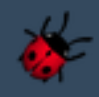
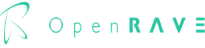
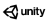

Robotic simulators software help to program robots offline. These simulators enable to test some programs or robot movements without stopping production or cause damage. This section aims at introducing and comparing main robotic simulators.

# A - Introduction of main robotic simulators

## Gazebo

[Gazebo](http://gazebosim.org/) is one of the most popular multi-robot simulators, firstly developed in 2004, fully open-source and supporting a wide range of sensors and objects. It runs on Linux (even if protected versions for Windows are available). It is designed to accurately reproduce the dynamics of the complex environments a robot could encounter. It is well integrated with ROS, flexible, provides accurate simulation with four different physical engines (ODE, Bullet, Simbody and DART) and benefits from a large and active community. Thanks to OGRE (Object-oriented Graphics Rendering Engine), the software provides realistic rendering of environments, for instance high-quality lighting, shadows and textures. The software can also generate sensor data, from different imported sensors or cameras. Besides the large range of robots, any robot can be imported using SDF format. Finally, robots, sensors and environment can be controlled through custom plugins. 

Many experts consider it as the best robotic simulator. 

## RoboDK

[RoboDK](https://robodk.com/) is an offline programming and simulation software mainly used for industrial robots. It runs on either Windows, Linux, Mac OS, Raspberry or Android. It is available for free (trial version) and purchase at RoboDK website. It has a wide range of CAD model library based on more than 500 professional industrial robots and tools. It offers an intuitive interface that do not require high programming skills. It is then easy to visualize root behavior for a specific movement. One of the main interests of the software is the possibility to export directly programs to the actual robot thanks to RoboDK Post Processors. Besides a module designed to calibrate robot is available, increasing accuracy of the simulation. 

## Webots

[Webots](https://www.cyberbotics.com/) robot simulator was developed at the Swiss Federal Institute of Technology in 1996 that can be downloaded from Cyberbotics company website. It provides a complete development environment (indoor or outdoor) for modeling, programming and simulating robots and can be interfaced with third-party applications through TCP/IP. Its simple and friendly interface enables to add and remove objects, robots, and evaluating them in a scenario, with short development time. In addition, the simulator provides a wide range of existing robots, components such as actuators, sensors, objects, furniture or materials… It also includes a compiler (C++) to test and control algorithms but the software is versatile with open-sources APIs, which are very useful for those who are familiar with a specific programming language (Python, Java, Matlab or ROS) or for the use of a specific library (i.e. OpenCV). It uses the ODE (Open Dynamics Engine) physics engine. 

Finally, Webots proposes an exhaustive documentation (through tutorials, examples or user guide) and benefits from an active community. 

## CoppeliaSim

[CoppeliaSim](https://www.coppeliarobotics.com/) (formerly called V-REP) was first released in 2010 and is closed-source with a free educational license. It offers a distributed control framework solution with advanced functionalities for testing and debugging complex robotic systems. Each object/model can be individually controlled via child scripts, writing plugins, ROS node, and external client application with a remote API. It runs on either Windows or Linux. If the embedded scripts are written in LUA, CoppeliaSim provides plugins for Matlab, C++, Python and Java programming. The three main elements of CoppeliaSim are consisted of scene objects (such as joints, shape, sensors, paths, etc…), calculation modules (such as inverse kinematics or collision detection) and control mechanism (scripts, plugin, sockets). 

CoppeliaSim benefits from a large wide of robots, objects and sensors. Furthermore, models in CoppeliaSim are flexible, portable and scalable. Thus, they can be modified, copied or resized from one scene to another. In addition, even if it is not very intuitive, building a custom robot remains possible. Tutorials and existing models are very helpful for his purpose. In addition, CoppeliaSim provides four different physical engines (ODE, Bullet, Vortex Dynamics and Newton). Compared with Gazebo, it is more stable with easier setup and running. 

## OpenRave

[OpenRave](http://openrave.org/) was firstly developed in 2006 at the Carnegie Mellon University Robotics Institute. It aims at analyzing for testing, developing and deploying motion planning algorithms in real-world robotics applications, mostly for industrial purpose. It is cross-platform (Linux, Windows and Mac OS). However, it is not yet available for Ubuntu 20.04. It can be integrated into actual robotics system through command line tools and interfaces.

## Unity

[Unity](https://unity.com/) is a cross-platform (Linux, Windows and Mac OS) game engine developed by Unity Technologies and released in June 2005. Initially developed to develop 3D-games (and especially popular for iOS and Android mobile games) as it is easy to use for beginner developers, it has been extended in 2010s to create 3D simulations in fields such as automotive and engineering, mainly through the development of its dedicated physics engine Nvidia PhysX. 

# B - Comparison of main features

In this section, you find two tables comparing a list of non-exhaustive relevant features for a robotic simulator. These tables should help you to choose the most relevant simulators regarding to your needs. 

This first table is focusing on features related to general simulators such as programming language or supported OS.

|                         	| Gazebo                           	| RoboDK                                                 	| Webots                                                                                             	| CoppeliaSim                                                             	| OpenRave                   	| Unity                                                               	|
|-------------------------	|----------------------------------	|--------------------------------------------------------	|----------------------------------------------------------------------------------------------------	|-------------------------------------------------------------------------	|----------------------------	|---------------------------------------------------------------------	|
| Logo                    	|   	|                   |          	|  	|   	|   	|                                                           	
| General Info            	| Open Source Robotics Foundation  	| RoboDK                                                 	| Cyberbotics Ltd  (Switzerland)                                                                     	| Coppelia Robotics                                                       	| OpenRAVE Community         	| Unity Technologies                                                  	|
| Website                 	| gazebosim.org                    	| robodk.com                                             	| cyberbotics.com                                                                                    	| coppeliarobotics.com                                                    	| openrave.org               	| unity3d.com                                                         	|
| Supported OS            	| GNU/Linux (Ubuntu)               	| Linux, Mac OS, Windows, Android                        	| GNU/Linux (Ubuntu) Mac OS Windows                                                                  	| GNU/Linux (Ubuntu) Mac OS Windows                                       	| GNU/Linux (Ubuntu) Windows 	| GNU/Linux (Ubuntu) Mac OS Windows                                   	|
| Last Release            	| 11.0.0  (2019-01-30)             	| 5.2.2 (2021-04-26)                                     	| R2021a (2020-12-15)                                                                                	| 4.2.0 (2021-04-06)                                                      	| 0.8.2 (2012-10-18)         	| 2021.1.10 (2021-06-04)                                              	|
| Programming language    	| C++                              	| Python                                                 	| C++                                                                                                	| Lua                                                                     	| C++                        	| C#                                                                  	|
| API support             	| C++                              	| C, C++, Python, Matlab                                 	| C, C++, Python, Java, Matlab                                                                       	| C, C++, Python, Java, Urbi, Matlab, Octave                              	| C, C++, Python, Matlab     	| C#                                                                  	|
| Physics Engine          	| ODE, Bullet, Simbody, DART       	| None                                                   	| Proprietary based on ODE                                                                           	| ODE, Bullet, Vortex, Newton                                             	| ODE, Bullet                	| NVidia PhysX, Box2D (Possibility to use open-source physics engine) 	|
| CAD files support       	| SDF/URDF, OBJ, STL, Collada      	| STEP, IGES, STL, WRML                                  	| WBT, VRML, X3D                                                                                     	| OBJ, STL, DXF, 3DS, Collada, URDF                                       	| XML, VRML, OBJ, Collada    	| FBX, Collada, DXF, OBJ                                              	|
| ROS support             	| ROS1 & ROS2                      	| No                                                     	| ROS1 & ROS2                                                                                        	| ROS1 & ROS2                                                             	| ROS 1                      	| ROS1 & ROS2                                                         	|
| Licenses                	| Open-source (hosted by ROS)      	| Free trial Version  (1 month) Pro version for purchase 	| Open-source (Apache License 2.0) Free and 3 levels of commercial license depending on user support 	| Free educational (students & research) version Pro version for purchase 	| Open-source (Lesser GPL)   	| Free Student and Personal Version  Pro version for purchase         	|
| Multithreading enabled? 	| Yes                              	| No                                                     	| Yes                                                                                                	| No                                                                      	| Yes                        	| Yes                                                                 	|

This second table is focusing on features related to robots such as actuators, already existing robots, etc... 

|                                                    	| Gazebo                                                                                   	| RoboDK                                                                              	| Webots                                                                                                                                    	| CoppeliaSim                                                                        	| OpenRave                     	| Unity                         	|
|----------------------------------------------------	|------------------------------------------------------------------------------------------	|-------------------------------------------------------------------------------------	|-------------------------------------------------------------------------------------------------------------------------------------------	|------------------------------------------------------------------------------------	|------------------------------	|-------------------------------	|
| Family of robots (mobile, humanoid, industrial...) 	| Mobile, Humanoid, Industrial                                                             	| Industrial robots (commercial robots)                                               	| Mobile, Humanoid, Industrial                                                                                                              	| Mobile, Humanoid, Industrial                                                       	| Mobile, Humanoid, Industrial 	| Mobile, Humanoid, Industrial  	|
| Supported actuators                                	| Revolute, Prismatic, Screw and Spherical Joints                                          	| Possibility to create rotated and linear axis                                       	| Brake, Connector, Display, Emitter, Linear Motor, Muscle, Pen, Propeller, Rotational Motor, Speaker, Track (Conveyor Belt or tank robots) 	| Revolute (and some variants), Prismatic and Spherical Motors                       	| Revolute and linear Joints   	| Revolute and Prismatic Joints 	|
| Supported Tools                                    	| Grippers                                                                                 	| Grippers, Weld tools, Spindle, Finishing tools (Grinding, polishing…), tool changer 	| Gripper                                                                                                                                   	| Pens, Paint Gun, Welding Torch, Grippers                                           	| Grippers                     	| Grippers                      	|
| Supported sensors                                  	| Camera Sensor, Depth camera sensor, Distance and Proximity Sensors, Laser, Force Sensors 	| Lasers, Cameras, Laser Tracker                                                      	| Accelerometer, Camera, Compass, Distance Sensor, GPS, Gyro, Lidar, Position Sensor, Receiver, Touch Sensor                                	| Vision Sensor, Force Sensor, Proximity Sensor, Accelerometers Gyro, Lasers, Lidars 	| Cameras, Ray-casting Laser   	| Cameras                       	|

# For further information 

- L. Pitonakava, M. Giuliani, A. Pipe and A. Winfield (2018). Feature and performance comparison of the V-REP, Gazebo and ARGoS robot simulators. DO: 10.1007/978-3-319-96728-8_30 

- A. Ayala, F. Cruz, D. Campos, R. Rubio, B. Fernandes, R. Dazeley (2020). A Comparison of Humanoid Robot Simulators: A Quantitative Approach 

- Shamshiri R R, Hameed I A, Pitonakova L, Weltzien C, Balasundram S K, Yule I J, et al. Simulation software and virtual environments for acceleration of agricultural robotics: Features highlights and performance comparison.    Int J Agric & Biol Eng, 2018; 11(4): 15–31. 

- Serena Ivaldi, Jan Peters, Vincent Padois, Francesco Nori. Tools for simulating humanoid robotdynamics: a survey based on user feedback. IEEE-RAS International Conference on Humanoid Robots (Humanoids), 2014, Madrid, Spain. hal-01116148 

# Useful links

- https://gazebosim.org - website of Gazebo 

- https://robodk.com - website of RoboDK 

- https://cyberbotics.com - website-hosting Webots 

- https://coppeliarobotics.com - website of CoppeliaSim 

- http://openrave.org - website of OpenRave 

- https://unity.com/fr - website of Unity 
