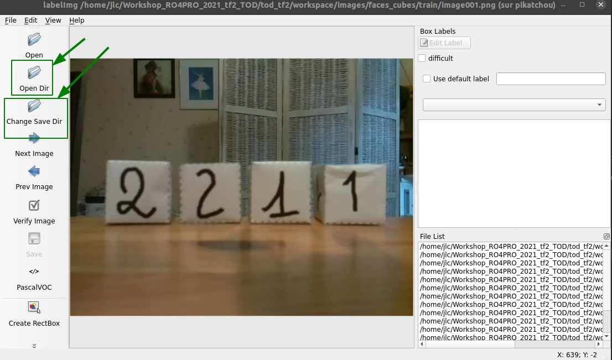

---
    Targeted learning outcomes:
    - how to use the software "labelImg" to localize and annotate the objects in the images
    - how to convert the annotation files from the XML format to the "tfreccord" format intended by tensorflow.
    - how to describe the supervised leraning labels in the file "label_map.pbtxt".

    Activity type   : ⚙️ [task]
    Expected duration : 15 to 60 minutes or more (depends on the total number of images to annotate) 
---

## Activity plan

Annotation of images involves 3 steps:
1. Annotate the images with the _labelImg_ software to locate and labelize all the objects in each training image.
2. Convert the annotated XML files to the _tfrecord_ format.
3. Create the file `label_map.pbtxt`.

## 1. Annotate the images with the _labelImg_ software

The annotation of the images can be done with the software `labelImg`.
This step of the overall work takes time and can be carried out with several people if necessary by dividing up the images to be annotated...<br>
Launch `labelImg` with the` tf2` EVP activated:
``
```bash
(tf2) user@host:~ $ labelImg
```
Use the __[Open Dir]__ and __[Change Save Dir]__ buttons to read and write files in the directory `<project>/images/train/`.<br>

The first image is automatically loaded into the graphical interface:


For each image, you must locate an label each object to recognize:

* with the button __[Create RectBox]__, you draw the bounding box arrond each face of the cubes
* the labels box opens and you have to write the label `one` or` two` according to the surrounded face <br>
⚠️ It is very important to put alphabetic __labels__ and not __numeric__ ones: put the string `one` not the number `1`!
* iterates the process for each of the cube faces present in the image ...

    first object | second object | ...end
:-----------------------:|:------------------------:|:-------------------------:
 |  | 

* when it is finished, you click on the button __[Save]__ and you go to the next image with the button __[Next Image]__.
* Once all the images have been annotated, use the __[Open Dir]__ and __[Change Save Dir]__ buttons to annotate the test images in the `<project>/images/test/` directory in the same way.

## 2. Convert annotated XML files to _tfrecord_ format

First you create a single _CSV_ file regrouping the data of the various _XML_ files created by the annotation.

The `xml_to_csv_tt.py` program creates the two files` train_labels.csv` and `test_labels.csv` in the directory `<project>/images/`. <br>
From the `tod_tf2` directory type:

```bash
# From within tod_tf2
(tf2) user@host:~ $ python xml_to_csv_tt.py -p cube_faces
Successfully converted xml data in file <cube_faces/images/train_labels.csv>
Successfully converted xml data in file <cube_faces/images/test_labels.csv>
```
Now use the `generate_tfrecord_tt.py` program to create the 2 files` train.record` and `test.record` in the `cube_faces/training` directory.<br>
From the `tod_tf2` directory directory type the command:
```bash
# From within tod_tf2
(tf2) user@host:~ $ python generate_tfrecord_tt.py --project cube_faces
Successfully created the TFRecord file: <cube_faces/training/train.record>
Successfully created the TFRecord file: <cube_faces/training/test.record>
```

## 3. Created the file label_map.pbtxt
 
The last step is to create the `label_map.pbtxt` file in the `<project>/training/` directory.

This file describes the _label map_ required for training the network.
This map makes it possible to know the _ID_ (integer) associated with each label (string) identifying the objects to be detected.
 The typical structure of the file is as follows: 


	item {
	  id: 1
	  name: 'objet_1'
	}
	item {
	  id: 2
	  name: 'objet_2'
	}
	...

### Example

For the `cube_faces` project, th content of the file `cube_faces/training/label_map.pbtxt` is :

	item {
	  id: 1
	  name: 'one'
	}
	item {
	  id: 2
	  name: 'two'
	}

