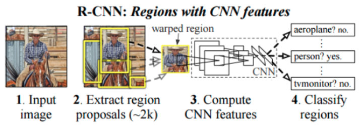

---
     Activity type: ⚙️ [task]
     Approximate duration: 20 minutes (depends on internet speed)
    
    Targeted learning outcomes:
     - to know the main advantages/disadvantages of R-CNN and SSD networks.
     - to know how to install in the working tree a pre-trained network downloaded from the "TensorFlow2 Detection Model Zoo" site.
---

## Pre-trained network for Object Detection

Several families of networks dedicated to Object Detection are available on [TensorFlow 2 Detection Model Zoo](https://github.com/tensorflow/models/blob/master/research/object_detection/g3doc/tf2_detection_zoo.md) including:

* __R-CNN__ (Region-based Convolutional Neural Network, see [lectures](#lectures) [1]): based on the concept of __selective search__<br>
<br>
(source: https://arxiv.org/pdf/1311.2524.pdf)<br>
Instead of applying the processing window to all possible positions in the image, the targeted search algorithm generates 2,000 proposals for regions of interest where it is most likely to find objects to be detected. This algorithm uses things like the texture, intensity and color of the objects it has learned to detect to suggest regions of interest. Once the 2000 regions have been chosen, the last part of the network calculates the probability that the object in the region belongs to each class. The `Fast R-CNN` and `Faster R-CNN` versions make training more efficient and faster.

* __SSD__ (Single Shot Detector, see [lectures](#lectures) [2]) networks are part of the detectors considering the detection of objects as a _regression problem_. The SSD algorithm first uses a convolutional neural network to produce a map of key points in the image and then, like Faster R-CNN, uses frames of different sizes to process scales and aspect ratios.

The difference between _Faster R-CNN_ and _SSD_ is that _R-CNN_ performs a classification on each of the 2000 windows generated by the targeted search algorithm, while _SSD_ tries to predict the class AND the window of the object at the same time. This makes _SSD_ faster than _Faster R-CNN_ but also less accurate.

## Download a pre-trained R-CNN network and install it in the workspace

In the table on the [TensorFlow 2 Detection Model Zoo](https://github.com/tensorflow/models/blob/master/research/object_detection/g3doc/tf2_detection_zoo.md) website, the performances of the different networks is expressed in __COCO mAP__ (Mean Average Precision), a metric commonly used to measure the accuracy of an object detection model. It consists in measuring the proportion of successful detections on images already annotated from the COCO dataset (Common Object in CONtext) which contains 200,000 images annotated with 80 different objects. This measurement serves as a benchmark for comparing the accuracy of different object detection architectures (more information on _mAP_ in reading [2]).

📥 For the rest of the work you can use the neural network `Faster R-CNN ResNet50 V1 640x640` available from the site [TensorFlow 2 Detection Model Zoo](https://github.com/tensorflow/models/blob/master/research/object_detection/g3doc/tf2_detection_zoo.md) (~ 203 MB).

Download and extract the TGZ archive to the right place in the working tree:

```bash
# From within tod_tf2/
(tf2) user@host $ wget http://download.tensorflow.org/models/object_detection/tf2/20200711/faster_rcnn_resnet50_v1_640x640_coco17_tpu-8.tar.gz -P /tmp
(tf2) user@host $ tar xvzf /tmp/faster_rcnn_resnet50_v1_640x640_coco17_tpu-8.tar.gz -C pre-trained      # extract the archive in teh right directory
(tf2) user@host $ rm /tmp/faster_rcnn_resnet50_v1_640x640_coco17_tpu-8.tar.gz                           # no more useful
```

Then create the corresponding directory `faster_rcnn_resnet50_v1_640x640_coco17_tpu-8` in your workspace, under `<project>/training`.

## Example 

With the _cube_faces_ project (detection of digits hand-written on faces of cubes):

```bash	
# From within tod_tf2/
(tf2) user@host $ mkdir training/cube_faces/faster_rcnn_resnet50_v1_640x640_coco17_tpu-8
```
Let's check with the `tree` command:

```bash
# From within tod_tf2/
(tf2) jlc@pikatchou $ tree -d . -I models
.
├── cube_faces
│   ├── images
│   │   ├── test
│   │   └── train
│   └── training
│       └── faster_rcnn_resnet50_v1_640x640_coco17_tpu-8
├── pre-trained
│   └── faster_rcnn_resnet50_v1_640x640_coco17_tpu-8
│       ├── checkpoint
│       └── saved_model
│           └── variables
└── tod_tf2_tools
```

## Readings

* [1] [Zero to Hero: Guide to Object Detection using Deep Learning: Faster R-CNN,YOLO,SSD](https://cv-tricks.com/object-detection/faster-r-cnn-yolo-ssd/)
* [2] [mAP (mean Average Precision) for Object Detection](https://jonathan-hui.medium.com/map-mean-average-precision-for-object-detection-45c121a31173)
* [3] [Understanding SSD MultiBox — Real-Time Object Detection In Deep Learning](https://towardsdatascience.com/understanding-ssd-multibox-real-time-object-detection-in-deep-learning-495ef744fab)


