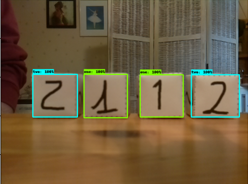
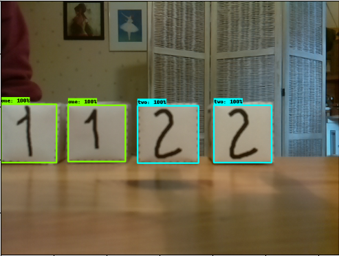
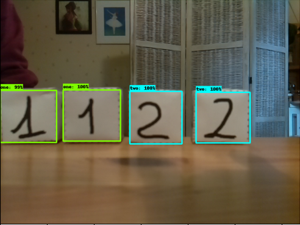
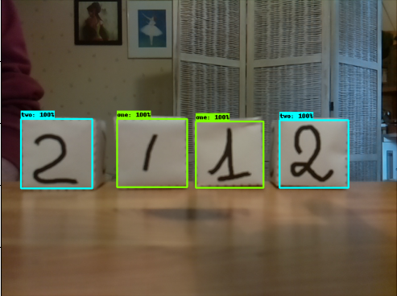

---
    Targeted learning outcomes:
    - learn to operate and evaluate a re-trained TOD neural netowork.

    Activity type    : ⚙️ [task]
    Expected duration: 30 minutes (depends on your computer CPU & RAM).
---

## Evaluate the re-trained network

The Python script plot_object_detection_saved_model.py let's you operate the re-trained network with any new images, the arguments are:
* `-p`: the name of the project
* `-m`: the path of the `... /saved/` folder containing the weight files of the trained network
* `-i`: the path of the images folder or the path of the image file to analyze
* `-n`: the maximum number of objects to be detected
* `-t`: the detection threshold (_threshold_) expressed in% (optional, default value: 50%).

### Example

For example to detect the cubes of the test images with the network that you have trained for the `cube_faces` projec, using the environment variable `PTN_DIR`:

```bash
# From within tod_tf2
(tf2) user@host: $ python plot_object_detection_saved_model.py -p faces_cubes -s $PTN_DIR/saved_model1/saved_model -i faces_cubes/images/test/ -n 4
Loading model...Done! Took 13.23 seconds
Running inference for faces_cubes/images/test/image016.png... [2 2 1 1]
[0.9998258  0.99902177 0.99812204 0.9964721 ]
[[0.40203822 0.12419666 0.64018315 0.30807328]
 [0.4043577  0.76715255 0.6404976  0.9653229 ]
 [0.40296176 0.5467712  0.63852876 0.7309122 ]
 [0.3932786  0.32322642 0.64034694 0.5083482 ]]
Running inference for faces_cubes/images/test/image018.png... [2 2 1 1]
[0.99967873 0.9996051  0.9983627  0.99751186]
[[0.40055594 0.6233792  0.63929296 0.80680573]
 [0.40259457 0.4026048  0.63897103 0.58319676]
 [0.4041245  0.19101582 0.6288158  0.3679664 ]
 [0.40252358 0.         0.64536196 0.16534011]]
Running inference for faces_cubes/images/test/image019.png... [2 2 1 1]
[0.99970055 0.9993857  0.99750453 0.9968694 ]
[[0.40160167 0.42744026 0.6401532  0.6097636 ]
 [0.40586317 0.64189494 0.6397717  0.82715124]
 [0.40226468 0.         0.6392519  0.18196338]
 [0.39843452 0.20977092 0.6328793  0.3960455 ]]
Running inference for faces_cubes/images/test/image017.png... [2 2 1 1]
[0.9997949 0.9994717 0.9933088 0.9883559]
[[0.40147427 0.6982088  0.63554984 0.87740797]
 [0.39989385 0.04223634 0.6387966  0.24200168]
 [0.40242052 0.4871788  0.6324738  0.66032267]
 [0.39879817 0.2852207  0.6340168  0.4698804 ]]
```

Examples of images displayed by the Python script:

|   image016.png           |   image018.png               |            image019.png    |    image017.png
:-------------------------:|:----------------------------:|:--------------------------:|:------------------------------:
 |    |  | 

For each processed image the Python script returns:
* the list of the labels of the 4 objects detected (`1` or` 2`)
* the list of the detection probabilities for the 4 objects detected
* the list of the 4 sets of normalized coordinates of the bounding boxes [y, x bottom left corner then y, x top right corner].

⚠️ Note that the objects are __in the order of decreasing detection probabilities__:
* if you want to sort the objects in the image from left to right, you can use the `x` abscissas of bounding boxes,
* if you want to sort the objects in the image from top to bottom, you can use the `y` ordinate of bounding boxes, <br>
in any case, the __numpy__ `argsort` function is your friend ...

