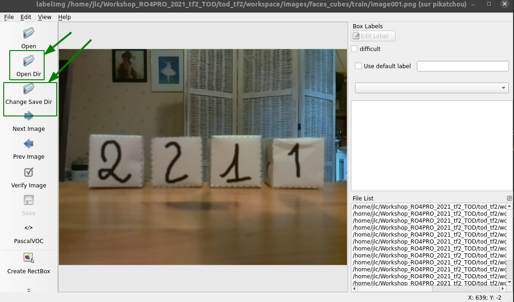

In this section we will use the __Tensorflow Object Detection__ (_a.k.a_ TOD) API which offers:

* a collection of pre-trained networks, specially designed for object detection in images (__Object Detection__),
* a _transfer learning_ mechanism to continue the training of pre-trained networks with our own labeled images,
to obtain the detection of the objects of interest.

Unlike the __Classification__ strategy presented in the section [Classification](<https://learn.e.ros4.pro/en/vision/classification_tf2/>),
the __Object detection__ can directly find the bounding boxes of the targeted objects: it avoids the usage of conventional image processing to extract the targeted objets (faces of cubes for example), then to classify the images of the cube faces.

The drawback of the image processing used to create the sub-images to be classified is that it involves some low level (pixel level) pre-processing of the image : thresholding, contour extraction, segmentation, etc... This processing is quite fragile: sensitive to brightness, to the presence or not of a black background ...

An expected advantage of the Object Detection approach is to provide the bounding boxes of the faces of the cubes directly, without going through the image pre-processing step.

## Prerequisites

* Undergraduate
* Good understanding of Python and numpy
* A first experience of neural networks is desirable.

The training of neural networks with the `tensorflow` module will preferably be done within a __Python virtual environment__ (PVE) which allows one to worke in a dedicated Python environment, separate from the existing one for working under ROS

💻 Use the [FAQ/Python3/virtual environment](<https://learn.e.ros4.pro/en/faq/python3/venv>) to create an PVE:

* named `tf2`,
* with a version of Python equal to `3.8`.

## 1. Documentation

1. General documentation on numpy:

  * [Numpy cheatsheet](https://s3.amazonaws.com/assets.datacamp.com/blog_assets/Numpy_Python_Cheat_Sheet.pdf)
  * [NumPy quickstart](https://numpy.org/devdocs/user/quickstart.html)

2. Documentation on the_TOD_ API for `tensorflow2`:

* The full official tutorial: [TensorFlow 2 Object Detection API tutorial](https://tensorflow-object-detection-api-tutorial.readthedocs.io/en/latest/index.html)
* The git repository: [models/research/object_detection](https://github.com/tensorflow/models/tree/master/research/object_detection) <br> <br>
The tutorial can be consulted to find details that are not developed in the proposed activity, but it is best to follow
the instructions in the present document to quickly install and use a recent version of tensorflow2.

3. Further reading:

* [1] [Zero to Hero: Guide to Object Detection using Deep Learning: Faster R-CNN, YOLO, SSD](https://cv-tricks.com/object-detection/faster-r-cnn-yolo-ssd /)
* [2] [mAP (mean Average Precision) for Object Detection](https://jonathan-hui.medium.com/map-mean-average-precision-for-object-detection-45c121a31173)
* [3] [Understanding SSD MultiBox - Real-Time Object Detection In Deep Learning](https://towardsdatascience.com/understanding-ssd-multibox-real-time-object-detection-in-deep-learning-495ef744fab) 

## 2. Install the TOD API

The installation of the TOD API takes place in 5 steps:

1. Create and initialize your workspace
2. Clone the `tensorflow/models` repository
3. Install the `protobuf` tools
4. Install the COCO API
5. Install the `object_detection` package.

Throughout the document the _prompt_ of the terminal will be noted `(tf2) user@host $`: the prefix `(tf2)` is there to remind you that the Python work for the TOD API is done
in the __Virtual Python tf2__ environment previously created (see the Prerequisites).

### 2.1 Create and initialize your workspace

The first step is to create the working directory `tod_tf2`, in which all the files will be created, and to position yourself in this directory which will be __the root folder of the project__:

```bash
(tf2) user@host $ cd <some_part> # choose the directory to create `tod_tf2`, for example" cd ~/catkins_ws "
(tf2) user@host $ mkdir tod_tf2
(tf2) user@host $ cd tod_tf2/
```

📥 Next, you clone the `cjlux/tod_tf2_tools.git` github repository and copy the `*.py` and `*.ipynb` files from the `tod_tf2_tools` folder to the `tod_tf2` folder:

```bash
# From tod_tf2/
(tf2) user@host $ git clone https://github.com/cjlux/tod_tf2_tools.git
(tf2) user@host $ cp tod_tf2_tools/*.py  .
(tf2) user@host $ cp tod_tf2_tools/*.ipynb  . 
```

### 2.2 Clone the `tensorflow/models` repository

📥 In the working directory `tod_tf2` clone the github repository `tensorflow/models` (~ 635 MB):

```bash
# From tod_tf2/
(tf2) user@host $ git clone https://github.com/tensorflow/models.git
```

You get a `models` folder. The TOD API is in the folder `models/research/object_detection/`:

```bash	
(tf2) user@host $ tree -d -L 2 .
.
└── models
    ├── community
    ├── official
    ├── orbit
    └── research
```

📥 Complete your installation with some Python packages useful for working with the TOD API:

```bash
(tf2) user@host $ conda install cython contextlib2 pillow lxml
(tf2) user@host $ pip install labelimg rospkg
```

Update the environment variable `PYTHONPATH` by adding the two lines at the end of the `~/.bashrc` file:

```bash
export TOD_ROOT="<absolute path to tod_tf2>"
export PYTHONPATH=$TOD_ROOT/models:$TOD_ROOT/models/research:$PYTHONPATH
```

replace `"<absolute path to tod_tf2>"` by th absolute path to the `tod_tf2` folder on your workstation.

* Launch a new terminal to activate the new shell environment: all the following will be done in this new terminal.
* ⚠️ don't forget to activate the `tf2` PVE in this new terminal:

```bash
user@host $ conda activate tf2
(tf2) user@host $
 ```

### 2.3 Install the `protobuf` tools 

The native TOD API uses `*.proto` files for configuring models and storing training parameters.
These files must be translated into `*.py` files in order for the Python API to work properly:

* First install the debian `protobuf-compile` package which gives access to the `protoc` command:

```bash
(tf2) user@host $ sudo apt install protobuf-compiler
```

* You can then go into the `tod_tf2/models/research` directory and enter:

```bash
# From tod_tf2/models/research/
(tf2) user@host $ protoc object_detection/protos/*.proto  --python_out=.
```

This command works silently.

### 2.6 Test tthe TOD API installation

To test your installation of the TOD API, go to the `models/research /` directory and type the command:

```bash	
# From within tod_tf2/models/research/
(tf2) user@host $ python object_detection/builders/model_builder_tf2_test.py
```

The program runs a whole series of tests and should end with an OK without any error:

```
...
[       OK ] ModelBuilderTF2Test.test_invalid_second_stage_batch_size
[ RUN      ] ModelBuilderTF2Test.test_session
[  SKIPPED ] ModelBuilderTF2Test.test_session
[ RUN      ] ModelBuilderTF2Test.test_unknown_faster_rcnn_feature_extractor
INFO:tensorflow:time(__main__.ModelBuilderTF2Test.test_unknown_faster_rcnn_feature_extractor): 0.0s
I0505 18:19:38.639148 140634691176256 test_util.py:2075] time(__main__.ModelBuilderTF2Test.test_unknown_faster_rcnn_feature_extractor): 0.0s
[       OK ] ModelBuilderTF2Test.test_unknown_faster_rcnn_feature_extractor
[ RUN      ] ModelBuilderTF2Test.test_unknown_meta_architecture
INFO:tensorflow:time(__main__.ModelBuilderTF2Test.test_unknown_meta_architecture): 0.0s
I0505 18:19:38.640017 140634691176256 test_util.py:2075] time(__main__.ModelBuilderTF2Test.test_unknown_meta_architecture): 0.0s
[       OK ] ModelBuilderTF2Test.test_unknown_meta_architecture
[ RUN      ] ModelBuilderTF2Test.test_unknown_ssd_feature_extractor
INFO:tensorflow:time(__main__.ModelBuilderTF2Test.test_unknown_ssd_feature_extractor): 0.0s
I0505 18:19:38.641987 140634691176256 test_util.py:2075] time(__main__.ModelBuilderTF2Test.test_unknown_ssd_feature_extractor): 0.0s
[       OK ] ModelBuilderTF2Test.test_unknown_ssd_feature_extractor
----------------------------------------------------------------------
Ran 21 tests in 53.105s

OK (skipped=1)
```

Finally, you can verify the installation using the IPython notebook `object_detection_tutorial.ipynb` present in the `tod_tf2` directory. <br>
(note: this is a copy of the `tod_tf2/models/research/object_detection/colab_tutorials/object_detection_tutorial.ipynb` notebook in which we removed the installation cells of the TOD API and some other cells that can generate errors...).


* ⚠️ Before running the notebook cells, you must correct an error in the file `.../tod_tf2/models/research/object_detection/utils/ops.py`, line 825:
replace `tf.uint8` with `tf.uint8.as_numpy_dtype`

* In the `tod_tf2` directory run the `jupyter notebook` command and load the `object_detection_tutorial.ipynb` notebook.
* Run the cells one by one, you shouldn't get any mistakes:
	* The "__Detection__" part (which lasts from a few seconds to several minutes depending on your CPU…) uses the pre-trained network `ssd_mobilenet_v1_coco_2017_11_17` to detect objects in the test images:


	* The "__Instance Segmentation__" part is more resource intensive (up to 8 GB of RAM) and lasts from a few tens of seconds to several tens of minutes depending on your CPU; it uses the pre-trained `mask_rcnn_inception_resnet_v2_atrous_coco_2018_01_28` network to detect objects and their masks, for example:
 

The rest of the work breaks down as follows:

* Complete the working tree
* Download the pre-trained network
* Create the labeled image bank for the supervised training of the chosen network
* Train the network with the labeled image bank.
* Evaluate network inferences with test images
* Integrate network operation into the ROS environment.

## 3. Complete the work tree

The proposed generic tree structure is as follows: 

```bash
tod_tf2
├── images
│   └──<project>
│       ├── test
│       │   └── *.jpg, *.png ... *.xml
│       ├── train
│       │   └── *.jpg, *.png ... *.xml
│       └── *.csv
├── pre_trained
│   └── <pre_trained-network>
├── training
│   └──<project>
│       ├── <pre_trained-network>
│       ├── train.record
│       ├── test.record
│       └── label_map.txt
└── models
    └── research
        └── object_detection
```

* Everything that is specific to the project is placed in a `<project>` directory at different levels.

* The `images/<project>` folder contains for each project:

  * the `test` and `train` folders which each contain:
    * the PNG, JPG ... images,
    * XML annotation files created with the `labelImg` software: they give, for each object of an image, the coordinates of bounding box  and the label of the object.
  * CSV annotation files (content of XML files converted to CSV format), which will in turn be converted to _tensorflow record_ format.
* The `pre_trained/` folder contains a subfolder for each of the pre-trained networks used.
* the `training/<project>` folder contains for each project:
  * a folder for the pre-trained network used: it is in this folder that the weight files of the trained network are stored,
  * the `train.reccord` and `test.reccord` files: contain the labeled training and test data converted from CSV format to _tensorflow record_ format,
  * the `label_map.txt` file: lists the labels corresponding to the objects to be detected.

For the detection of the faces of the cubes in the images of the robot's camera, the `<project>` folder will be named `faces_cubes`, which gives the working tree:

```bash
tod_tf2
├── images
│   └── faces_cubes
│       ├── test
│       │   └── *.jpg, *.png ... *.xml
│       ├── train
│       │   └── *.jpg, *.png ... *.xml
│       └── *.csv
├── pre_trained
│   └── <pre_trained-network>
├── training
│   └── faces_cubes
│       ├─── <pre_trained-network>
│       ├── train.record
│       ├── test.record
│       └── label_map.txt
└── models
    └── research
        └── object_detection
```

A few shell commands can create the first levels of this tree:

```bash
# From within tod_tf2
(tf2) user@host $ mkdir -p images/faces_cubes/test
(tf2) user@host $ mkdir -p images/faces_cubes/train
(tf2) user@host $ mkdir pre_trained
(tf2) user@host $ mkdir -p training/faces_cubes
```

Verification:

```bash
# From within tod_tf2
(tf2) user@host $ tree -d . -I models
.
├── images
│   └── faces_cubes
│       ├── test
│       └── train
├── pre_trained
├── tod_tf2_tools
└── training
    └── faces_cubes
```

## 4. Donwload the pre-traind network

Several families of networks dedicated to object detection are available on the `TensorFlow 2 Detection Model Zoo site, including:

* __R-CNN__ (Region-based Convolutional Neural Network): based on the concept of selective search

 (source: https://arxiv.org/pdf/1311.2524.pdf)<br>
Instead of applying the processing window to all possible positions in the image, the targeted search algorithm generates 2,000 proposals for regions of interest where it is most likely to find objects to be detected. This algorithm uses things like the texture, intensity and color of the objects it has learned to detect to suggest regions of interest. Once the 2000 regions have been chosen, the last part of the network calculates the probability that the object in the region belongs to each class. The `Fast R-CNN` and `Faster R-CNN` versions make training more efficient and faster.

* __SSD__ (Single Shot Detector) networks are part of the detectors considering the detection of objects as a _regression problem_. The SSD algorithm first uses a convolutional neural network to produce a map of key points in the image and then, like Faster R-CNN, uses frames of different sizes to process scales and aspect ratios.

The difference between _Faster R-CNN_ and _SSD_ is that _R-CNN_ performs a classification on each of the 2000 windows generated by the targeted search algorithm, while _SSD_ tries to predict the class AND the window of the object at the same time. This makes _SSD_ faster than _Faster R-CNN_ but also less accurate.

In the table on the [TensorFlow 2 Detection Model Zoo](https://github.com/tensorflow/models/blob/master/research/object_detection/g3doc/tf2_detection_zoo.md) website, the performance of the different networks is expressed in __COCO mAP__ (Mean Average Precision), a metric commonly used to measure the accuracy of an object detection model. It consists in measuring the proportion of successful detections on images already annotated from the COCO dataset (Common Object in CONtext) which contains 200,000 images annotated with 80 different objects. This measurement serves as a benchmark for comparing the accuracy of different object detection architectures (more information on _mAP_ in reading [2]).

📥 For the work of detecting the faces of the cubes in the images provided by the Ergo Jr robot's camera you can download the `Faster R-CNN ResNet50 V1 640x640` network from the [TensorFlow 2 Detection Model Zoo](https://github.com/tensorflow/models/blob/master/research/object_detection/g3doc/tf2_detection_zoo.md) site (~ 203 MB).

Once downloaded, you must extract the TGZ archive to the right place in the working tree:
```bash
# From within tod_tf2/
(tf2) user@host $ tar xvzf ~/Téléchargements/faster_rcnn_resnet50_v1_640x640_coco17_tpu-8.tar.gz -C pre_trained
```

then create the corresponding folder `faster_rcnn_resnet50_v1_640x640_coco17_tpu-8` in the `training/faces_cubes` folder:
```bash	
# From within tod_tf2/
(tf2) user@host $ mkdir training/faces_cubes/faster_rcnn_resnet50_v1_640x640_coco17_tpu-8
```
We check: 
```bash
# From within tod_tf2/
(tf2) user@host $ tree -d pre_trained
pre_trained
└── faster_rcnn_resnet50_v1_640x640_coco17_tpu-8
    ├── checkpoint
    └── saved_model
        └── variables
        
(tf2) user@host $ tree -d training
training
└── faces_cubes
    └── faster_rcnn_resnet50_v1_640x640_coco17_tpu-8
```

## 5. Create the data for supervised learning

This stage of the work has five tasks:

1. Create images with the robot's camera -> *.jpg, *.png files
2. Annotate the images with the software `labelImg` -> files *.xml
3. Convert annotated XML files to CSV format
4. Convert CSV annotated files to _tensorflow record_ format
5. Create the file `label_map.pbtxt` which contains the labels of the objects to recognize. 

### 5.1 Create the images with the robot's camera 

The images of the faces of the cubes can be obtained with the ROS service `/get_image` from the robot Poppy Ergo Jr. 

image001.png               |  image002.png
:-------------------------:|:-------------------------:
   |  

🤖 Reminders -- launch of the ROS Master and ROS services on the robot:
 
* turn on the Poppy Ergo Jr robot,
* connect to the robot's RPi card:  `ssh pi @ poppy.local` (mdp:` raspberry`)
* ✅ check that `ROS_MASTER_URI` points to` poppy.local:11311`


```bash
(tf2) user@host: $ ssh pi@poppy.local
pi@poppy.local password:
...

pi@poppy:~ $ env|grep ROS_MASTER
ROS_MASTER_URI=http://poppy.local:11311
```

* if `ROS_MASTER_URI` is not correct, edit the robot's`~/.bashrc` file, set the correct value and type `source ~\.bashrc` ...
* Launches the ROS Master and the ROS services on the robot with the command: 

```bash
pi@poppy:~ $ roslaunch poppy_controllers control.launch
...
```

💻 And now in a terminal on your PC, with the PVE `(tf2)` disabled:
* ✅ check that `ROS_MASTER_URI` points to`poppy.local:11311`: 

```bash
(tf2) user@host: $ env|grep ROS_MASTER
ROS_MASTER_URI=http://poppy.local:11311
```

* if `ROS_MASTER_URI` is not correct, edit the file` ~/.bashrc`, set the correct value and type `source ~\.bashrc` ...


🐍 You can use the Python program `get_image_from_robot.py` from the `tod_tf2` folder to save the cube images in files named `imagesxxx.png` (`xxx` = `001`,` 002` ...).<br>
Pressing a keyboard key allows you to switch from one image to another, pressing the `Q` key exits the program: 

```python
import cv2, rospy
from poppy_controllers.srv import GetImage
from cv_bridge import CvBridge

i=1
while True:
    get_image = rospy.ServiceProxy("get_image", GetImage)
    response  = get_image()
    bridge    = CvBridge()
    image     = bridge.imgmsg_to_cv2(response.image)
    cv2.imwrite(f"image{i:03d}.png", image)
    cv2.imshow("Poppy camera", image)
    key = cv2.waitKey(0)
    if key==ord('q') or key==ord("Q"): break
    cv2.destroyAllWindows()
    i += 1
cv2.destroyAllWindows()
```

📍 In case of conflict between "ROS / PVE tf2 / PyQT" using the program `get_image_from_robot.py` you can temporarily deactivate the PVE tf2:

* either by launching a new terminal,
* either by typing the command `conda deactivate`.


Each team must make roughly twenty images by varying the faces of the cubes. 
Once all the images have been collected, you should put about 90% of the images in the `images\faces_cubes\train` folder 
and the rest in the `images\faces_cubes\test` folder.

### 5.2 Annotate images with the `labelImg` software

The annotation of images can be easly done with the software `labelImg`.
This is a time-consuming step in the work that can be carried out as a group by dividing up the images to be annotated ...

The installation of the Python module `labelImg` made in the PVE` tf2` (see section 2.) allows to launch the software by typing: 

```bash
(tf2) user@host:~ $ labelImg
```

Use the [Open Dir] and [Change Save Dir] buttons to position the read AND write files in the `images/face_cubes/train/` folder. <br>
The first image is automatically loaded into the graphical interface: 




For each image, you must annotate the objects to recognize:

* with the [Create RectBox] button, you surround a face of a cube,
* the "labels box" opens and you have to write the label "`one`" or "`two`" according to the surrounded face,
* iterate for each of the cube faces present in the image ... 

    first face          |  second face            |  last face
:-------------------------:|:-------------------------:|:-------------------------:
   |   | 

* when it's finished, you click on the [Save] button and you go to the next image with the [Next Image] button.
* Once all the images have been annotated, use the [Open Dir] and [Change Save Dir] buttons to annotate the test images in the `images/face_cubes/test/` folder in the same way.

### 5.3 5.3 Convert annotated XML files to CSV format

This step makes it possible to synthesize in a single CSV file the training data contained in the various XML files created after the annotation step.
The `xml_to_csv_tt.py` program generates the two CSV files corresponding to the training and test data. <br>
From the `tod_tf2` folder type the following command: 

```bash
# From within tod_tf2
(tf2) user@host:~ $ python xml_to_csv_tt.py -p faces_cubes
Successfully converted xml data in file <images/faces_cubes/train_labels.csv>.
Successfully converted xml data in file <images/faces_cubes/test_labels.csv>.
```

The files `train_labels.csv` and `test_labels.csv` are created in teh `images/faces_cubes/` directory.

### 5.4 Convert annotated CSV files to _tfrecord_ format

For this step, we use the `generate_tfrecord_tt.py` program. <br>
From the `tod_tf2` folder type the command: 

```bash
# From within tod_tf2
(tf2) user@host:~ $ python generate_tfrecord_tt.py --project faces_cubes
Successfully created the TFRecord file: ./training/faces_cubes/train.record
Successfully created the TFRecord file: ./training/faces_cubes/test.record
```

With this command you have just created the 2 files `train.record` and` test.record` in the `training/faces_cubes` folder: 
these two files will be used for training and network evaluation.

### 5.5 Create the label_map.pbtxt file

The last step is to create the `label_map.pbtxt` file in the` training/faces_cubes` folder.

This file describes the _label map_ required for training the network.
The label map makes it possible to know the ID (integer) associated with each label (_label_) identifying the objects to be recognized. 
The structure of the file is as follows: 

```yaml
item {
   id: 1
   name: 'objet_1'
 }
 item {
   id: 2
   name: 'objet_2'
 }
 ...
```

For the `face_cubes` project, the content of the` training/faces_cubes/label_map.pbtxt` file to create is: 

```yaml
item {
  id: 1
  name: 'one'
}
item {
  id: 2
  name: 'two'
}
```

## 6. Start supervised training from the pre-trained network

This work breaks down into several stages:

1. Edit the pre-trained network configuration file to describe the training configuration.
2. Start the supervised training.
3. Export the weights of the trained network in a usable format.

### 6.1 Modifying the configuration file

This is the last step before starting training ...

* The `pipeline.config` configuration file found in the`pre_trained/faster_rcnn_resnet50_v1_640x640_coco17_tpu-8` folder must be copied in the target folder `training/faces_cubes/ faster_rcnn_resnet50_v1_640x640_coco`tpu.

* You must modify the parameters of the file `training/faces_cubes/faster_rcnn_resnet50_v1_640x640_coco17_tpu-8` to adapt them to the training: 

|n°  | paramètre                     | Description                                                            | Valeur initiale  | valeur à donner |  explication                    |
|:---|:------------------------------|:-----------------------------------------------------------------------|:----------------:|:---------------:|:--------------------------------|
|010 | `num_classes`                 | nombre de classe d'objets                                              | 90               | 2               | les deux classes 'one' et 'two' |
|077| `max_detections_per_class`    | nombre max de détection par classe                                     | 100              | 4               | 4 cubes          | 
|078| `max_total_detections`        | nombre max total de détections                                         | 100              | 4               | 4 cubes          | 
|093| `batch_size`                  | nombre d'images à traiter en lot avant <br>mise à jour des poids du réseau | 64               | 1, 2,...        | une valeur trop élevée risque de faire dépasser la <br>capacité mémoire RAM de ta machine... <br>à régler en fonction de la quantité <br> de RAM de ta machine.  |
|097| `num_steps`                   | Nombre max d'itérations d'entraînement                                 | 25000             | 1000           | une valeur trop grande donne des temps de calcul<br> prohibitifs et un risque de sur-entraînement 
|113| `fine_tune_checkpoint`        | chemin des fichiers de sauvegarde des <br> poids du réseau pré-entraîné     | "PATH_TO_BE_<br>CONFIGURED" | "pre_trained/faster_rcnn_resnet50_<br>v1_640x640_coco17_tpu-8/<br>checkpoint/ckpt-0" | se termine par `/ckpt-0` qui est le préfixe des <br>fichiers dans le dossier `.../checkpoint/` |
|114| `fine_tune_checkpoint_type`   | Choix de l'algorithme : "classification" <br>ou "detection"                | "classification"| "detection"  | on veut faire de la detection d'objets |
|120| `max_number_of_boxes`         | Nombre max de boîtes englobantes  dans <br>chaque image                    | 100               | 4               | les faces des cubes sur une image |
|122| `use_bfloat16`                | `true` pour les architectures TPU, <br>`false` pour CPU                    | true              | false           | |
|126| `label_map_path`              | chemin du fichier des labels                                           | "PATH_TO_BE_<br>CONFIGURED" | "training/faces_cubes/label_map.pbtxt" | utilisé pour l'entraînement |
|128| `input_path`                  | fichier des données d'entrée <br> d'entraînement au format `tfrecord`       |"PATH_TO_BE_<br>CONFIGURED" | "training/faces_cubes/train.record"    | utilisé pour l'entraînement |
|139| `label_map_path`              | chemin du fichier des labels                                           | "PATH_TO_BE_<br>CONFIGURED" | "training/faces_cubes/label_map.pbtxt" | utilisé pour l'évaluation|
|128| `input_path`                  | fichier des données d'entrée de test <br> au format `tfrecord`              | "PATH_TO_BE_<br>CONFIGURED" | "test/faces_cubes/test.record"    | utilisé pour l'évaluation|

## 6.2 Start training

* Copy the file `models\research\object_detection\model_main_tf2.py` in the project root directory `tod_tf2`.
* Type the command: 


```bash
# From within tod_tf2
(tf2) user@host $ python model_main_tf2.py --model_dir=training/faces_cubes/faster_rcnn_resnet50_v1_640x640_coco17_tpu-8/checkpoint1  --pipeline_config_path=training/faces_cubes/faster_rcnn_resnet50_v1_640x640_coco17_tpu-8/pipeline.config
```

The files of the trained weights will be written in the folder `.../faster_rcnn_resnet50_v1_640x640_coco17_tpu-8/checkpoint1`: if you restart the training, you can use `.../checkpoint2`, `.../checkpoint3` to separate successive tests.

The Python program launched is very verbose ... <br>
after a time which can be quite long (several minutes with a small CPU), the training logs appear on the screen: 


```bash
...
W0507 00:24:41.010936 140206908888832 deprecation.py:531] From /home/jlc/miniconda3/envs/tf2/lib/python3.8/site-packages/tensorflow/python/util/deprecation.py:605: calling map_fn_v2 (from tensorflow.python.ops.map_fn) with dtype is deprecated and will be removed in a future version.
Instructions for updating:
Use fn_output_signature instead
INFO:tensorflow:Step 100 per-step time 22.002s loss=0.825
I0507 01:01:11.942076 140208909420352 model_lib_v2.py:676] Step 100 per-step time 22.002s loss=0.825
INFO:tensorflow:Step 200 per-step time 20.926s loss=0.813
I0507 01:36:04.090147 140208909420352 model_lib_v2.py:676] Step 200 per-step time 20.926s loss=0.813
INFO:tensorflow:Step 300 per-step time 20.803s loss=0.801
I0507 02:10:44.351419 140208909420352 model_lib_v2.py:676] Step 300 per-step time 20.803s loss=0.801
INFO:tensorflow:Step 400 per-step time 20.946s loss=0.812
I0507 02:45:38.927271 140208909420352 model_lib_v2.py:676] Step 400 per-step time 20.946s loss=0.812
INFO:tensorflow:Step 500 per-step time 20.960s loss=0.794
I0507 03:20:34.990385 140208909420352 model_lib_v2.py:676] Step 500 per-step time 20.960s loss=0.794
INFO:tensorflow:Step 600 per-step time 21.045s loss=0.802
I0507 03:55:39.516442 140208909420352 model_lib_v2.py:676] Step 600 per-step time 21.045s loss=0.802
INFO:tensorflow:Step 700 per-step time 20.863s loss=0.786
I0507 04:30:25.868283 140208909420352 model_lib_v2.py:676] Step 700 per-step time 20.863s loss=0.786
INFO:tensorflow:Step 800 per-step time 20.744s loss=0.799
I0507 05:05:00.163027 140208909420352 model_lib_v2.py:676] Step 800 per-step time 20.744s loss=0.799
INFO:tensorflow:Step 900 per-step time 20.825s loss=0.837
I0507 05:39:42.691898 140208909420352 model_lib_v2.py:676] Step 900 per-step time 20.825s loss=0.837
INFO:tensorflow:Step 1000 per-step time 20.789s loss=0.778
I0507 06:14:21.503472 140208909420352 model_lib_v2.py:676] Step 1000 per-step time 20.789s loss=0.778
```

In the example above, we see logs every 100 steps, with about 20 seconds per step, giving about 35 minutes between each display and about 6 hours of calculation for the 1000 steps.

In case of a sudden stop of the program with the message "Process stopped", do not hesitate to reduce the value of the `batch_size` parameter down to 2 or even 1 if necessary ...<br>
Even with a `batch_size` of 2, the Python process may require up to 2 or 3 GB of RAM on its own, which can put some laptops in difficulty ...

Once the training is finished you can analyze the training statistics with `tensorboard` by typing the command: 

```bash
# From within tod_tf2
(tf2) user@host:~ $ tensorboard --logdir=training/faces_cubes/faster_rcnn_resnet50_v1_640x640_coco17_tpu-8/checkpoint1/train
Serving TensorBoard on localhost; to expose to the network, use a proxy or pass --bind_all
TensorBoard 2.4.0 at http://localhost:6006/ (Press CTRL+C to quit)
...
```


`tensorflow` launches a local HHTP server on your machine, and you can load the `http://localhost:6006/` page with a browser to see the analysis curves (just make CTRL + click with the mouse cursor positioned on the URL `http://localhost:6006/`):

! [tensorflow] (img / tensorboard.png)

The tensorboard software makes it possible to examine the evolution of statistics characteristic of learning.

### 6.3 Export the weights of the trained network

We use the Python script `exporter_main_v2.py` from the `models/reasearch/object_detection/` folder to extract the trained __inference graph__ and save it in a `saved_model.pb` file which can be reloaded later to use the trained network: 

```bash
# From within tod_tf2
(tf2) user@host $ cp models/research/object_detection/exporter_main_v2.py .
(tf2) user@host $ python exporter_main_v2.py --input_type image_tensor --pipeline_config_path training/faces_cubes/faster_rcnn_resnet50_v1_640x640_coco17_tpu-8/pipeline.config --trained_checkpoint_dir training/faces_cubes/faster_rcnn_resnet50_v1_640x640_coco17_tpu-8/checkpoint1 --output_directory training/faces_cubes/faster_rcnn_resnet50_v1_640x640_coco17_tpu-8/saved_model1
```

The Python script creates the file `saved_model.pb` in the folder ` .../faster_rcnn_resnet50_v1_640x640_coco17_tpu-8/saved_model1/saved_model`: 
```bash
# From within tod_tf2
(tf2) user@host:~ $ tree training/
training/
└── faces_cubes
    └── faster_rcnn_resnet50_v1_640x640_coco17_tpu-8
        ├── checkpoint1
        │   ├── checkpoint
        │   ├── ckpt-1.data-00000-of-00001
        │   ├── ckpt-1.index
        │   └── train
        │       └── events.out.tfevents....v2
        ├── pipeline.config
        ├── saved_model1
        │   ├── checkpoint
        │   │   ├── checkpoint
        │   │   ├── ckpt-0.data-00000-of-00001
        │   │   └── ckpt-0.index
        │   ├── pipeline.config
        │   └── saved_model
        │       ├── assets
        │       ├── saved_model.pb
        │       └── variables
        │           ├── variables.data-00000-of-00001
        │           └── variables.index
```

## 7. Evaluate the trained network

We will verify that the trained network is indeed capable of detecting the faces of the cubes and the numbers written on the faces.

The Python script `plot_object_detection_saved_model.py` allows to exploit the network trained on images, the arguments are:

* `-p`: the name of the project
* `-m`: the path of the` .../saved/` folder containing the weight files of the trained network
* `-i`: the path of the images folder or the path of the image file to analyze
* `-n`: the maximum number of objects to detect
* `-t`: the detection threshold (_threshold_) expressed in% (optional, default value: 50%).

For example, to detect the cubes of the test images with the network that we have just trained: 

```bash
# From within tod_tf2
(tf2) user@host: $ python plot_object_detection_saved_model.py -p faces_cubes -s training/faces_cubes/faster_rcnn_resnet50_v1_640x640_coco17_tpu-8/saved_model1/saved_model -i images/faces_cubes/test/ -n 4

Loading model...Done! Took 11.77 seconds

Running inference for images/faces_cubes/test/image016.png... [2 1 1 2]
[0.999408   0.99929774 0.9985869  0.99794155]
[[0.4046488  0.13016616 0.6338345  0.31058723]
 [0.40798646 0.56277716 0.63340956 0.7373474 ]
 [0.40612057 0.3360289  0.63908    0.5120028 ]
 [0.40730068 0.7692113  0.6340802  0.9632611 ]]

Running inference for images/faces_cubes/test/image018.png... [2 2 1 1]
[0.9995958  0.99956626 0.99756575 0.9960402 ]
[[0.4140944  0.62948036 0.6388739  0.7997428 ]
 [0.41462958 0.40451866 0.6399791  0.5834095 ]
 [0.41448513 0.19922832 0.63370967 0.36855492]
 [0.40865567 0.         0.63875306 0.16509269]]

Running inference for images/faces_cubes/test/image019.png... [2 2 1 1]
[0.99956614 0.99939644 0.9977343  0.99497354]
[[0.41152024 0.43164197 0.6439534  0.6055011 ]
 [0.41524586 0.65218127 0.6408151  0.8317957 ]
 [0.40619218 0.20989983 0.6326463  0.40074167]
 [0.40634462 0.         0.6389088  0.18785618]]

Running inference for images/faces_cubes/test/image017.png... [2 2 1 1]
[0.999482   0.99903905 0.9982924  0.99810815]
[[0.4101084  0.70229053 0.63589627 0.8758344 ]
 [0.4053984  0.05132582 0.6378698  0.23081933]
 [0.41257906 0.49104023 0.63610333 0.66249573]
 [0.40499112 0.29253355 0.63419634 0.46947986]]
```

for each processed image we display here:

* the list of the 4 labels of the objects found (1 or 2)
* the list of 4 object detection probabilities
* the list of the 4 sets of normalized coordinates of bounding boxes [y x top left corner then y x bottom right corner].

The images produced are: 

|   image016.png           |   image018.png               |            image019.png    |    image017.png
:-------------------------:|:----------------------------:|:--------------------------:|:------------------------------:
 |    |  | 

## 8. Integration

Once the network has been trained and evaluated, if the results are good, all that remains is to create the `nn.py` to operate the network trained for your project: the goal is to integrate the neural network `nn` in the ROS context:


1. Wait for the ROS parameter `takeImage` to change to` True` and reset it to `False`
2. Obtain the file of the image taken by the robot's camera using the ROS service `/get_image`
3. Process the image to obtain the labels and bounding boxes of the faces of the cubes (remember to put the cubes back in the correct order ...)
4. And for each cube: give the ROS `label` parameter the value of the cube label, set the ROS `RobotReady` parameter to` False` and wait for the ROS `RobotReady` parameter to return to True 

See the section [Integration]() for more details on this activity.


