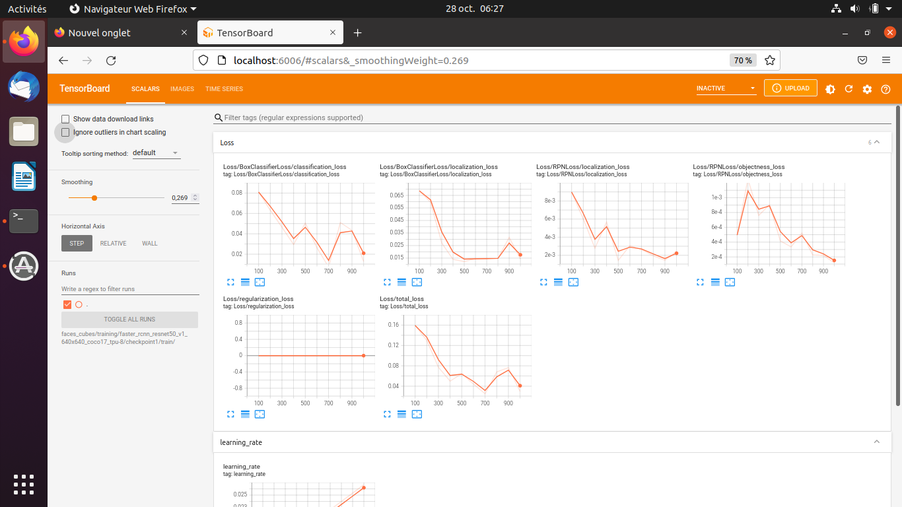

---
    Targeted learning outcomes:
    - how to customize the configuration file of a TOD pre-trained neural network.
    - how to continue the supervised training of a pre-trained TOD neural network.
    - how to export the weights of the re-trained neural network to an operational format.

    Activity type      : ⚙️ [task]
    Expected duration  : 1 to 2 hours or more (depends on your computer CPU & RAM).
---

## Activity plan 

The re-train of a TOD pre-trained network involves 3 steps:

1. Customize the configuration file of the neural network to set all the parameters of the supervised training.
2. Run the supervised re-training.
3. Export the weights of the re-trained neural network to an operational format.

## Preliminaries

To simplify the shell commands that you will have to write you can define two environment variables:
* `PTN` (_Pre-Trained Network_) :  gives the name of the choosen pre-trained TOD neural network, also designated as `<pre-trained_net>`
* `PTN_DIR` : gives the path of the directory `<project>/training/<pre-trained_net>`

### Example

Fot the project `cube_faces` and the network `faster_rcnn_resnet50_v1_640x640_coco17_tpu-8` :

```bash
user@host $ export PTN=faster_rcnn_resnet50_v1_640x640_coco17_tpu-8
user@host $ echo $PTN      # to check...
faster_rcnn_resnet50_v1_640x640_coco17_tpu-8

user@host $ export PTN_DIR=cube_faces/training/$PTN
user@host $ echo $PTN_DIR   # to check...
cube_faces/training/faster_rcnn_resnet50_v1_640x640_coco17_tpu-8
```

## 1. Modify the configuration file

The configuration file `pipeline.config` must be copied from the directory `pre-trained/<pre-trained_net>` to the target directory `<project>/training/<pre-trained_net>`.

Using the environment variables set previously:
```bash
# From within tod_tf2
user@host $ cp pre-trained/$PTN/pipeline.config $PTN_DIR
```


* Then you must edit the file `<project>/training/<pre-trained_net>/pipeline.configure` to  customize some important parameters.

### Example

With the project `cube_faces` and the pre-trained network `faster_rcnn_resnet50_v1_640x640_coco17_tpu-8`:

|Line | Parameter name              | Description                                                            | Initial value  | Value |  Comment               |
|:--|:------------------------------|:-----------------------------------------------------------------------|:----------------:|:---------------:|:--------------------------------|
|010| `num_classes`                 | number of objects classes                                              | 90               | 2               | the two classe `one` et `two` |
|077| `max_detections_per_class`    | maximum number of detections per classe                                | 100              | 4               | 4 cubes maximum per image | 
|078| `max_total_detections`        | total maximum number of detections                                     | 100              | 4               | 4 `one` or `two` on the 4 cubes | 
|093| `batch_size`                  | number of images per batch to learn before updating the network weights| 64               | 1, 2...       | a high value can result in RAM overhead. To be adjusted according to the amount of your computer RAM|
|097| `num_steps`                   | Max number of iterations steps                                         | 25000            | 1000           | a too great value can result in very high computing times and also an over-fiitting risk| 
|113| `fine_tune_checkpoint`        | path of the output files to save the network weights                   | 'PATH_TO_BE_CONFIGURED' | 'pre-trained/faster_rcnn_resnet50_v1_640x640_coco17_tpu-8/checkpoint/ckpt-0' | the path ends with `/ckpt-0`which is the prefix of the files in the directory `.../checkpoint/` |
|114| `fine_tune_checkpoint_type`   | Which algorithm to use: "classification" or "detection"                | 'classification' | 'detection'  | you to train the TOD pre-trained network to Object Detction|
|120| `max_number_of_boxes`         | Maximum number of bounding boxes in every image                        | 100               | 4               | the 4 bounding boxes around the visible face of the 4 cubes|
|122| `use_bfloat16`                | `true` for TPA architectures, `false` for CPU                          | true              | false           |  depnds on your computer: for a laptop it is a CPU|
|126| `label_map_path`              | path of the label file                                                 | 'PATH_TO_BE_CONFIGURED' | 'cube_faces/training/label_map.pbtxt' | used for training stage |
|128| `input_path`                  | path of the input file for training used for evaluation stage          | 'PATH_TO_BE_CONFIGURED' | 'cube_faces/training/train.record'    | used for training stage |
|139| `label_map_path`              | path of the label file                                                 | 'PATH_TO_BE_CONFIGURED' | 'cube_faces/training/label_map.pbtxt' | used for evaluation stage|
|128| `input_path`                  | path of the input file for training used for evaluation stage          | 'PATH_TO_BE_CONFIGURED' | 'cube_faces/training/test.record"    | used for evaluation stage|


## 2 Launch the re-training

⚠️ It is important to verify carefully the content of the file `<project>/training/<pre-trained_net>/pipeline.configure` before lauching the training: une bonne pratique est de le faire vérifier par quelqu'un d'autre...

⚠️ Don't use values of `batch_size`>=2 unless your computer has a powerful CPU and at least 4 GB of RAM !

Copy the file `models/research/object_detection/model_main_tf2.py` in teh root directory `tod_tf2`:
```bash
# From within tod_tf2
(tf2) user@host $ cp models/research/object_detection/model_main_tf2.py .
```
Then launch the training:
```bash
# From within tod_tf2
(tf2) user@host $ python model_main_tf2.py --model_dir=$PTN_DIR/checkpoint1 --pipeline_config_path=$PTN_DIR/pipeline.config
```
The trained weights of the network are written in the directory `$PTN_DIR/checkpoint1` : if you launch again another training you can use `checkpoint2`, `checkpoint3`... to separate the results for successive trials.

The _tensorflow_ modile is quite verbose...<br>
After a "certain time" (which can be quite long, several tens of minutes with an ordinary CPU), the logs are displayed on the screen, in particular the lines which start with `INFO` showing that the training is in progress:

	...
	...
    INFO:tensorflow:Step 100 per-step time 18.002s
    I1028 00:58:19.951609 140629825712512 model_lib_v2.py:698] Step 100 per-step time 18.002s
    INFO:tensorflow:{'Loss/BoxClassifierLoss/classification_loss': 0.08096047,
     'Loss/BoxClassifierLoss/localization_loss': 0.06868178,
     'Loss/RPNLoss/localization_loss': 0.008976435,
     'Loss/RPNLoss/objectness_loss': 0.000495165,
     'Loss/regularization_loss': 0.0,
     'Loss/total_loss': 0.15911385,
     'learning_rate': 0.014666351}
    I1028 00:58:20.032363 140629825712512 model_lib_v2.py:701] {'Loss/BoxClassifierLoss/classification_loss': 0.08096047,
     'Loss/BoxClassifierLoss/localization_loss': 0.06868178,
     'Loss/RPNLoss/localization_loss': 0.008976435,
     'Loss/RPNLoss/objectness_loss': 0.000495165,
     'Loss/regularization_loss': 0.0,
     'Loss/total_loss': 0.15911385,
     'learning_rate': 0.014666351}
    ...
    ...
    ...
    INFO:tensorflow:Step 1000 per-step time 17.001s
    I1028 05:13:56.353814 140629825712512 model_lib_v2.py:698] Step 1000 per-step time 17.001s
    INFO:tensorflow:{'Loss/BoxClassifierLoss/classification_loss': 0.012904001,
     'Loss/BoxClassifierLoss/localization_loss': 0.014184773,
     'Loss/RPNLoss/localization_loss': 0.002441862,
     'Loss/RPNLoss/objectness_loss': 0.0001208472,
     'Loss/regularization_loss': 0.0,
     'Loss/total_loss': 0.029651484,
     'learning_rate': 0.0266665}
    I1028 05:13:56.354788 140629825712512 model_lib_v2.py:701] {'Loss/BoxClassifierLoss/classification_loss': 0.012904001,
     'Loss/BoxClassifierLoss/localization_loss': 0.014184773,
     'Loss/RPNLoss/localization_loss': 0.002441862,
     'Loss/RPNLoss/objectness_loss': 0.0001208472,
     'Loss/regularization_loss': 0.0,
     'Loss/total_loss': 0.029651484,
     'learning_rate': 0.0266665}

if the process stops suddenly with the message "Process stopped", do not hesitate to reduce the value of `batch_size` down to 2, or even 1 if necessary .... <br>
Even with a `batch_size` of 2, the Python process may require up to 2-3 GB of RAM on its own, which can put some laptops in difficulty ...

In the example above, we see logs every 100 steps, with approximately 17 seconds per step, or approximately 29 minutes between each display and approximately 5 hours of calculation for the 1000 steps. This calculation is done with `batch_size=1` on a rather "small CPU" (AMD A9-9420 RADEON R5 at 3 GHz).

Once the training is finished you can analyze the training statistics with `tensorboard` by typing the command:
```bash
# From within tod_tf2
(tf2) user@host:~ $ tensorboard --logdir=$PTN_DIR/checkpoint1/train
Serving TensorBoard on localhost; to expose to the network, use a proxy or pass --bind_all
TensorBoard 2.4.0 at http://localhost:6006/ (Press CTRL+C to quit)
...
```
`tensorboard` launches a local HTTP server on your computer and you can load the page with a web brower to see the performance plots by hiting CTRL + left_clic while the mouse cursor is positionned over `http://localhost:6006/` :



_tensorboard_ lets you observe the evolution over steps of the main statistics of the learning process.

## 3. Export the weights of the trained network

Now copy the file `exporter_main_v2.py` from the directory `models/reasearch/object_detection/` to the root directory `tod_tf2`. 
When you run this script, it extracts the trained __inference graph__ and saves it as `saved_model.pb` (this file can be used later to load the trained network):
```bash
# From within tod_tf2
(tf2) user@host $ cp models/research/object_detection/exporter_main_v2.py .
(tf2) user@host $ python exporter_main_v2.py --input_type image_tensor --pipeline_config_path $PTN_DIR/pipeline.config --trained_checkpoint_dir $PTN_DIR/checkpoint1 --output_directory $PTN_DIR/saved_model1
...some stuff....
```
The Python script creates the file `saved_model.pb` under the directory `$PTN_DIR/saved_model1/saved_model`:

```bash
# From within tod_tf2
(tf2) user@host:~ $ tree cube_faces/training/
cube_faces/training/
├── faster_rcnn_resnet50_v1_640x640_coco17_tpu-8
│   ├── checkpoint1
│   │   ├── checkpoint
│   │   ├── ckpt-1.data-00000-of-00001
│   │   ├── ckpt-1.index
│   │   ├── ckpt-2.data-00000-of-00001
│   │   ├── ckpt-2.index
│   │   └── train
│   │       └── events.out.tfevents.1635373645.pikatchou.30316.0.v2
│   ├── pipeline.config
│   └── saved_model1
│       ├── checkpoint
│       │   ├── checkpoint
│       │   ├── ckpt-0.data-00000-of-00001
│       │   └── ckpt-0.index
│       ├── pipeline.config
│       └── saved_model
│           ├── assets
│           ├── saved_model.pb
│           └── variables
│               ├── variables.data-00000-of-00001
│               └── variables.index
├── label_map.pbtxt
├── test.record
└── train.record

```

