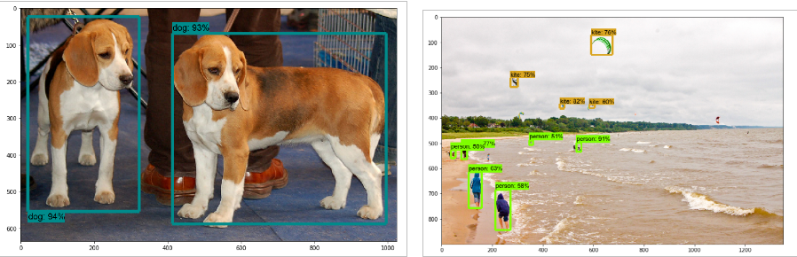
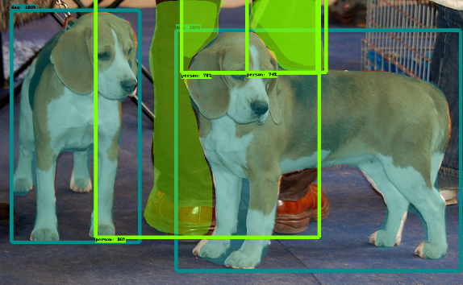

---
Targeted learning outcomes:

     - how to initialize your workspace for object detection using the TOD API
     - how to install the TOD API and the required components

     Activity type: 🛠️ [task]
     Expected duration: 60 minutes (depends on internet speed and your computer's CPU & RAM resources).
---

## Prerequisites

* Undergraduate and more
* Know how to use basic Linux shell commands to use and modify the file tree.
* Good understanding of Python and multi-dimensional arrays of numpy (`ndarray`).
* First experience of neural networks (dense and convolutional) desirable.

## Activity plan

The installation of the TOD API involves 6 steps:
1. Create and initialize the _root directory_
2. Download and install the `tensorflow/models` repository
3. Install the `protobuf` tools
4. Install the COCO API
5. Install the `object_detection` package
6. Test the installation of the TOD API

In the following the _prompt_ of the terminal will be noted `(tf2) user@host $`: the prefix `(tf2)` is there to remind you that all the work is done in the __Virtual Environment Python tf2__ that you will have created beforehand (see the learning path prerequisite).

### 1. Create and initialize the root directory

The first step is to create the working directory `tod_tf2`, which will be the __root directory of the project__ in which all the files will be created, and to make it your working directory:
```bash
(tf2) user@host $ cd <some where>   # choose a directory where to create `tod_tf2`, for example: "cd ~/catkins_ws"
(tf2) user@host $ mkdir tod_tf2
(tf2) user@host $ cd tod_tf2        # tod_tf2 is now your working directory
```
📥 Then clone the `cjlux/tod_tf2_tools.git` github repository and copy all the `*.py` and `*.ipynb` files from `tod_tf2_tools` to `tod_tf2`: 
```bash
# From tod_tf2/
(tf2) user@host $ git clone https://github.com/cjlux/tod_tf2_tools.git
(tf2) user@host $ cp tod_tf2_tools/*.py .
(tf2) user@host $ cp tod_tf2_tools/*.ipynb .
```

### 2. Download and install the `tensorflow/models` repository

📥 Download the ZIP file from the `tensorflow/models` github repository (~ 35 MB) in the `/tmp` directory then unzip its content in the `tod_tf2` folder:
```bash
(tf2) user@host $ wget https://github.com/tensorflow/models/archive/refs/heads/master.zip -P /tmp
(tf2) user@host $ cd ~/catkin_ws/tod_tf2       # adapt as needed if the path to tod_tf2 is different
(tf2) user@host $ unzip /tmp/master.zip        # unzip the archive file in the directory tod_tf2
(tf2) user@host $ mv models-master/ models     # rename 'models-master' into 'models'
(tf2) user@host $ rm /tmp/master.zip           # remove the zip file in /tmp (no more useful)
```

The _TOD API_ lies in the `models/research/object_detection` directory:
```bash	
(tf2) user@host $ tree -d models -L 2   # 'models' tree on 2 levels only
models
├── community
├── official
│   ...
├── orbit
│   ...
└── research
    ...    
    ├── object_detection
    ...
```	

📥 Complete your installation with some Python packages useful for working with the TOD API:

```bash
(tf2) user@host $ conda install cython contextlib2 pillow lxml
(tf2) user@host $ pip install labelimg rospkg
```
Update the environment variable `PYTHONPATH` by adding these two lines at the end of your  `~/.bashrc` file:

```bash
export TOD_ROOT="<absolute path of your tod_tf2 directory>"
export PYTHONPATH=$TOD_ROOT/models:$TOD_ROOT/models/research:$PYTHONPATH
```
replace `"<absolute path of your tod_tf2 directory>"` with the absolute path of the `tod_tf2` directory
on your computer (maybe something like `/home/<logname>/catkin_ws/todtf2`).

* Launch a new terminal to activate the new shell environment: all the following will be done in this new terminal.

* ⚠️ don't forget to activate the `tf2` PVE in this new terminal:

```bash
user@host $ conda activate tf2
(tf2) user@host $
```

### 3. Install the `protobuf` tools

The native TOD API uses `*.proto` files for configuring models and storing training parameters.
These files must be translated into `*.py` files in order for the Python API to function properly:

* First install the debian `protobuf-compile` package which gives access to the `protoc` command:
``` bash
(tf2) user@host $ sudo apt install protobuf-compiler
```

* You can then position yourself in the `tod_tf2/models/research` folder and type:
``` bash
# From tod_tf2
(tf2) user@host $ cd models/research/
(tf2) user@host $ protoc object_detection/protos/*.proto --python_out=.
```
This command works silently.


### 4. Install the COCO API

COCO (Common Objects in Context) is a database intended to supply algorithms for object detection, segmentation
(see [cocodataset.org](https://cocodataset.org) for tutorials, publications...).

📥 To install the COCO Python API, clone the `cocoapi.git` site (~ 15 MB) in the `/tmp` directory then type the `make` command in the `cocoapi/PythonAPI`  folder. When done, copy the folder `pycococtools` in your `.../models/research/` directory:
```bash
(tf2) user@host $ cd /tmp
(tf2) user@host $ git clone  https://github.com/cocodataset/cocoapi.git
(tf2) user@host $ cd cocoapi/PythonAPI/
(tf2) user@host $ make
(tf2) user@host $ cp -r pycocotools/  "<absolute path of your tod_tf2 directory>"/models/research/
```
replace `"<absolute path of your tod_tf2 directory>"`  by the absolute path of the `tod_tf2` directory on your machine 
(for example `~/catkins_ws/tod_tf2`).

### 5. Install the `object_detection` module

To finish the installation, go to the `models/research/` directory and type:
```bash
(tf2) user@host $ cd ~/catkin_ws/tod_tf2       # adapt as needed if the path to tod_tf2 is different
(tf2) user@host $ cd models/research/
# From tod_tf2/models/research/
(tf2) user@host $ cp object_detection/packages/tf2/setup.py .
(tf2) user@host $ python setup.py build
(tf2) user@host $ pip install .
```

### 6. Test the installation of the TOD API

To test your TOD API installation, go to the `models/research/` folder and type:
```bash	
# From within tod_tf2/models/research/
(tf2) user@host $ python object_detection/builders/model_builder_tf2_test.py
```
The program runs a whole series of tests which can take "some time ..." and must end with an **OK** without giving an error:

	...
	[       OK ] ModelBuilderTF2Test.test_invalid_second_stage_batch_size
    [ RUN      ] ModelBuilderTF2Test.test_session
    [  SKIPPED ] ModelBuilderTF2Test.test_session
    [ RUN      ] ModelBuilderTF2Test.test_unknown_faster_rcnn_feature_extractor
    INFO:tensorflow:time(__main__.ModelBuilderTF2Test.test_unknown_faster_rcnn_feature_extractor): 0.0s
    I1026 22:28:48.083127 140638063505792 test_util.py:2188] time(__main__.ModelBuilderTF2Test.test_unknown_faster_rcnn_feature_extractor): 0.0s
    [       OK ] ModelBuilderTF2Test.test_unknown_faster_rcnn_feature_extractor
    [ RUN      ] ModelBuilderTF2Test.test_unknown_meta_architecture
    INFO:tensorflow:time(__main__.ModelBuilderTF2Test.test_unknown_meta_architecture): 0.0s
    I1026 22:28:48.083944 140638063505792 test_util.py:2188] time(__main__.ModelBuilderTF2Test.test_unknown_meta_architecture): 0.0s
    [       OK ] ModelBuilderTF2Test.test_unknown_meta_architecture
    [ RUN      ] ModelBuilderTF2Test.test_unknown_ssd_feature_extractor
    INFO:tensorflow:time(__main__.ModelBuilderTF2Test.test_unknown_ssd_feature_extractor): 0.0s
    I1026 22:28:48.085861 140638063505792 test_util.py:2188] time(__main__.ModelBuilderTF2Test.test_unknown_ssd_feature_extractor): 0.0s
    [       OK ] ModelBuilderTF2Test.test_unknown_ssd_feature_extractor
    ----------------------------------------------------------------------
    Ran 24 tests in 58.669s

    OK (skipped=1)

__The absence of an error message validates the installation of the TOD API on your computer.__

## Complements ...

Finally, you can verify the installation of the  TOD API using the IPython notebook `object_detection_tutorial.ipynb` present in the` tod_tf2` folder.<br>
(note: this is a copy of the original notebook `tod_tf2/models/research/object_detection/colab_tutorials/object_detection_tutorial.ipynb` in which we removed the installation cells of the TOD API and some other cells which may generate errors...).

* ⚠️ Before running the notebook cells, you must correct an error in the file `.../tod_tf2/models/research/object_detection/utils/ops.py` line 850:
replace `tf.uint8` with` tf.uint8.as_numpy_dtype`

* In the `tod_tf2` folder run the `jupyter notebook` command and load the `object_detection_tutorial.ipynb` notebook.
* Run the cells one by one, you shouldn't get any mistakes:

    * The "__Detection__" part (runs for few seconds to several minutes depending on your CPU) uses the pre-trained network `ssd_mobilenet_v1_coco_2017_11_17` to detect objects in two test images: <br>

   
    * The "__Instance Segmentation__" part is more resource intensive (up to 8 GB of RAM) and can run for several tens of minutes on a CPU; it uses the pre-trained `mask_rcnn_inception_resnet_v2_atrous_coco_2018_01_28` network to detect objects and their masks: <br>
(_⚠️ do not launch this cell if your machine does not have at least 8 GB of RAM and a powerful CPU_): <br>


