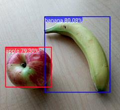
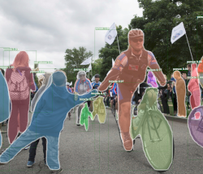
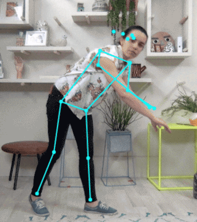

Artificial Intelligence has developed very strongly for more than 10 years with a
acceleration in the last 5 years. The main fields adressed by AI are:

# A - Visual perception: classification of images, description of scenes, recognition of objects, gestures...

## Classification of images

 

Image classification attempts to analyze an __entire image as a whole__ : the goal is to classify the image by assigning it to a specific label.

Image Classification refers to images in which only one object appears and is analyzed. 

In contrast, object detection involves both classification and localization tasks, and is used to analyze more realistic cases in which many objects may appear in an image.

A large choice of image databases freely available on the Internet makes it possible to train and test neural networks for image classification (see for example [paperswithcode](https://paperswithcode.com/datasets))

Some application of image classification:

- 

## Detection of objects in images

(Image credit: [tensorflow](https://www.tensorflow.org/lite/examples/object_detection/overview))

__Object detection__ attempts to detect objects of a certain class within an image. Each detected object has at least 3 attributes:

- a label which identifies the class of the object
- a bounding box which allow the localization of the object in the image
- a percentage of confidence which gives the quality of the detection.

Many algorithms exist with different strengths / weaknesses:

  - one-stage algorithms: prioritize inference speed (YOLO, SSD, RetinaNet ...)
  - Two-stage algorithms: prioritize detection accuracy, like "Faster R-CNN", "Mask R-CNN" and "Cascade R-CNN".

Some application of object detection:
- Robotic vision
- Face Recognition on Social Networks  

## Image Segmentation

(Image credit: [Detectron](https://github.com/facebookresearch/detectron))

__Image segmentation__ consist in clustering parts of an image together which belong to the same object class. 

It is a form of pixel-level prediction because each pixel in an image is classified according to a category: the task of image segmentation is to train a neural network to output a pixel-wise mask of the image.

A large choice of image databases freely available on the Internet makes it possible to train and test neural networks for image segmentation (see for example [paperswithcodes](https://paperswithcode.com/datasets?task=semantic-segmentation))

Some application of image segmentation:
 
- tumor segmentation  (example: [www.nature.com report](https://www.nature.com/articles/s41598-021-90428-8))
- 3D Semantic Segmentation (example: [recognition of common objects in 3D point cloud](https://paperswithcode.com/paper/pointnet-deep-learning-on-point-sets-for-3d))
- Panoptic Segmentation (example: [tutorial](https://kharshit.github.io/blog/2019/10/18/introduction-to-panoptic-segmentation-tutorial))
- Elimination of background in image or video  (example: [Remove any Background Without Green Screens](https://www.louisbouchard.ai/remove-background/), paper: ["Is a Green Screen Really Necessary for Real-Time Human Matting?"](https://arxiv.org/pdf/2011.11961.pdf))

## Pose estimation

(Image credit: [TesnsorFlox](https://www.tensorflow.org/lite/examples/pose_estimation/overview))

Pose estimation is the task of using an neural network to estimate the pose of a person from an image or a video by estimating the spatial locations of key body joints (keypoints)

      

## Image Generation

## Image Denoising

# B - Understanding of written or spoken natural language: machine translation, production
automatic press articles, sentiment analysis.

# C - Automatic analysis by "understanding" a query and returning relevant results
even if this result does not contain the words of the query.

# D - Autonomous decision-making to beat humans at chess or Go. 

Apart from technological aspects, AI also poses new questions in terms of __ethics__ and
__risk__: dependence on automation, misuse or error linked to "contaminated" data, impact on
privacy, etc. 

# Current trends in learning techniques 

- Generative adversarial networks (GAN)

- Lean and augmented data learning

- Probabilistic programming

- Automated machine learning (AutoML)

- Digital Twin

# Useful links

https://deeplearning.quora.com/
