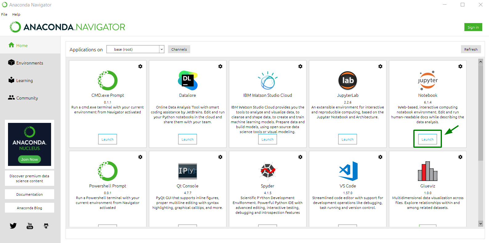
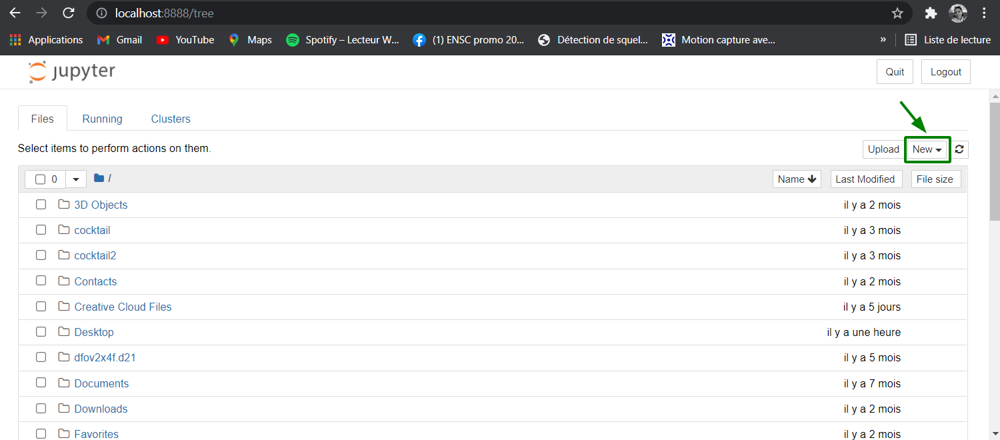

| Classe de capsule  | &emsp;durée recommandée |
|:-------------------|:------------------|
| Info  &emsp;  ℹ️  |&emsp; 10 min      |

## 🎒 Prérequis
- Lycée et +

## 🎓 Acquis d'apprentissage visés 
A l'issue de cette activité, l'apprenant saura : 
* ouvrir un notebook jupyter  
* créer un notebook  
* mettre en forme un notebook   
* executer un notebook   
* arreter un notebook   

Jupyter est une application web utilisée pour programmer dans plus de 40 langages de programmation, dont Python, Julia, Ruby, R, ou encore Scala2. Jupyter permet de réaliser des calepins ou notebooks, c'est-à-dire des programmes contenant à la fois du texte en markdown et du code en Python. 

Si tu veux utilise Jupyter en local sur ton ordinateur tu dois :  
📥 Installer soit :
- Anaconda :  [ici](https://www.anaconda.com/products/individual)  
- MiniConda : [ici](https://docs.conda.io/en/latest/miniconda.html) puis installer Jupyter : [ici](https://jupyter.org/install) ⚠️ installation avec pip ou conda et mamba 

**Anaconda** est une distribution scientifique libre et open source de Python : c’est-à-dire qu’en installant Anaconda, vous installerez Python, Spyder, Jupyter Notebook et des dizaines de packages scientifiques.
**MiniConda** est une mini version d'Anaconda qui ne comprend que conda et ses dépendances.

## 1. Ouvrir Jupyter Notebook

Pour ouvrir Jupyter Notebook deux options : 
* Ouvrir Anaconda Navigator > *launch Jupyter*

* Ouvrir via une fenêtre de commande et taper `jupyter notebook`

## 2. Créer un notebook 
Une fenêtre Jupyter va s'ourvir dans votre navigateur   

Pour créer un nouveau notebook clique sur *Nouveau* > *Python 3*.

## 3. Mettre en forme un notebook 

Les notebook Jupyter peuvent contenir des zones de textes en markdown : 
Pour mettre une cellule au format markdown, selectionner *Markdown* dans la liste déroulante

* Pour ajouter une cellule cliquer sur le bouton +. 
* Pour suprimer une cellule cliquer sur le bouton poubelle. 
* Pour couper une cellule cliquer sur le ciseaux. 
* Pour coller une cellule cliquer sur les 2 feuilles. 
* Pour monter ou descendre une cellule cliquer sur les fleches. 

Pour trouver d'autres commandes tu peux regarder dans l'onglet *Cellule* dans le menu. 

## 4. Exécuter un notebook 

Pour exécuter un notebook manuellement cellule par cellule : 
* en passant à la cellule suivante : shift + entrer ou cliquer sur le bouton *Exécuter* 
* en restant sur la cellule actuelle : controle + entrer 

## 5. Arrêter un notebook 

Pour arreter un notebook deux options : 
* Dans l'onglet *Actifs* dans l'accueil : cliquer sur le bouton rouge *Arrêter* a droite du nom du notebook 

* Dans le notebook : dans le menu cliquer sur *Kernel* --> *Shutdown*

