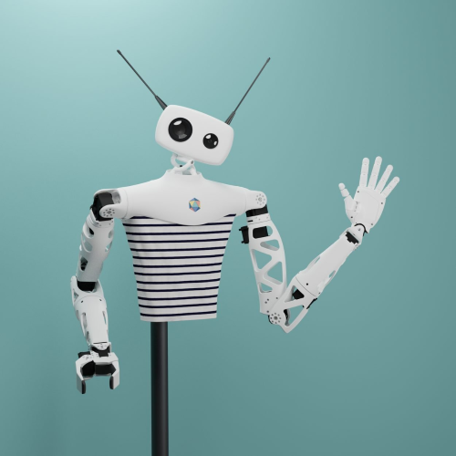
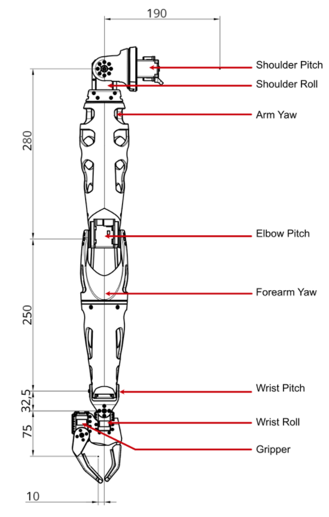
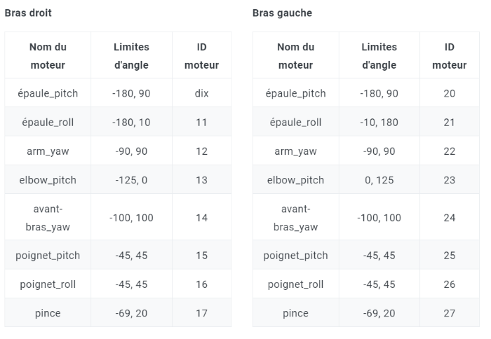

| Classe de capsule  | &emsp;durée recommandée |
|:-------------------|:------------------|
| Info  &emsp;  ℹ️  |&emsp; 5 min      |

## 🎒 Prérequis

- Lycée et +

## 🎓 Acquis d'apprentissage visés 

## 📗 Documentation

Les informations de cette capsule sont tirées des liens suivants :
* [Site Pollen Robotics](https://www.pollen-robotics.com/reachy/)  
* [Doc technique](https://pollen-robotics.github.io/reachy-2019-docs/docs/technical-specifications/)  

## 🤖 Le robot Reachy 

Reachy est une plate-forme humanoïde open-source expressive programmable avec Python. Il est particulièrement doué pour interagir avec les gens et manipuler des objets.
Que vous soyez un chercheur, un universitaire, un professionnel de la création ou de l'innovation, Reachy vous permettra d'apprendre, explorer et développer l'IA et la robotique.

## 1. Spécifications techniques générales

Poids total: 7 kg  
Alimentation: DC 12 V / 15 A  
Température: 0-45 ° C  
Interfaces: Ethernet / Wifi / USB 3 / HDMi  

## 2. Spécifications du bras de Reachy
**Répartition des poids :**  
Bras global: 1670g  
Épaule: 240g  
Bras supérieur: 610g  
Avant-bras: 590g  
Pince: 230g  

**Charge utile maximale:** 500g

Le bras de Reachy offre 7 degrés de mouvement + 1 pour la pince. 

## 3. Spécifications de la tête de Reachy 

La tête de Reachy comporte deux caméras: une pour observer son environnement et une autre pour se concentrer sur la tâche de manipulation. La tête est animée par Orbita, une technologie développée par l'équipe R&D de Pollen Robotics. Cet actionneur à rotule permet un mouvement dynamique et multidirectionnel. De plus, avec des antennes animées controlables, Reachy peut transmettre de nombreuses émotions à son public.

Carte de développement Coral G950-01456-01

### 3.1 Appareils photo
2 caméras Raspberry Pi associées à 2 lentilles optiques (une macro et une grand angle). Voir les détails sur le module de caméra Raspberry Pi [ici.](https://www.raspberrypi.org/documentation/hardware/camera/)

### 3.2 Articulation du cou Orbita

  

Actionneur à rotule composé d'un mécanisme parallèle motorisé par 3 moteurs DC Maxon. Le contrôle de chaque moteur se fait avec un codeur magnétique Pololu et un module moteur LUOS DC.

### 3.3 Antennes
Les antennes sont animées par un moteur Dynamixel et sont amovibles. Un système de 3 aimants (2 sud et 1 nord) permet de fixer les antennes sur l'axe de rotation.
