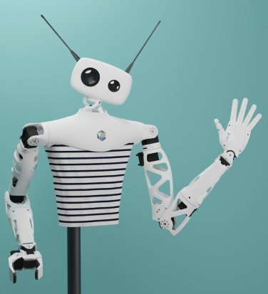
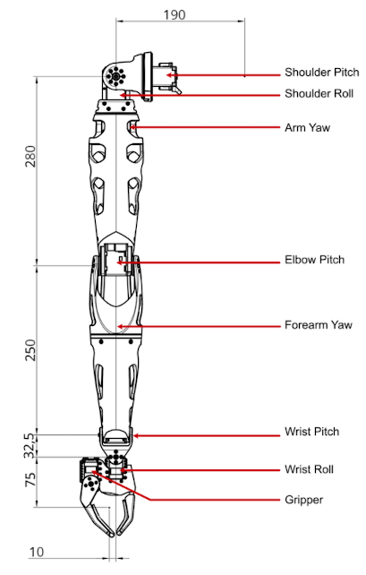

| Classe de capsule  | &emsp;durée recommandée |
|:-------------------|:------------------|
| Info  &emsp;  ℹ️  |&emsp; 5 min      |

## 🎒 Prérequis

- Lycée et +

## 📗 Ressources

Les informations de cette capsule sont tirées des liens :
* [Site Pollen Robotics](https://www.pollen-robotics.com/reachy/)  (en anglais)
* [Reachy 2021 Documentation](https://docs.pollen-robotics.com/) (en anglais)

## 🤖 Le robot Reachy 

Reachy est une plate-forme humanoïde **open-source** (software & hardware)  expressive programmable avec le langage Python. 
Il est particulièrement doué pour interagir avec les gens et manipuler des objets.
Que tu sois chercheur, étudiant, professionnel de la création ou de l'innovation, Reachy te permettra d'apprendre, explorer et développer l'IA et la robotique.

Reachy est utilisé à l'ENSAM comme un des supports aux activités robotiques et IA.

## 1. Principales caractérisques

Poids total : 7 kg 
Alimentation : DC 12 V / 15 A 
Température : 0-45 ° C 
Interfaces : Ethernet (RJ45) / Wifi / USB 3 / HDMi 

## 2. Caractérisques du bras

**Répartition des masses** :

Bras global |&emsp; Épaule |&emsp; Bras supérieur |&emsp; Avant-bras |&emsp; Pince
:--         | :--          |  :--                 |  :--             | :--
1670g       |&emsp; 240g   |&emsp; 610g           |&emsp; 590g       |&emsp; 230g 

**Charge utile maximale** : 500g

Le bras de Reachy possède 7 degrés de liberté + 1 pour la pince. 

 

## 3. Caractérisques de la tête

La tête est animée par une liaison _Orbita_, une technologie développée par l'équipe R&D de Pollen Robotics. Cet actionneur à rotule permet un mouvement dynamique et multidirectionnel. 
De plus, avec des antennes animées contrôlables, Reachy peut transmettre de nombreuses émotions à son public.

<iframe src=https://www.youtube.com/embed/X9dgsLX_u9I style=position:absolute;top:0;left:0;width:50%;height:50%;border:0 allowfullscreen title="YouTube Video">
</iframe>

// Carte de développement Coral G950-01456-01

### Caméras

La tête de Reachy comporte un jeu de double caméras 1080p @ 30fps avec zoom motorisé (FOV 65 ° à 125 °), associée à 2 objectifs optiques deux caméras : 
* la caméra grand angle est utile pour observer l'environnement,
* la deuxème caméra est utilisée pour l'observation des tâches de manipulation. 

### Articulation du cou : liaison Orbita

La liaison **Orbita**  (liaison rotule) repose sur un mécanisme parallèle motorisé par 3 moteurs DC Maxon. Le contrôle de chaque moteur se fait avec un codeur magnétique Pololu et un module moteur LUOS DC.

### Antennes
Les antennes sont animées par un moteur Dynamixel et sont amovibles. Un système de 3 aimants (2 sud et 1 nord) permet de fixer les antennes sur l'axe de rotation.
