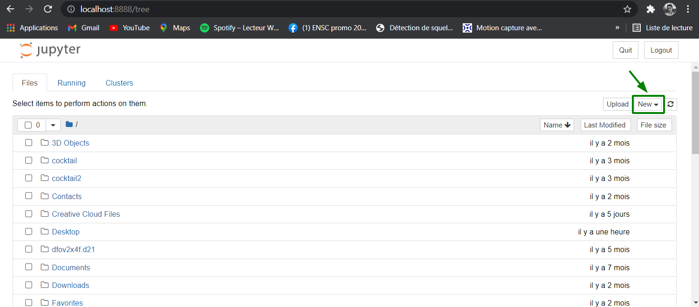
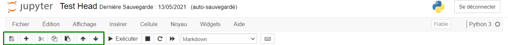
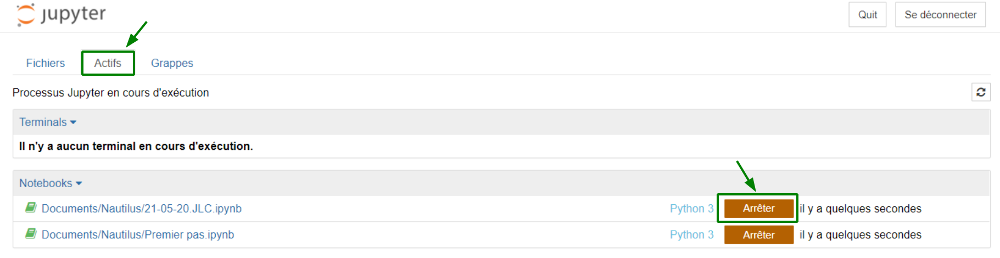

| Classe de capsule  | &emsp;durée recommandée |
|:-------------------|:------------------|
| Info  &emsp;  ℹ️  |&emsp; 10 min      |

## 🎒 Prérequis
- Lycée et +

## 🎓 Dans cette capsule : 

Cette capsule rappelle comment :

* ouvrir un notebook jupyter
* créer un notebook
* mettre en forme un notebook
* executer un notebook
* arreter un notebook.

Jupyter est une application web utilisée pour programmer dans plus de 40 langages de programmation, dont Python, Julia, Ruby, R, ou encore Scala2. Jupyter permet de réaliser des calepins ou notebooks, qui sont des fichiers manipulés dans un navigateur web standrad (firefox, edge, safari...) contenant à la fois du code Python et du texte mis en forme avec des balises *markdown*.

📥  Pour utiliser Jupyter sur ton ordinateur tu dois installer **Python** : nous conseillons d'installer dans un premier temps [miniconda](https://docs.conda.io/en/latest/miniconda.html) puis [jupyter](https://jupyter.org/install).

**miniconda** est un installateur muti-plateforme (GNU/Linux, MacOS & Windows) qui propose une version minimaliste de Python permettant d'installer des modules à la demande à l'aide des commandes *conda* ou *pip*.

Une fois miniconda installé, ouvre une console (fenêtre de commande Windows ou terminal MacOS & GNU/Linux) et tape la commande `conda install jupyter` ou `pip install jupyter`.

## 1. Ouvrir Jupyter Notebook

Avce **miniconda**  installé sur ton ordinateur, ouvre une console (fenêtre de commande Windows ou terminal MacOS & GNU/Linux) et tape la commande `jupyter notebook`

## 2. Créer un notebook 

Au lancement de jupyter sur ton ordinateur, le navigateur web va montrer la fenêtre d'accueil de jupyter 

Pour créer un nouveau notebook clique sur *Nouveau* > *Python 3*.

## 3. Mettre en forme un notebook 

Un notebook Jupyter peut contenir des cellules de texte mis en âge avec des balises *markdown* : 
Pour mettre une cellule au format markdown, selectionner *Markdown* dans la liste déroulante

* Pour **enregistrer** son notebook cliquer sur le bouton disquette. 
* Pour **ajouter** une cellule cliquer sur le bouton +. 
* Pour **suprimer** une cellule cliquer sur le bouton poubelle. 
* Pour **couper** une cellule cliquer sur le bouton ciseaux. 
* Pour **coller** une cellule cliquer sur le bouton avec les 2 feuilles. 
* Pour **monter ou descendre** une cellule cliquer sur le bouton avec les flèches. 

Beaucoup d'autres action sont proposées dans le menu *Cellule*...

## 4. Exécuter les cellules d'un notebook 

Pour exécuter un notebook manuellement cellule par cellule : 
* **en passant à la cellule suivante** : SHIFT + ENTRER dans la cellule courante, ou clic sur le bouton *Exécuter* 
* **en restant sur la cellule courante** : CTRL + ENTRER dans la cellule courante.

## 5. Arrêter un notebook 

Deux façons possibles pour arrêter l'interpréteur IPython associé à un notebook :

* Dans l'onglet *Actifs* dans l'accueil : cliquer sur le bouton *Arrêter* a droite du nom du notebook

* Dans le notebook : menu *Kernel* --> *Shutdown*

