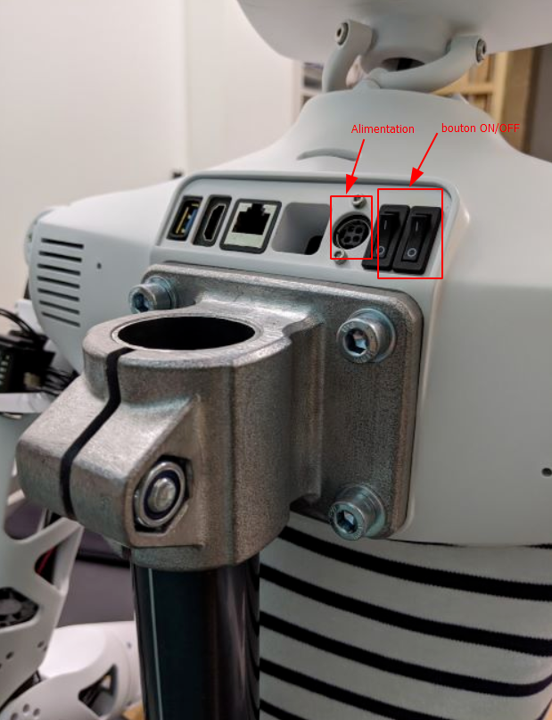

| Classe de capsule  | &emsp; durée recommandée |
|:-------------------|:------------------|
| Setup  &emsp;  🛠️  |&emsp; 10 min      |


## 📗 Ressources

Plus d'informations sur le robot et sa mise en route avec ces liens :  
- [Doc Pollen Robotics](https://pollen-robotics.github.io/reachy-2019-docs/docs/getting-started/)  (en anglais)
- [Prise en main Reachy](https://github.com/ta18/Reachy_Nautilus/blob/main/Prise%20en%20main.md)

  
### **Infos robot 🤖** : 
Nom du robot: **Nemo**  
Adresse IP : `192.168.4.1` 

## 1. Mise en route 

* Branche l'alimentation fournie sur la prise ronde au dos du robot.
* Appuie sur les 2 boutons ON/OFF pour mettre sous tension les moteurs et la Raspberry Pi.



## 2. Connexion au robot

Le robot Reachy est livré avec une carte Rasberry Pi qui permet de contrôler les moteurs et les périphériques qui l'équipent.<br>
Pour programmer le robot il suffit d'utiliser un navigateur WEB sur ton ordinateur (Linux, Mac ou Windows) : tu n'as aucun logiciel particulier à installer. 

### Connexion au wifi du robot 📶

1. Connecte-toi au **point d'acces** WiFi du robot (le SSID à la livraison est _Reachy-AP_ : nous l'avons renommé _Nemo_).
2. Entre l'adresse http://192.168.4.1:8888/ dans un navigateur web.
3. Appuye sur *se connecter* : tu obtiens la page d'accueil du service *Jupyter notebook* sans avoir besoin de donner un mot de passe.

**Si cela ne fonctionne pas...** 

✅ Vérifie que tu es bien connecté au hotspot Wifi du robot en tapant dans un terminal ou une fenêtre de commande :

```bash
ping 192.168.4.1
```
 s'il n'y a pas d'erreur c'est que tu es bien connecté au WiFi du robot.

✅ Fait attention a toujours bien rester connecté au hotspot WiFi _Nemo_. 

Et voilà tu es connecté au robot Reachy, bravo ! 🎉
