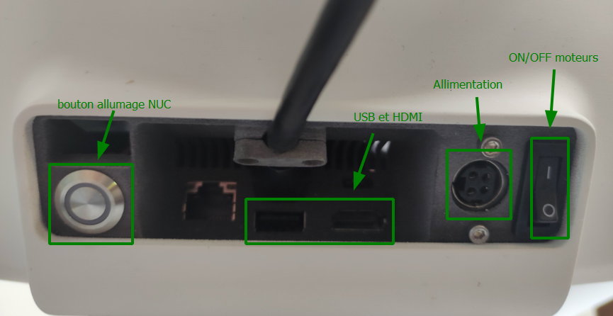

| Classe de capsule  | &emsp; durée recommandée |
|:-------------------|:------------------|
| Setup  &emsp;  🛠️  |&emsp; 10 min      |


## 📗 Ressources

Plus d'informations sur le robot et sa mise en route avec ces liens :
- [Doc Pollen Robotics](https://www.pollen-robotics.com/reachy/)  (en anglais)
- [Prise en main Reachy](https://github.com/ta18/Reachy_Nautilus/blob/main/Prise%20en%20main.md)

Matériel nécessaire : 
- Hub USB 
- Ecran PC
- Câble HDMI
- Clavier 
- Souris 

Tu vas travailler sur Reachy avec un écran HDMI, un clavier et une souris connectés sur le robot.

## 1. Branchements et mise en route 



1. Branche l'alimentation 12 V sur la prise ronde au dos du robot.
2. Branche l'écran HDMI sur le robot.
3. Branche le Hub USB au robot pour connecter le clavier et la souris.
4. Appuie sur le bouton poussoir pour mettre sous tension le mini ordinateur NUC qui équipe le robot, puis bascule l'interrupteur ON/OFF sur la position `1` pour mettre sous tension les moteurs.
5. Allume l'écran HDMI. 

## 2. Travailler avec le robot

Le robot Reachy est équipé d'un mini-ordinateur NUC Intel qui permet de contrôler les moteurs et les périphériques qui l'équipent.
Tu vas travailler directement sur le robot, c'est-à-dire sur l'ordinateur NUC du robot. 

Une fois les étapes de mise en route effectuées, il te faut entrer le mot de passe de la session reachy. Mot de passe session : *reachy*.<br>
Une fois le mot de passe rentré, tu vas te retrouver sur le bureau graphique Linux Ubuntu de robot : 
 

Pour programmer le robot il faut lancer Jupyter Notebook en tapant dans un terminal :
```bash
cd ~/Reachy_Nautilus
jupyter notebook 
```

Et voilà tu es prêt à commencer avec le robot Reachy ! 🎉

[next: Premiers pas avec Reachy](../firststep)
