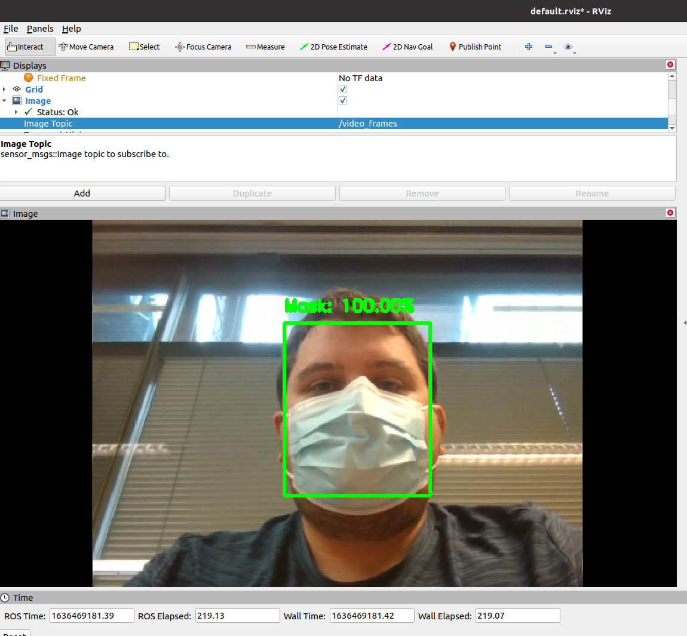

Dans cette section tu vas appliquer les précédents acquis de la partie Vision, via une application qui permet de détecter si on porte ou pas le masque. On interfacera cette application avec ROS. 

## 1. Prérequis

* Maitriser les sous-parties précédentes de la section Vision, notamment avoir fait toute la partie sur la détection d'objet.
* Avoir fait l'introduction à ROS (au moins l'intégration de ROS dans des algorithmes de vision (ex: partie OpenCV))


## 2. Télécharger le projet

Commençons par chercher le projet et le placer dans votre espace de travail

  ```bash	
  $ git clone https://github.com/v-iori/object_detection_eros4pro.git
  ```

Dans le dossier 'dataset' se situe la banque d'image qui nous servira à détecter les masques dans une image. Les dossiers contenant ces images, respectivement 'with_mask' et 'without_mask' sont compressés. On doit les décompresser.

  ```bash	
  $ cd object_detection_eros4pro/dataset/
  $ unzip with_mask.zip && unzip without_mask.zip
  ```

Pensez à renommer ces dossiers respectivement "with_mask" et "without_mask" s'ils ne sont pas nommés ainsi après la décompression.

Il faut maintenant créer un environnement virtuel avec tous les packages adéquats.


  ```bash	
  $ conda create -n Smile
  ```

Tapez "y" puis il nous faut activer l'environnement :

  ```bash	
  $ conda activate Smile
  ```

Enfin il nous faut installer dans cet environnement tous les packages nécessaires au fonctionnement du code. Tous les packages requis sont dans le fichier "requirements.txt" situé à la racine du projet. Placez-vous donc à la racine du projet puis : 

  ```bash	
  $ pip3 install requirements.txt
  ```

## 3. Entraîner le réseau de neurones

Il nous faut ensuite entrainer le réseau de neurones. Pour ceux qui ne peuvent pas faire cette étape il est toujours possible d'utiliser le réseau déjà entraîné. Regardons d'abord ce qu'il y a dans le fichier "train_mask_detector.py".

Après importation de toutes les librairies nécessaires au déroulement du code, cette première partie prend les images du dataset triés en deux parties : les personnes qui portent un masque et celles qui n'en portent pas. Notez l'utilisation de argparse. Pour donner un dataset précis, par exemple celui donné dans ce projet, il faut préciser le chemin du dossier contenant toutes les images utilisées pour l'entraînement. Pour lancer l'entraînement tapez la commande suivante :

  ```bash
  $ python3 train_mask_detector.py --dataset dataset
  ```

  ```python
  # import the necessary packages
  from tensorflow.keras.preprocessing.image import ImageDataGenerator
  from tensorflow.keras.applications import MobileNetV2
  from tensorflow.keras.layers import AveragePooling2D
  from tensorflow.keras.layers import Dropout
  from tensorflow.keras.layers import Flatten
  from tensorflow.keras.layers import Dense
  from tensorflow.keras.layers import Input
  from tensorflow.keras.models import Model
  from tensorflow.keras.optimizers import Adam
  from tensorflow.keras.applications.mobilenet_v2 import preprocess_input
  from tensorflow.keras.preprocessing.image import img_to_array
  from tensorflow.keras.preprocessing.image import load_img
  from tensorflow.keras.utils import to_categorical
  from sklearn.preprocessing import LabelBinarizer
  from sklearn.model_selection import train_test_split
  from sklearn.metrics import classification_report
  from imutils import paths
  import matplotlib.pyplot as plt
  import numpy as np
  import argparse
  import os

  # construct the argument parser and parse the arguments
  ap = argparse.ArgumentParser()
  ap.add_argument("-d", "--dataset", required=True,
    help="path to input dataset")
  ap.add_argument("-p", "--plot", type=str, default="plot.png",
    help="path to output loss/accuracy plot")
  ap.add_argument("-m", "--model", type=str,
    default="mask_detector.model",
    help="path to output face mask detector model")
  args = vars(ap.parse_args())
  ```

  Ces images sont ensuite labelisées, triées en deux catégories : les visages avec masque et les visages sans masque.

  ```python
  # grab the list of images in our dataset directory, then initialize
  # the list of data (i.e., images) and class images
  print("[INFO] loading images...")
  imagePaths = list(paths.list_images(args["dataset"]))
  data = []
  labels = []

  # loop over the image paths
  for imagePath in imagePaths:
    # extract the class label from the filename
    label = imagePath.split(os.path.sep)[-2]

    # load the input image (224x224) and preprocess it
    image = load_img(imagePath, target_size=(224, 224))
    image = img_to_array(image)
    image = preprocess_input(image)

    # update the data and labels lists, respectively
    data.append(image)
    labels.append(label)

  # convert the data and labels to NumPy arrays
  data = np.array(data, dtype="float32")
  labels = np.array(labels)

  # perform one-hot encoding on the labels
  lb = LabelBinarizer()
  labels = lb.fit_transform(labels)
  labels = to_categorical(labels)
  ```

  Cette partie détermine le nombre d'Epoch (nombre de fois que le dataset est soumis au réseau de neurone) et la taille du batch de chaque epoch. Vous êtes invité à varier ces paramètres et à regarder leur influence sur le résultat ! (Vous pouvez vous servir du graphique qui montre l'évolution de la précision du réseau en fonction du nombre d'epoch) ==> fichier générer à la racine du projet "plot.png".

  Afin d'améliorer la robustesse du réseau, on utilise la data augmentation : cela consiste à modifier les images du datase (exemple, en ajoutant du flou, en leur donnant des orientations, taills différentes). Enfin on charge le réseau utilisé. Ici il s'agit du réseau MobileNetV2. Ce réseau de neurones convolutionnel est léger en terme de poids de modèle, consomme peu et est rapide, ce qui permet de l'utiliser notamment dans des applications embarquées. Sa rapidité permet ici de traiter facilement un flux video, ce qu'on cherchera à faire à la fin. 

  ```python
  # initialize the initial learning rate, number of epochs to train for,
  # and batch size
  INIT_LR = 1e-4
  EPOCHS = 20
  BS = 32

  # partition the data into training and testing splits using 75% of
  # the data for training and the remaining 25% for testing
  (trainX, testX, trainY, testY) = train_test_split(data, labels,
    test_size=0.20, stratify=labels, random_state=42)

  # construct the training image generator for data augmentation
  aug = ImageDataGenerator(
    rotation_range=20,
    zoom_range=0.15,
    width_shift_range=0.2,
    height_shift_range=0.2,
    shear_range=0.15,
    horizontal_flip=True,
    fill_mode="nearest")

  # load the MobileNetV2 network, ensuring the head FC layer sets are
  # left off
  baseModel = MobileNetV2(weights="imagenet", include_top=False,
    input_tensor=Input(shape=(224, 224, 3)))
  ```
  Cette partie, enfin, entraîne le réseau et explicite les résultats de cet entrainement. Le modèle est alors exporté à la racine du projet dans le fichier "mask_detector.model". Ne pas hésiter à le renommer pour tester différents modèles.

  ```python
  # construct the head of the model that will be placed on top of the
  # the base model
  headModel = baseModel.output
  headModel = AveragePooling2D(pool_size=(7, 7))(headModel)
  headModel = Flatten(name="flatten")(headModel)
  headModel = Dense(128, activation="relu")(headModel)
  headModel = Dropout(0.5)(headModel)
  headModel = Dense(2, activation="softmax")(headModel)

  # place the head FC model on top of the base model (this will become
  # the actual model we will train)
  model = Model(inputs=baseModel.input, outputs=headModel)

  # loop over all layers in the base model and freeze them so they will
  # *not* be updated during the first training process
  for layer in baseModel.layers:
    layer.trainable = False

  # compile our model
  print("[INFO] compiling model...")
  opt = Adam(lr=INIT_LR, decay=INIT_LR / EPOCHS)
  model.compile(loss="binary_crossentropy", optimizer=opt,
    metrics=["accuracy"])

  # train the head of the network
  print("[INFO] training head...")
  H = model.fit(
    aug.flow(trainX, trainY, batch_size=BS),
    steps_per_epoch=len(trainX) // BS,
    validation_data=(testX, testY),
    validation_steps=len(testX) // BS,
    epochs=EPOCHS)

  # make predictions on the testing set
  print("[INFO] evaluating network...")
  predIdxs = model.predict(testX, batch_size=BS)

  # for each image in the testing set we need to find the index of the
  # label with corresponding largest predicted probability
  predIdxs = np.argmax(predIdxs, axis=1)

  # show a nicely formatted classification report
  print(classification_report(testY.argmax(axis=1), predIdxs,
    target_names=lb.classes_))

  # serialize the model to disk
  print("[INFO] saving mask detector model...")
  model.save(args["model"], save_format="h5")

  # plot the training loss and accuracy
  N = EPOCHS
  plt.style.use("ggplot")
  plt.figure()
  plt.plot(np.arange(0, N), H.history["loss"], label="train_loss")
  plt.plot(np.arange(0, N), H.history["val_loss"], label="val_loss")
  plt.plot(np.arange(0, N), H.history["accuracy"], label="train_acc")
  plt.plot(np.arange(0, N), H.history["val_accuracy"], label="val_acc")
  plt.title("Training Loss and Accuracy")
  plt.xlabel("Epoch #")
  plt.ylabel("Loss/Accuracy")
  plt.legend(loc="lower left")
  plt.savefig(args["plot"])
  ```

  Outre les résultats affichés sur la console, on notera ce graphe, qui montre l'évolution de la précision du réseau en fonction du nombre d'epoch : 

  
  
  
## 4. Utiliser le réseau entraîné sur des images

Maintenant que nous avons notre réseau entrainé, il est temps de le tester sur d'autres images. Vous trouverez quelques images à tester dans le dossier "images" mais libre à vous d'en tester d'autres ! 

Par exemple testons celle-ci :

  ```bash
  $ python3 detect_mask_image.py --image images/Luke.jpg
  ```

  Note : Pour arrêter le programme ==> Ctrl + Z
  
  
 
  On peut également tester une image avec différents cas (ex: relancez le code en remplaçant "Luke.jpg" par "pic1.jpg")

  

Vous êtes invité à regarder la structure du code de traitement d'une image. Intéressons-nous ici à une partie spécifique de l'algorithme : on remarque ici que le code va charger deux modèles : le premier est en fait un détecteur de visage. Les poids du modèle sont déjà compilés et se situent dans le dossier "face_detector". Le deuxième modèle est celui entraîné plus tôt dans cette partie. 

  ```python
  	# load our serialized face detector model from disk
	print("[INFO] loading face detector model...")
	prototxtPath = os.path.sep.join([args["face"], "deploy.prototxt"])
	weightsPath = os.path.sep.join([args["face"],
		"res10_300x300_ssd_iter_140000.caffemodel"])
	net = cv2.dnn.readNet(prototxtPath, weightsPath)

	# load the face mask detector model from disk
	print("[INFO] loading face mask detector model...")
	model = load_model(args["model"])
  ```

Après avoir construit un BLOB (binary large object) de l'image à traiter, on va d'abord appliquer notre détecteur de visage, puis ensuite déterminer, s'il y a un visage détecté, si celui porte un visage ou pas. Dans la suite du code, on retrouve des post-traitements de l'image afin d'afficher les contours du visage et d'expliciter sur l'image le résultat de notre algorithme.

  ```python
  # construct a blob from the image
	blob = cv2.dnn.blobFromImage(image, 1.0, (300, 300),
		(104.0, 177.0, 123.0))

	# pass the blob through the network and obtain the face detections
	print("[INFO] computing face detections...")
	net.setInput(blob)
	detections = net.forward()

	# loop over the detections
	for i in range(0, detections.shape[2]):
		# extract the confidence (i.e., probability) associated with
		# the detection
		confidence = detections[0, 0, i, 2]

		# filter out weak detections by ensuring the confidence is
		# greater than the minimum confidence
		if confidence > args["confidence"]:
			# compute the (x, y)-coordinates of the bounding box for
			# the object
			box = detections[0, 0, i, 3:7] * np.array([w, h, w, h])
			(startX, startY, endX, endY) = box.astype("int")

			# ensure the bounding boxes fall within the dimensions of
			# the frame
			(startX, startY) = (max(0, startX), max(0, startY))
			(endX, endY) = (min(w - 1, endX), min(h - 1, endY))

			# extract the face ROI, convert it from BGR to RGB channel
			# ordering, resize it to 224x224, and preprocess it
			face = image[startY:endY, startX:endX]
			face = cv2.cvtColor(face, cv2.COLOR_BGR2RGB)
			face = cv2.resize(face, (224, 224))
			face = img_to_array(face)
			face = preprocess_input(face)
			face = np.expand_dims(face, axis=0)

			# pass the face through the model to determine if the face
			# has a mask or not
			(mask, withoutMask) = model.predict(face)[0]
  ```

## 5. Utiliser le réseau entraîné sur un flux video

Il est également possible d'utiliser ce réseau sur un flux video, comme une webcam. Pour cela rien de plus simple, il suffit de remplacer dans le code précédent les images par les images issus du flux video, et d'afficher le résultat pour chaque image du flux (ici notées frame) :

  ```python
  # initialize the video stream and allow the camera sensor to warm up
  print("[INFO] starting video stream...")
  vs = VideoStream(src=0).start()
  time.sleep(2.0)

  # loop over the frames from the video stream
  while True:
    # grab the frame from the threaded video stream and resize it
    # to have a maximum width of 400 pixels
    frame = vs.read()
    frame = imutils.resize(frame, width=400)

    # detect faces in the frame and determine if they are wearing a
    # face mask or not
    (locs, preds) = detect_and_predict_mask(frame, faceNet, maskNet)

    # loop over the detected face locations and their corresponding
    # locations
    for (box, pred) in zip(locs, preds):
      # unpack the bounding box and predictions
      (startX, startY, endX, endY) = box
      (mask, withoutMask) = pred

      # determine the class label and color we'll use to draw
      # the bounding box and text
      label = "Mask" if mask > withoutMask else "No Mask"
      color = (0, 255, 0) if label == "Mask" else (0, 0, 255)
        
      # include the probability in the label
      label = "{}: {:.2f}%".format(label, max(mask, withoutMask) * 100)

      # display the label and bounding box rectangle on the output
      # frame
      cv2.putText(frame, label, (startX, startY - 10),
        cv2.FONT_HERSHEY_SIMPLEX, 0.45, color, 2)
      cv2.rectangle(frame, (startX, startY), (endX, endY), color, 2)

    # show the output frame
    cv2.imshow("Frame", frame)
    key = cv2.waitKey(1) & 0xFF

    # if the `q` key was pressed, break from the loop
    if key == ord("q"):
      break

  # do a bit of cleanup
  cv2.destroyAllWindows()
  vs.stop()
  ```

Vous pouvez voir le code complet dans le fichier "detect_mask_video.py". Pour lancer le code il suffit de taper :

```bash
  $ python3 detect_mask_video.py
```

## 6. Implémentation avec ROS

Cette fois-ci, c'est à vous de jouer. Le but est d'ici utiliser tout ce que vous avez vu jusqu'à présent pour récuperer le flux video traité par l'algorithme via un topic ROS, et de le visualiser sous Rviz. Le résultat final devrait ressembler à ça :

  

Note : Si vous n'avez pas de webcam, vous pouvez aussi implémenter ROS sur une image traitée. 

## Documentation

https://towardsdatascience.com/review-mobilenetv2-light-weight-model-image-classification-8febb490e61c

https://github.com/chandrikadeb7/Face-Mask-Detection