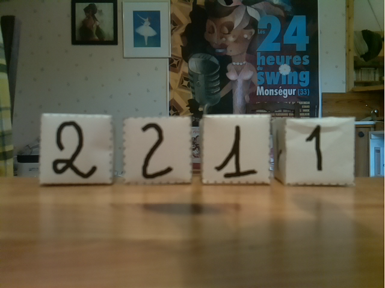
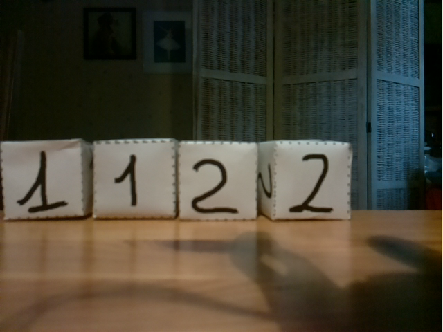
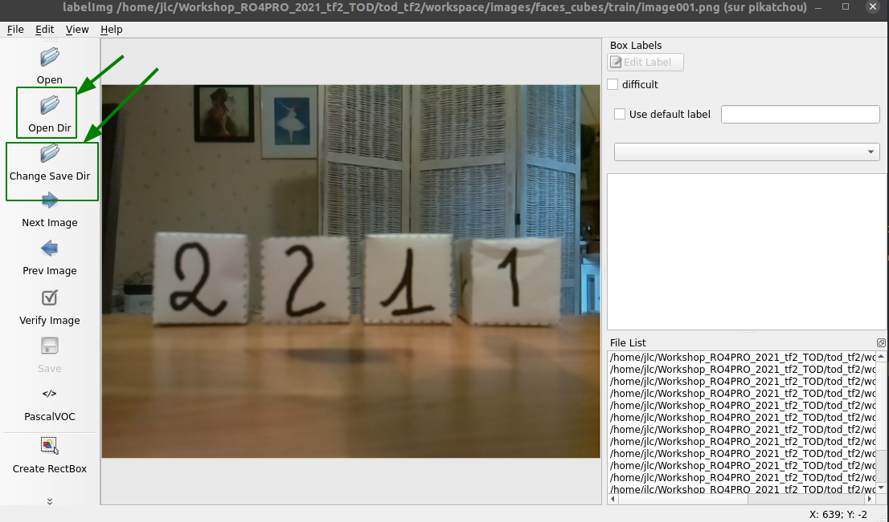
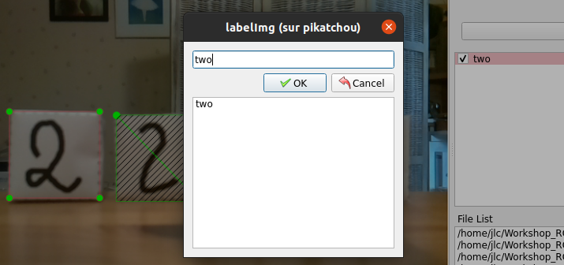

| Classe de capsule  | &emsp;Durée recommandée |
|:-------------------|:------------------|
| Info  &emsp;  ℹ️  |&emsp; 30 min      |

## 🎒 Prérequis

* Quelques notions de base d'utilisation du terminal
* Quelques notions sur les réseaux de neurone
* Capsule sur l'installation des modules]
* Capsule sur la mise en place de l'arborescence de travail]
* Capsule sur le téléchargement d'un réseau pré-entraîné]

## 🎓 Acquis d'apprentissage

* Création d'images avec le robot
* Modification des images au format adapté
* Création d'un fichier qui contient les labels à reconnaître

## Créer les données pour l'apprentissage supervisé

Cette étape du travail comporte cinq tâches :

1. Créer des images avec la caméra du robot -> fichiers \*.jpg, \*.png
2. Annoter les images avec le logiciel `labelImg` -> fichiers \*.xml
3. Convertir les fichiers annotés XML au format CSV
4. Convertir les fichiers annotés CSV au format _tensorflow record_
5. Créer le fichier `label_map.pbtxt` qui contient les labels des objets à reconnaître.

### 1. Créer les images avec une caméra 

Dans le cas des images prises avec des smartphones ou autre, il faut les convertir en png et les redimenssionner.
Les commandes suivantes effectuent ces modifications :

```python
#from tod_tf2/images/faces_cube/train or tod_tf2/images/faces_cube/test
mogrify -format png *.*
convert '*.png[640x]' resized%03d.png
```

Ici, la valeur de 640 correspond au taille des images du réseau.

### 2. Créer les images avec la caméra du robot  

Les images des faces des cubes peuvent être obtenues en utilisant le service ROS `/get_image` proposé par le robot Poppy Ergo Jr.

image001.png               |  image002.png
:-------------------------:|:-------------------------:
   |  


🤖 Rappels : lancement du ROS Master et des services ROS sur le robot :
 
* allumer le robot Poppy Ergo Jr,
* se connecter sur la carte RPi du robot : `ssh pi@poppy.local` (mdp: `raspberry`) 
* ✅ vérifier que `ROS_MASTER_URI` pointe bien vers `poppy.local:11311` :
```bash
(tf2) jlc@pikatchou: $ ssh pi@poppy.local
pi@poppy.local password:
...

pi@poppy:~ $ env|grep ROS_MASTER
ROS_MASTER_URI=http://poppy.local:11311
```	
* si `ROS_MASTER_URI` n'est pas bon, édite le fichier `~/.bashrc` du robot, mets la bonne valeur et tape `source ~\.bashrc`...
* Lance le ROS Master et les services ROS sur le robot avec la commande : 
```bash
pi@poppy:~ $ roslaunch poppy_controllers control.launch
...
```

💻 Et maintenant dans un terminal sur ton PC, avec l'EVP `(tf2)` désactivé :
* ✅ vérifie que `ROS_MASTER_URI` pointe bien vers `poppy.local:11311` :
```bash
(tf2) jlc@pikatchou: $ env|grep ROS_MASTER
ROS_MASTER_URI=http://poppy.local:11311
```	
* si `ROS_MASTER_URI` n'est pas bon, édite le fchier `~/.bashrc`, mets la bonne valeur et tape `source ~\.bashrc`...


🐍 Tu peux utiliser le programme Python `get_image_from_robot.py` du dossier `tod_tf2` pour enregistrer les images des cubes dans des fichiers nommées `imagesxxx.png` (`xxx` = `001`, `002`...). 
Un appui sur une touche clavier permet de passer d'une image à l'autre, un appui sur la touche `Q` permet de quitter le programme :

```python
import cv2, rospy
from poppy_controllers.srv import GetImage
from cv_bridge import CvBridge

i=1
while True:
    get_image = rospy.ServiceProxy("get_image", GetImage)
    response  = get_image()
    bridge    = CvBridge()
    image     = bridge.imgmsg_to_cv2(response.image)
    cv2.imwrite(f"image{i:03d}.png", image)
    cv2.imshow("Poppy camera", image)
    key = cv2.waitKey(0)
    if key==ord('q') or key==ord("Q"): break
    cv2.destroyAllWindows()
    i += 1
cv2.destroyAllWindows()
```

📍  En cas de conflit grave "ROS / EVP tf2 / PyQT" en utilisant le programme `get_image_from_robot.py` tu peux désactiver temporairement l'EVP tf2 :
* soit en lançant un nouveau terminal,
* soit en tapant la commande `conda deactivate`


Chaque équipe doit faire une dizaine d'images en variant les faces des cubes visibles, puis les images pourront être partagées sur un serveur pour servir à toutes les équipes.

Une fois collectées toutes les images, il faut mettre environ 90 % des images dans le dossier `images\faces_cubes\train` et le reste dans le dossier `images\faces_cubes\test`.

### 2 Annoter les images avec le logiciel labelImg

L'annotation des images peut être faite de façon très simple avec le logiciel `labelImg`.
C’est une étape du travail qui prend du temps et qui peut être réalisée à plusieurs en se répartissant les images à annoter...

L'installation du module Python `labelImg` faite dans l'EVP `tf2` (cf section 2.) permet de lancer le logiciel `labelImg` en tapant :
```bash
(tf2) jlc@pikatchou:~ $ labelImg
```

Utilise les boutons [Open Dir] et [Change Save Dir] pour te positionner la lecture ET l'écriture des fichiers dans le dossier `images/face_cubes/train/`.<br>
La première image est automatiquement chargée dans l'interface graphique :



Pour chaque image, tu dois annoter les objets à reconnaître :
* avec le bouton [Create RectBox], tu entoures une face d'un cube,
* la boîte des labels s'ouvre alors et tu dois écrire le blabel `one` ou `two` en fonction de la face entourée,
* itère le processus pour chacune des faces de cubes présente dans l'image...

    première face          |  deuxième face            |  fin
:-------------------------:|:-------------------------:|:-------------------------:
   |   | 

* quand c'est fini, tu cliques sur le bouton [Save] et tu passes à l'image suivante avec le bouton [Next Image].
* Une fois toutes les images annotées, utilise les boutons [Open Dir] et [Change Save Dir] pour annoter de la même façon les images de test du dossier `images/face_cubes/test/`.

### 3 Convertir les fichiers XML annotés au format CSV

Cette étape permet de synthétiser dans un fichier CSV unique les données d’apprentissage contenues dans les différents fichiers XML crées à l’étape d'annotation. 
Le programme `xml_to_csv_tt.py` permet de générer les deux fichiers CSV correspondant aux données d’apprentissage et de test. <br>
Depuis le dossier `tod_tf2` tape la commande suivante :

```bash
# From within tod_tf2
(tf2) jlc@pikatchou:~ $ python xml_to_csv_tt.py -p faces_cubes
Successfully converted xml data in file <images/faces_cubes/train_labels.csv>.
Successfully converted xml data in file <images/faces_cubes/test_labels.csv>.
```
Les fichiers `train_labels.csv` et `test_labels.csv` sont créés dans le dossier  `images/faces_cubes/`.

### 4 Convertir les fichiers CSV annotés au format _tfrecord_

Pour cette étape, on utilise le programme `generate_tfrecord_tt.py`.<br>
Depuis le dossier `tod_tf2` tape la commande :
```bash
# From within tod_tf2
(tf2) jlc@pikatchou:~ $ python generate_tfrecord_tt.py --project faces_cubes
Successfully created the TFRecord file: ./training/faces_cubes/train.record
Successfully created the TFRecord file: ./training/faces_cubes/test.record
```
Avec cette commande tu viens de créer les 2 fichiers `train.record` et `test.record` dans le dossier `training/faces_cubes` : ce sont les fichiers qui serviront pour l’entraînement et l'évaluation du réseau.

### 5 Créer le fichier label_map.pbtxt
 
La dernière étape consiste a créer le fichier `label_map.pbtxt` dans le dossier `training/faces_cubes`. 

Ce fichier décrit la « carte des labels » (_label map_) nécessaire à l’entraînement du réseau. 
La carte des labels permet de connaître l’ID (nombre entier) associé à chaque étiquette (_label_) identifiant les objets à reconnaître. La structure type du fichier est la suivante :


	 item {
	   id: 1
	   name: 'objet_1'
	 }
	 item {
	   id: 2
	   name: 'objet_2'
	 }
	 ...

Pour le projet `face_cubes`, le contenu du fichier `training/faces_cubes/label_map.pbtxt` à créer est :

	 item {
	   id: 1
	   name: 'one'
	 }
	 item {
	   id: 2
	   name: 'two'
	 }
