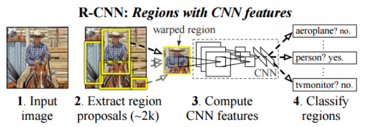

| Classe de capsule  | &emsp;Durée recommandée |
|:-------------------|:------------------|
| Info  &emsp;  ℹ️  |&emsp; 5 min      |


## 🎒 Prérequis

* Quelques notions de base d'utilisation du terminal
* Quelques notions sur les réseaux de neurone
* Capsule sur l'installation des modules
* Capsule sur la mise en place de l'arborescence de travail

## 🎓 Acquis d'apprentissage

* Mise en place d'un réseau, ici, pré-entraîné

## Introduction 

Construire son propre modèle et l'entraîner peut prendre plusieurs jours 
et requiert une quantité de données d'entraînements très importantes. 
Une solution est d'entraîner un modèle déjà existant et, bien sur, 
compatible avec l'architecture de destination (TPU, ARM...). Cette
technique est connue sous le nom de **Transfert Learning** ou parfois **Fine Tuning**.
En effet, le **Transfert Learning** permet de partir d'un modèle déjà entrainé pour 
une tâche spécifique et de compléter l'entraînement avec de nouvelles classes 
en utilisant une base de données plus petites.
Deux possibilités existent pour faire cela : 
* Re-entraîner tout le modèle (en ajustant les poids à travers le réseau), 
* Enlever la dernière couche qui effectue la classification et entraîner une nouvelle couche 
qui reconnaît des nouvelles classes.

## Télécharger le réseau pré-entraîné

Plusieurs familles de réseaux dédiés à la détection d’objets sont proposés sur le site  [TensorFlow 2 Detection Model Zoo](https://github.com/tensorflow/models/blob/master/research/object_detection/g3doc/tf2_detection_zoo.md), parmi lesquelles :

* Les réseaux __R-CNN__ (_Region-based Convolutional Neural Network_) : basés sur le concept de __recherche ciblée__ (_selective search_). 
(source: https://arxiv.org/pdf/1311.2524.pdf)<br>
Au lieu d’appliquer la sous-fenêtre d'analyse à toutes les positions possibles dans l’image, l’algorithme de recherche ciblée génère 2000 propositions de régions d’intérêts où il est le plus probable de trouver des objets à détecter. Cet algorithme se base sur des éléments tels que la texture, l’intensité et la couleur des objets qu’il a appris à détecter pour proposer des régions d’intérêt. Une fois les 2000 régions choisies, la dernière partie du réseau calcule la probabilité que l’objet dans la région appartienne à chaque classe. Les versions __Fast R-CNN__ et __Faster R-CNN__ rendent l’entraînement plus efficace et plus rapide.

* Les réseaux __SSD__ (_Single Shot Detector_) : font partie des détecteurs considérant la détection d’objets comme un problème de régression. L'algorithme __SSD__ utilise d’abord un réseau de neurones convolutif pour produire une carte des points clés dans l’image puis, comme __Faster R-CNN__, utilise des cadres de différentes tailles pour traiter les échelles et les ratios d’aspect.

La différence entre "Faster R-CNN" et SSD est qu’avec R-CNN on réalise une classification sur chacune des 2000 fenêtres générées par l’algorithme de recherche ciblée, alors qu’avec SSD on cherche à prédire la classe ET la fenêtre de l’objet en même temps. Cela rend SSD plus rapide que "Faster R-CNN", mais également moins précis.

Dans le tableau du site [TensorFlow 2 Detection Model Zoo](https://github.com/tensorflow/models/blob/master/research/object_detection/g3doc/tf2_detection_zoo.md), les performances des différents réseaux sont exprimées en _COCO mAP (Mean Average Precision)_, métrique couramment utilisée pour mesurer la précision d’un modèle de détection d’objets. Elle consiste à mesurer la proportion de détections réussies sur des images déjà annotées du dataset COCO (Common Object in CONtext)
qui contient 200 000 images annotées avec 80 objets différents. Cette mesure sert de référence pour comparer la précision de différentes architectures de détection d’objets (plus d’informations sur _mAP_ dans la lecture [2]).


📥 Pour le travail de détection des faces des cubes dans les images fournies par la caméra du robot Ergo Jr tu peux télécharger le réseau `Faster R-CNN ResNet50 V1 640x640` sur le site [TensorFlow 2 Detection Model Zoo](https://github.com/tensorflow/models/blob/master/research/object_detection/g3doc/tf2_detection_zoo.md) (~203 Mo).

__Attention ! Si le réseau doit être converti en **.tflite** par la suite afin d'être exporté sur des architectures 
plus légères comme sur Raspberry Pi, un réseaux SSD tel que **SSD MobileNet V2 FPNLite** est
préférable.__ (cf. Capsule **Convertir un réseau Tensorflow en TFLite**).

Une fois téléchargée, il faut extraire l'archive TGZ au bon endroit dans l'arborescence de travail :
```bash
# From within tod_tf2/
(tf2) jlc@pikatchou $ tar xvzf ~/Téléchargements/faster_rcnn_resnet50_v1_640x640_coco17_tpu-8.tar.gz -C pre_trained
```
puis créer le dossier correspondant `faster_rcnn_resnet50_v1_640x640_coco17_tpu-8` dans le dossier `training/faces_cubes` :
```bash	
# From within tod_tf2/
(tf2) jlc@pikatchou $ mkdir training/faces_cubes/faster_rcnn_resnet50_v1_640x640_coco17_tpu-8
```
On vérifie :
```bash
# From within tod_tf2/
(tf2) jlc@pikatchou $ tree -d pre_trained
pre_trained
└── faster_rcnn_resnet50_v1_640x640_coco17_tpu-8
    ├── checkpoint
    └── saved_model
        └── variables
        
(tf2) jlc@pikatchou $ tree -d training
training
└── faces_cubes
    └── faster_rcnn_resnet50_v1_640x640_coco17_tpu-8
```