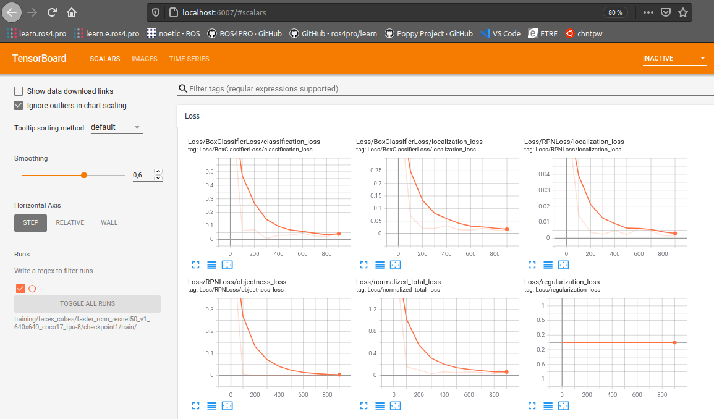

| Classe de capsule  |  Durée recommandée |
|:-------------------|:------------------|
| Info     ℹ️  |  30 min      |


## 🎒 Prérequis

* Quelques notions de base d'utilisation du terminal
* Quelques notions sur les réseaux de neurone
* Capsule sur l'installation des modules
* Capsule sur la mise en place de l'arborescence de travail
* Capsule sur le téléchargement d'un réseau pré-entraîné
* Capsule sur la création des données pour l'apprentissage supervisé

## 🎓 Acquis d'apprentissage

* Mise en place de la configuration d'entraînement d'un réseau pré-entraîné
* Lancement d'un apprentissage supervisé
* Exporter les poids du réseau entrainé 


## 1. Lancer l'entraînement supervisé du réseau pré-entraîné

Ce travail se décompose en plusieurs étapes :

1. Modifier le fichier de configuration du réseau pré-entraîné pour décrire la configuration d'entraînement.
2. Lancer l'entraînement supervisé.
3. Exporter les poids du réseau entrainé dans un format utilisable.

### 1. Modifier le fichier de configuration

C’est la dernière étape avant de lancer l’entraînement…

* Le fichier de configuration `pipeline.config` présent dans le dossier `pre_trained/faster_rcnn_resnet50_v1_640x640_coco17_tpu-8` doit être copié dans le dossier cible `training/faces_cubes/faster_rcnn_resnet50_v1_640x640_coco17_tpu-8`. 

* Il faut ensuite modifier les paramètres du fichier `training/faces_cubes/faster_rcnn_resnet50_v1_640x640_coco17_tpu-8` pour les adpater à l'entraînement :

|n° | paramètre                     | Description                                                            | Valeur initiale  | valeur à donner |  explication                    |
|:--|:------------------------------|:-----------------------------------------------------------------------|:----------------:|:---------------:|:--------------------------------|
|010| `num_classes`                 | nombre de classe d'objets                                              | 90               | 2               | les deux classes 'one' et 'two' |
|077| `max_detections_per_class`    | nombre max de détection par classe                                     | 100              | 4               | 4 cubes          | 
|078| `max_total_detections`        | nombre max total de détections                                         | 100              | 4               | 4 cubes          | 
|093| `batch_size`                  | nombre d'images à traiter en lot avant mise à jour des poids du réseau | 64               | 1, 2,...        | une valeur trop élevée risque de faire dépasser la capacité mémoire RAM de ta machine... à régler en fonction de la quantité de RAM de ta machine.  |
|097| `num_steps`                   | Nombre max d'itérations d'entraînement                                 | 25000             | 1000           | une valeur trop grande donne des temps de calcul prohibitifs et un risque de sur-entraînement 
|113| `fine_tune_checkpoint`        | chemin des fichiers de sauvegarde des poids du réseau pré-entraîné     | "PATH_TO_BE_<br>CONFIGURED" | "pre_trained/faster_rcnn_resnet50_v1_<br>640x640_coco17_tpu-8/checkpoint/ckpt-0" | se termine par `/ckpt-0` qui est le préfixe des fichiers dans le dossier `.../checkpoint/` |
|114| `fine_tune_checkpoint_type`   | Choix de l'algorithme : "classification" ou "detection"                | "classification"| "detection"  | on veut faire de la detection d'objets |
|120| `max_number_of_boxes`         | Nombre max de boîtes englobantes  dans chaque image                    | 100               | 4               | les faces des cubes sur une image |
|122| `use_bfloat16`                | `true` pour les architectures TPU, `false` pour CPU                    | true              | false           | |
|126| `label_map_path`              | chemin du fichier des labels                                           | "PATH_TO_BE_<br>CONFIGURED" | "training/faces_cubes/label_map.pbtxt" | utilisé pour l'entraînement |
|128| `input_path`                  | fichier des données d'entrée d'entraînement au format `tfrecord`       | "PATH_TO_BE_<br>CONFIGURED" | "training/faces_cubes/train.record"    | utilisé pour l'entraînement |
|139| `label_map_path`              | chemin du fichier des labels                                           | "PATH_TO_BE_<br>CONFIGURED" | "training/faces_cubes/label_map.pbtxt" | utilisé pour l'évaluation|
|128| `input_path`                  | fichier des données d'entrée de test au format `tfrecord`              | "PATH_TO_BE_<br>CONFIGURED" | "training/faces_cubes/test.record"    | utilisé pour l'évaluation|

## 2. Lancer l'entraînement

* Copie le fichier `models\research\object_detection\model_main_tf2.py` dans la racine `tod_tf2`.
* Tape la commande :
```bash
# From within tod_tf2
(tf2) jlc@pikatchou $ python model_main_tf2.py --model_dir=training/faces_cubes/faster_rcnn_resnet50_v1_640x640_coco17_tpu-8/checkpoint1  --pipeline_config_path=training/faces_cubes/faster_rcnn_resnet50_v1_640x640_coco17_tpu-8/pipeline.config
```
Les fichiers des poids entraînés seront écrits dans le dossier `.../faster_rcnn_resnet50_v1_640x640_coco17_tpu-8/checkpoint1` : si tu relances l'entraînement, tu peux utiliser `.../checkpoint2`, `.../checkpoint3` pour séparer des essais successifs.

Le programme Python lancé est très verbeux...<br>
au bout d'un temps qui peut être assez long (plusieurs minutes avec un petit CPU), les logs de l'entraînement apparaissent à l'écran :

	...
	...
	W0507 00:24:41.010936 140206908888832 deprecation.py:531] From /home/jlc/miniconda3/envs/tf2/lib/python3.8/site-packages/tensorflow/python/util/deprecation.py:605: calling map_fn_v2 (from tensorflow.python.ops.map_fn) with dtype is deprecated and will be removed in a future version.
	Instructions for updating:
	Use fn_output_signature instead
	INFO:tensorflow:Step 100 per-step time 22.002s loss=0.825
	I0507 01:01:11.942076 140208909420352 model_lib_v2.py:676] Step 100 per-step time 22.002s loss=0.825
	INFO:tensorflow:Step 200 per-step time 20.926s loss=0.813
	I0507 01:36:04.090147 140208909420352 model_lib_v2.py:676] Step 200 per-step time 20.926s loss=0.813
	INFO:tensorflow:Step 300 per-step time 20.803s loss=0.801
	I0507 02:10:44.351419 140208909420352 model_lib_v2.py:676] Step 300 per-step time 20.803s loss=0.801
	INFO:tensorflow:Step 400 per-step time 20.946s loss=0.812
	I0507 02:45:38.927271 140208909420352 model_lib_v2.py:676] Step 400 per-step time 20.946s loss=0.812
	INFO:tensorflow:Step 500 per-step time 20.960s loss=0.794
	I0507 03:20:34.990385 140208909420352 model_lib_v2.py:676] Step 500 per-step time 20.960s loss=0.794
	INFO:tensorflow:Step 600 per-step time 21.045s loss=0.802
	I0507 03:55:39.516442 140208909420352 model_lib_v2.py:676] Step 600 per-step time 21.045s loss=0.802
	INFO:tensorflow:Step 700 per-step time 20.863s loss=0.786
	I0507 04:30:25.868283 140208909420352 model_lib_v2.py:676] Step 700 per-step time 20.863s loss=0.786
	INFO:tensorflow:Step 800 per-step time 20.744s loss=0.799
	I0507 05:05:00.163027 140208909420352 model_lib_v2.py:676] Step 800 per-step time 20.744s loss=0.799
	INFO:tensorflow:Step 900 per-step time 20.825s loss=0.837
	I0507 05:39:42.691898 140208909420352 model_lib_v2.py:676] Step 900 per-step time 20.825s loss=0.837
	INFO:tensorflow:Step 1000 per-step time 20.789s loss=0.778
	I0507 06:14:21.503472 140208909420352 model_lib_v2.py:676] Step 1000 per-step time 20.789s loss=0.778

Dans l'exemple ci-dessus, on voit des logs tous les 100 pas, avec environ 20 secondes par pas, soit environ 35 minutes entre chaque affichage et environ 6h de calcul pour les 1000 pas.

En cas d'arrêt brutal du programme avec le message "Processus arrêté", ne pas hésiter à diminer la valeur du paramètre `batch_size` jusquà 2 voire 1 si nécessaire.... <br>
Même avec un `batch_size` de 2, le processus Python peut nécessiter jusqu'à 2 ou 3 Go de RAM pour lui tout seul, ce qui peut mettre certains portables en difficulté...

Une fois l'entraînement terminé tu peux analyser les statistiques d'entraînement avec `tensorboard` en tapant la commande :
```bash
# From within tod_tf2
(tf2) jlc@pikatchou:~ $ tensorboard --logdir=training/faces_cubes/faster_rcnn_resnet50_v1_640x640_coco17_tpu-8/checkpoint1/train
Serving TensorBoard on localhost; to expose to the network, use a proxy or pass --bind_all
TensorBoard 2.4.0 at http://localhost:6006/ (Press CTRL+C to quit)
...
```
`tensorflow` lance un serveur HHTP en local sur ta machine, et tu peux ouvrir la page `http://` avec un navigateur pour voir les courbes d'analyse en faisant CTRL + clic avec le curseur de la souris positionné sur le mot `http://localhost:6006/` :



Le logiciel tensorboard permet d'examiner l'évolution de statistiques caractéristiques de l'apprentissage.

## 3. Exporter les poids du réseau entraîné

On utilise le script Python `exporter_main_v2.py` du dossier `models/reasearch/object_detection/` pour extraire le __graph d'inférence__ entraîné et le sauvegarder dans un fichier `saved_model.pb` qui pourra être rechargé ultérieurement pour exploiter le réseau entraîneé :
```bash
# From within tod_tf2
(tf2) jlc@pikatchou $ cp models/research/object_detection/exporter_main_v2.py .
(tf2) jlc@pikatchou $ python exporter_main_v2.py --input_type image_tensor --pipeline_config_path training/faces_cubes/faster_rcnn_resnet50_v1_640x640_coco17_tpu-8/pipeline.config --trained_checkpoint_dir training/faces_cubes/faster_rcnn_resnet50_v1_640x640_coco17_tpu-8/checkpoint1 --output_directory training/faces_cubes/faster_rcnn_resnet50_v1_640x640_coco17_tpu-8/saved_model1
```
Le script Python créé le fichier `saved_model.pb` dans le dossier `.../faster_rcnn_resnet50_v1_640x640_coco17_tpu-8/saved_model1/saved_model` :

```bash
# From within tod_tf2
(tf2) jlc@pikatchou:~ $ tree training/
training/
└── faces_cubes
    └── faster_rcnn_resnet50_v1_640x640_coco17_tpu-8
        ├── checkpoint1
        │   ├── checkpoint
        │   ├── ckpt-1.data-00000-of-00001
        │   ├── ckpt-1.index
        │   └── train
        │       └── events.out.tfevents.1620391994.pikatchou.30554.1504.v2
        ├── pipeline.config
        ├── saved_model1
        │   ├── checkpoint
        │   │   ├── checkpoint
        │   │   ├── ckpt-0.data-00000-of-00001
        │   │   └── ckpt-0.index
        │   ├── pipeline.config
        │   └── saved_model
        │       ├── assets
        │       ├── saved_model.pb
        │       └── variables
        │           ├── variables.data-00000-of-00001
        │           └── variables.index
```
