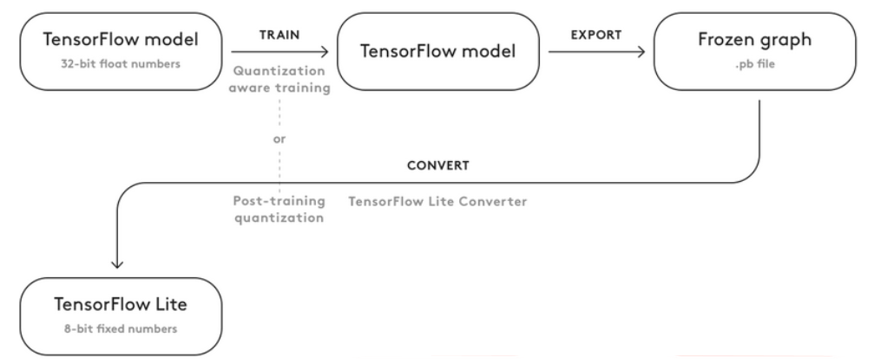

| Classe de capsule  | &emsp;Durée recommandée |
|:-------------------|:------------------|
| Info  &emsp;  ℹ️  |&emsp; 10 min      |

## 🎒 Prérequis

* BAC+2 et +
* Bonne compréhension de Python et numpy
* Une première expérience des réseaux de neurones est souhaitable
* Une raspberry Pi avec caméra mise en place
* Capsule sur la **Mise en place des modules sur la Raspberry Pi**
* Capsule sur la **Détection d'objet sur la Raspberry Pi**

## 🎓 Acquis d'apprentissage

* Conversion d'un réseau Tensorflow en un réseau Tensorflow Lite

## 📗 Documentation

Credit : 
* https://github.com/tensorflow/models/blob/master/research/object_detection/g3doc/running_on_mobile_tf2.md
* https://www.tensorflow.org/lite/convert
* https://coral.ai/docs/edgetpu/models-intro/

## Introduction


TensorFlow Lite est une version allégée de TensorFlow, conçus pour les mobiles 
et les objets embarqués. TensorFlow Lite permet une inférence à faible latence
avec une faible taille binaire.
La taille des modèles peut être encore réduite grâce à la quantification, qui 
convertit des paramètres de 32 bits en des représentations de 8 bits. 

Dans la capsule **Détection d'objet sur la Raspberry Pi**, un réseau sous Tensorflow Lite est utilisé.
C'est à dire qu'il possède un fichier **detect.tflite** et un **labelmap.txt**.
Cependant, customiser son réseau, c'est à dire l'entraîner sur des images spécifiques, 
est peu adapté pour une Raspberry Pi, du fait du manque de mémoire et du processeur ARM.
De plus, il n'est pas vraiment possible d'entraîner directement un réseau avec TensorFlow Lite.
L'idée est donc d'entraîner un réseau Tensorflow, avec une base de données spécifiques,
sur des machines avec des ressources importantes. Puis, de convertir ce réseau entrainé 
sous Tensorflow Lite afin de pouvoir l'utiliser sur une Raspberry Pi ou autre.

La conversion consiste donc à obtenir deux fichiers `detect.tflite` et `labelmap.txt`.
Ces deux fichiers doivent ensuite être intégrer dans le répertoire du projet 
sur la Raspberry Pi.
Ajouter de nouvelles images spécifiques permet aussi 
de limiter la perte de précision en convertissant le modèle en **.tflite**.


Si on reprend la capsule sur la reconnaissance d'objet avec Tensorflow, 
on remarque qu'un réseau pré-entrainé Faster R-CNN est utilisé. 
En convertissant celui-ci à l'aide du script `export_tflite_ssd_graph.py`
du module research/object_detection, on remarque que ce type de réseau 
n'est pas supporté par TFLite (notamment TFArray).
Parmi les réseaux existants, on retient les réseaux SSD et YOLO
spécifiques à la détection d'objet et qui sont supportés par TFLite.
YOLO/Tiny YOLO est plus rapide mais moins précis.
Inversement, les réseaux SSD (Singe Shot MultiBoxDetector) sont plus précis mais moins rapides.
Ces derniers utilisent un CNN et réalisent du Transfert Learning.
Plus précisement, les réseaux SSD (entraînés avec la base de données COCO) 
possèdent les caractéristiques suivantes :

* La localisation et la classification de l'objet sont faites en un seul parcours de réseau,
* La technique MultiBox est utilisée,
* En plus d'être détectés, les objets sont aussi classifiés.

## Convertir le réseau

Afin de convertir son réseau, on réalise dans un premier temps l'ensemble des capsules **Detection d'objet avec Tensorflow**.


__Attention ! Dans la capsule **Téléchargement du réseau pré-entrainé**, si le réseau doit être porté par la suite
sur des architectutes plus légères (TPU, ...), il faut choisir un réseau de départ adapté.__


Ici, les capsules s'appuient sur l'utilisation d'une Raspberry Pi. Par conséquent, seuls les réseaux SSD sont adaptés.
De plus, comme on souhaite obtenir l'extension **.tflite**, le réseau doit avoir une annotation __FPNLite__.
**FPN** correspond à **Feature Pyramid Network**, c'est un sous-réseau qui génère des **feature maps** de
différentes résolutions.
Le réseau utilisé dans les prochains exemples et capsules est le réseau 
**SSD MobileNet V2 FPNLite 640x640**.

<br>(source: https://coral.ai/docs/edgetpu/models-intro/#compatibility-overview)<br>

### Exporter le graphe d'inférence TFLite 

Cette commande génère un **savedModel** intermédiaire qui va être ensuite utilisé avec le convertisseur TFLite.
Cela devrait génèrer un dossier saved_model avec un ficher **saved_model.pb**.


```python 
# From the tensorflow/models/research/ directory
python object_detection/export_tflite_graph_tf2.py \
    --pipeline_config_path path/to/ssd_model/pipeline.config \
    --trained_checkpoint_dir path/to/ssd_model/checkpoint \
    --output_directory path/to/exported_model_directory
```

### Convertir avec le convertisseur TFLite

Pour convertir un **SavedModel**, la commande est la suivante : 


```python 
tflite_convert \
  --saved_model_dir=/tmp/mobilenet_saved_model \
  --output_file=/tmp/mobilenet.tflite
```

Si la commande ne renvoie pas d'erreur, elle devrait génèrer un fichier avec l'extension **.tflite**.


