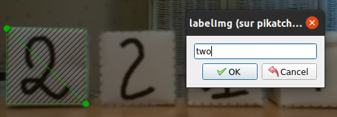
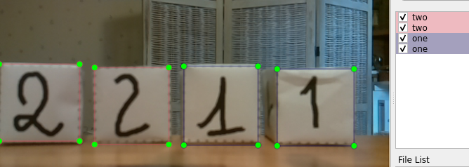

|Acquis d'apprentissages visés :|
|:--
|Savoir utiliser le logiciel _labelImg_ pour localiser et nommer les objets dans des images.|
|Savoir convertir les fichhier d'annotations du format XML au format _tfreccord_ attendu par tensorflow.|
|Savoir comment créer le fichier _label_map.pbtxt_ decrivant les labels de l'apprentissage supervisé.|


L'activité proposée se décompose en 3 étapes :
1. Annoter les images avec le logiciel _labelImg_ pour localiser et nommer les objets dans les images d'entraînement.
2. Convertir les fichiers XML annotés au format _tfreccod_.
3. Créer le fichier label_map.pbtxt

## 1. Annoter les images avec le logiciel labelImg

L'annotation des images peut être faite avec le logiciel `labelImg`.
C’est une étape du travail qui prend du temps et qui peut être réalisée à plusieurs en se répartissant les images à annoter...
L'installation du module Python `labelImg` se fait faite dans l'EVP `tf2`. Le gogiciel est lancé en tapant :
```bash
(tf2) jlc@pikatchou:~ $ labelImg
```

Utilise les boutons [Open Dir] et [Change Save Dir] pour positionner la lecture ET l'écriture des fichiers dans le dossier 
`<projet>/images/train/`, soit ici : `face_cubes/imgaes/train/`.<br>

La première image est automatiquement chargée dans l'interface graphique :


Pour chaque image, tu dois annoter les objets à reconnaître :
* avec le bouton [Create RectBox], tu entoures une face d'un cube,
* la boîte des labels s'ouvre alors et tu dois écrire le blabel `one` ou `two` en fonction de la face entourée,
* itère le processus pour chacune des faces de cubes présente dans l'image...

    première face          |  deuxième face            |  fin
:-------------------------:|:-------------------------:|:-------------------------:
   |   | 

* quand c'est fini, tu cliques sur le bouton __[Save]__ et tu passes à l'image suivante avec le bouton __[Next Image]__.
* Une fois toutes les images annotées, utilise les boutons __[Open Dir]__ et __[Change Save Dir]__ pour annoter de la même façon les images de test du dossier `<projet>/images/test/`.

### 2. Convertir les fichiers XML annotés au format _tfrecord_

Il faut d'abord créer un fichier CSV unique regroupant les données des différents fichiers XML crées à l’étape d'annotation. 

Le programme `xml_to_csv_tt.py` permet de créer les deux fichiers `train_labels.csv` et `test_labels.csv` dans le dossier  `<projet>/images/`.<br>
Depuis le dossier `tod_tf2` tape la commande suivante :

```bash
# From within tod_tf2
(tf2) jlc@pikatchou:~ $ python xml_to_csv_tt.py -p faces_cubes
Successfully converted xml data in file <faces_cubes/images/train_labels.csv>.
Successfully converted xml data in file <faces_cubes/images/test_labels.csv>.
```
In ne reste plus qu'à utiliser le programme `generate_tfrecord_tt.py` pour créer les 2 fichiers `train.record` et `test.record` dans le dossier `faces_cubes/training`.<br>
Depuis le dossier `tod_tf2` tape la commande :
```bash
# From within tod_tf2
(tf2) jlc@pikatchou:~ $ python generate_tfrecord_tt.py --project faces_cubes
Successfully created the TFRecord file: ./faces_cubes/training/train.record
Successfully created the TFRecord file: ./faces_cubes/training/test.record
```


### 3. Créer le fichier label_map.pbtxt
 
La dernière étape consiste a créer le fichier `label_map.pbtxt` dans le dossier `<projet>/training/`. 

Ce fichier décrit la « carte des labels » (_label map_) nécessaire à l’entraînement du réseau. 
Cette carte permet de connaître l’ID (nombre entier) associé à chaque étiquette (_label_) identifiant les objets à reconnaître. La structure type du fichier est la suivante :


	 item {
	   id: 1
	   name: 'objet_1'
	 }
	 item {
	   id: 2
	   name: 'objet_2'
	 }
	 ...

Pour le projet `face_cubes`, le contenu du fichier `<projet>/training/label_map.pbtxt` à créer est :

	 item {
	   id: 1
	   name: 'one'
	 }
	 item {
	   id: 2
	   name: 'two'
	 }

