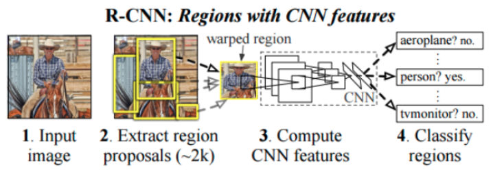

| Acquis d'apprentissages visés : |
|:---|
|Connaître les principaux avantages/inconvénients des réseaux ___R-CNN___ et ___SSD___.|
|Savoir installer dans l'arborescence de travail un réseau pré-entrainé téléchargé depuis le site _TensorFlow2 Detection Model Zoo_.|

## Les réseaux _tensorflow_ pré-entraînés à la détection d'objets

Plusieurs familles de __réseaux pré-entrainés__ dédiés à la détection d’objets sont proposés sur le site  [TensorFlow 2 Detection Model Zoo](https://github.com/tensorflow/models/blob/master/research/object_detection/g3doc/tf2_detection_zoo.md), parmi lesquelles :

* Les réseaux ___R-CNN___ (_Region-based Convolutional Neural Network_) : basés sur le concept de __recherche ciblée__ (_selective search_ voir [bla](##Lectures) ).<br>
<br>
*(source image : https://arxiv.org/pdf/1311.2524.pdf*)<br>
Au lieu d’appliquer la sous-fenêtre d'analyse à toutes les positions possibles dans l’image, l’algorithme de recherche ciblée génère 2000 propositions de _régions d’intérêts_ où il est le plus probable de trouver des objets à détecter. Cet algorithme se base sur des éléments tels que la texture, l’intensité et la couleur des objets qu’il a appris à détecter pour proposer des régions d’intérêt. Une fois les 2000 régions choisies, la dernière partie du réseau calcule la probabilité que l’objet dans la région appartienne à chaque classe. Les versions ___Fast R-CNN___ et ___Faster R-CNN__ rendent l’entraînement plus efficace et plus rapide._

* Les réseaux ___SSD___ (_Single Shot Detector_) : font partie des détecteurs considérant la détection d’objets comme un problème de régression. L'algorithme ___SSD___ utilise d’abord un réseau de neurones convolutif pour produire une carte des points clés dans l’image puis, comme ___Faster R-CNN___, utilise des cadres de différentes tailles pour traiter les échelles et les ratios d’aspect.

La différence entre les réseaux _Faster R-CNN_ et _SSD_ est qu’un réseau _R-CNN_ réalise une classification sur chacune des 2000 fenêtres générées par l’algorithme de recherche ciblée, alors qu’un réseau SSD cherche à prédire la classe ET la fenêtre de l’objet en même temps. Cela rend les réseaux _SSD_ plus rapides que les réseaux _Faster R-CNN_, mais également moins précis.

Dans le tableau du site [TensorFlow 2 Detection Model Zoo](https://github.com/tensorflow/models/blob/master/research/object_detection/g3doc/tf2_detection_zoo.md), les performances des différents réseaux sont exprimées en _COCO mAP (Mean Average Precision)_, métrique couramment utilisée pour mesurer la précision d’un modèle de détection d’objets. Elle consiste à mesurer la proportion de détections réussies sur des images déjà annotées du dataset COCO (Common Object in CONtext)
qui contient 200 000 images annotées avec 80 objets différents. Cette mesure sert de référence pour comparer la précision de différentes architectures de détection d’objets (cf Lectures complémentaires [2] en fin de page).


📥 Pour la suite du travail, tu peux télécharger l'archive TGZ du réseau `Faster R-CNN ResNet50 V1 640x640` sur le site [TensorFlow 2 Detection Model Zoo](https://github.com/tensorflow/models/blob/master/research/object_detection/g3doc/tf2_detection_zoo.md) (~203 Mo).<br>
Une fois téléchargée, il faut extraire l'archive TGZ au bon endroit dans l'arborescence de travail :
```bash
# From within tod_tf2/
(tf2) jlc@pikatchou $ wget http://download.tensorflow.org/models/object_detection/tf2/20200711/faster_rcnn_resnet50_v1_640x640_coco17_tpu-8.tar.gz -P ~/Téléchargement
(tf2) jlc@pikatchou $ tar xvzf ~/Téléchargements/faster_rcnn_resnet50_v1_640x640_coco17_tpu-8.tar.gz -C pre_trained
```
puis créer le dossier correspondant `faster_rcnn_resnet50_v1_640x640_coco17_tpu-8` dans le dossier `<project>/training`.

## Exemple

Avec le projet _faces_cubes_ :

```bash	
# From within tod_tf2/
(tf2) jlc@pikatchou $ mkdir faces_cubes/training/faster_rcnn_resnet50_v1_640x640_coco17_tpu-8
```
Vérifie avec la commande `tree` qui doit donner les affichages ci-dessous :
```bash
# From within tod_tf2/
(tf2) jlc@pikatchou $ tree -d . -I models
.
├── faces_cubes
│   ├── images
│   │   ├── test
│   │   └── train
│   └── training
│       └── faster_rcnn_resnet50_v1_640x640_coco17_tpu-8
├── pre_trained
│   └── faster_rcnn_resnet50_v1_640x640_coco17_tpu-8
│       ├── checkpoint
│       └── saved_model
│           └── variables
└── tod_tf2_tools
```

##Lectures

* [1] [Zero to Hero: Guide to Object Detection using Deep Learning: Faster R-CNN,YOLO,SSD](https://cv-tricks.com/object-detection/faster-r-cnn-yolo-ssd/)
* [2] [mAP (mean Average Precision) for Object Detection](https://jonathan-hui.medium.com/map-mean-average-precision-for-object-detection-45c121a31173)
* [3] [Understanding SSD MultiBox — Real-Time Object Detection In Deep Learning](https://towardsdatascience.com/understanding-ssd-multibox-real-time-object-detection-in-deep-learning-495ef744fab)


