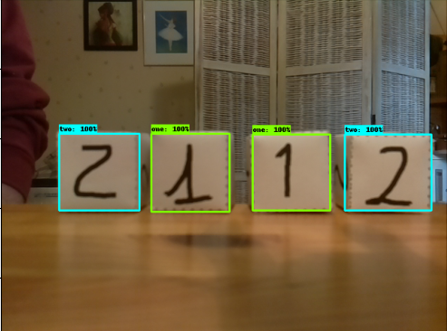
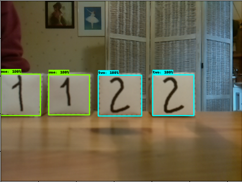
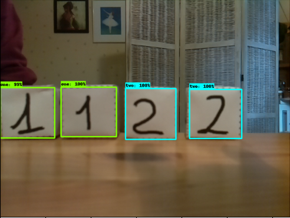
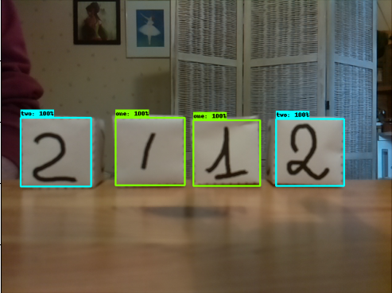

---
    Acquis d'apprentissage visés :
    - Savoir exploiter un réseau TOD ré-entraîné.

    Type d'activité     : ⚙️ [tâche]
    Durée approximative : 30 minutes (dépend des ressources CPU & RAM de ton ordinateur).
---

## Évaluer les inférences du réseau ré-entrainé

Vérifie que le réseau entraîné est bien capable de détecter les faces des cubes en discriminant correctement les numéros écrits sur les faces.

Le script Python `plot_object_detection_saved_model.py` permet d'exploiter le réseau entraîné sur des images, les arguments sont :
* `-p` : le nom du projet
* `-m` : le chemin du dossier `.../saved/` contenant les fichiers des poids du réseau entraîné
* `-i` : le chemin du dossier des images ou le chemin du fichier image à analyser
* `-n` : le nombre max d'objets à détecter
* `-t` : le seuil (_threshold_) de détection exprimé en % (optionnel, valeur par défaut : 50 %).

Par exemple pour faire la détection des cubes des images de test avec le réseau que tu viens d'entraîner :

```bash
# From within tod_tf2
(tf2) user@host: $ python plot_object_detection_saved_model.py -p faces_cubes -s $PTN_DIR/saved_model1/saved_model -i faces_cubes/images/test/ -n 4
Loading model...Done! Took 13.23 seconds
Running inference for faces_cubes/images/test/image016.png... [2 2 1 1]
[0.9998258  0.99902177 0.99812204 0.9964721 ]
[[0.40203822 0.12419666 0.64018315 0.30807328]
 [0.4043577  0.76715255 0.6404976  0.9653229 ]
 [0.40296176 0.5467712  0.63852876 0.7309122 ]
 [0.3932786  0.32322642 0.64034694 0.5083482 ]]
Running inference for faces_cubes/images/test/image018.png... [2 2 1 1]
[0.99967873 0.9996051  0.9983627  0.99751186]
[[0.40055594 0.6233792  0.63929296 0.80680573]
 [0.40259457 0.4026048  0.63897103 0.58319676]
 [0.4041245  0.19101582 0.6288158  0.3679664 ]
 [0.40252358 0.         0.64536196 0.16534011]]
Running inference for faces_cubes/images/test/image019.png... [2 2 1 1]
[0.99970055 0.9993857  0.99750453 0.9968694 ]
[[0.40160167 0.42744026 0.6401532  0.6097636 ]
 [0.40586317 0.64189494 0.6397717  0.82715124]
 [0.40226468 0.         0.6392519  0.18196338]
 [0.39843452 0.20977092 0.6328793  0.3960455 ]]
Running inference for faces_cubes/images/test/image017.png... [2 2 1 1]
[0.9997949 0.9994717 0.9933088 0.9883559]
[[0.40147427 0.6982088  0.63554984 0.87740797]
 [0.39989385 0.04223634 0.6387966  0.24200168]
 [0.40242052 0.4871788  0.6324738  0.66032267]
 [0.39879817 0.2852207  0.6340168  0.4698804 ]]
```

Exemples d'images produites par le script Python :

|   image016.png           |   image018.png               |            image019.png    |    image017.png
:-------------------------:|:----------------------------:|:--------------------------:|:------------------------------:
 |    |  | 

Pour chaque image traitée on a :
* la liste des 4 labels des objets trouvé (`1` ou `2`)
* la liste des 4 probabilités de détection des objets
* la liste des 4 jeux de coordonnées normalisées des boîtes englobantes [ y, x coin haut gauche puis y, x coin bas droit]. 

⚠️ Note que les objets sont dans __l'ordre des probabilités de détection décroissantes__ : 
* si tu veux trier les objets dans l'image de gauche à droite, tu peux exploiter les abcisses `x` des boites englobantes,
* si tu veux trier les objets dans l'image de haut en bas, tu peux exploiter l'ordonnée `y` des boites englobantes,<br>
dans tous les cas, la fonction __numpy__ `argsort` est ton amie...


