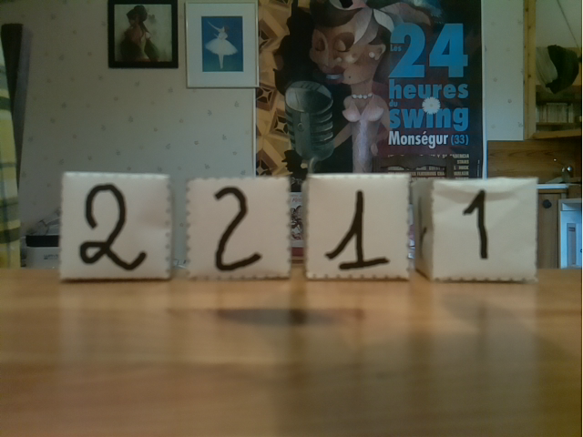

## Obtenir les images avec la caméra du robot  

Les images des faces des cubes peuvent être obtenues en utilisant le service ROS `/get_image` proposé par le robot Poppy Ergo Jr.

image001.png               |  image002.png
:-------------------------:|:-------------------------:
   |  


🤖 Rappels : lancement du ROS Master et des services ROS sur le robot :
 
* allumer le robot Poppy Ergo Jr,
* se connecter sur la carte RPi du robot : `ssh pi@poppy.local` (mdp: `raspberry`) 
* ✅ vérifier que `ROS_MASTER_URI` pointe bien vers `poppy.local:11311` :
```bash
(tf2) jlc@pikatchou: $ ssh pi@poppy.local
pi@poppy.local password:
...

pi@poppy:~ $ env|grep ROS_MASTER
ROS_MASTER_URI=http://poppy.local:11311
```	
* si `ROS_MASTER_URI` n'est pas bon, édite le fichier `~/.bashrc` du robot, mets la bonne valeur et tape `source ~\.bashrc`...
* Lance le ROS Master et les services ROS sur le robot avec la commande : 
```bash
pi@poppy:~ $ roslaunch poppy_controllers control.launch
...
```

💻 Et maintenant dans un terminal sur ton PC, avec l'EVP `(tf2)` désactivé :
* ✅ vérifie que `ROS_MASTER_URI` pointe bien vers `poppy.local:11311` :
```bash
(tf2) jlc@pikatchou: $ env|grep ROS_MASTER
ROS_MASTER_URI=http://poppy.local:11311
```	
* si `ROS_MASTER_URI` n'est pas bon, édite le fchier `~/.bashrc`, mets la bonne valeur et tape `source ~\.bashrc`...


🐍 Tu peux utiliser le programme Python `get_image_from_robot.py` du dossier `tod_tf2` pour enregistrer les images des cubes dans des fichiers nommées `imagesxxx.png` (`xxx` = `001`, `002`...). <br>
Un appui sur une touche clavier permet de passer d'une image à l'autre, un appui sur la touche `Q` permet de quitter le programme :

```python
import cv2, rospy
from poppy_controllers.srv import GetImage
from cv_bridge import CvBridge

i=1
while True:
    get_image = rospy.ServiceProxy("get_image", GetImage)
    response  = get_image()
    bridge    = CvBridge()
    image     = bridge.imgmsg_to_cv2(response.image)
    cv2.imwrite(f"image{i:03d}.png", image)
    cv2.imshow("Poppy camera", image)
    key = cv2.waitKey(0)
    if key==ord('q') or key==ord("Q"): break
    cv2.destroyAllWindows()
    i += 1
cv2.destroyAllWindows()
```

📍  En cas de conflit grave "ROS / EVP tf2 / PyQT" en utilisant le programme `get_image_from_robot.py` tu peux désactiver temporairement l'EVP tf2 :
* soit en lançant un nouveau terminal,
* soit en tapant la commande `conda deactivate`

Une les images réalisées, il faut mettre environ 90 % des images dans le dossier `<project>/images/train` et le reste dans le dossier `<project>/images/test`.

