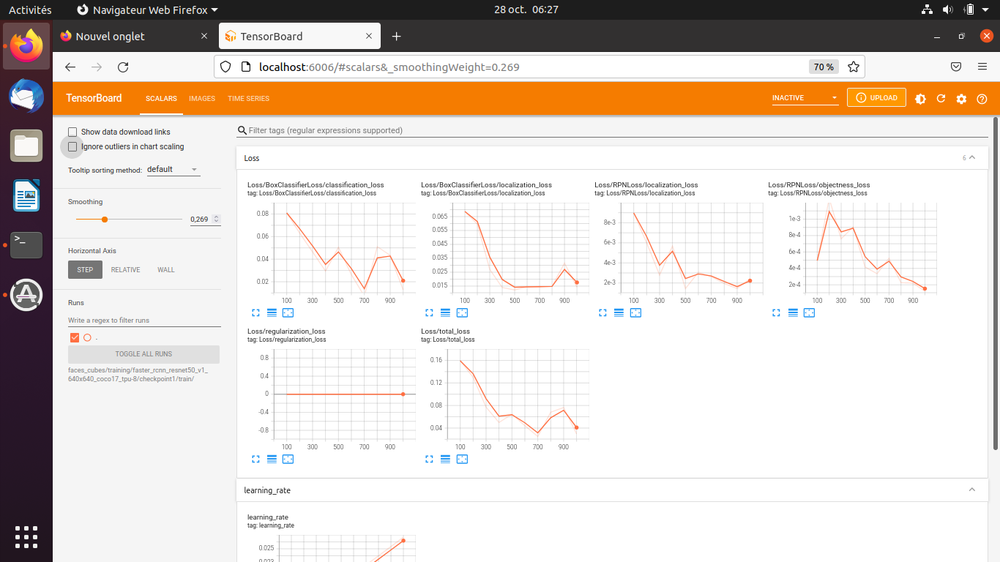

---
    Acquis d'apprentissage visés :
    - Savoir modifier le fichier de configuration d'un réseau TOD pré-entrainé, pour l'adapter à ses besoins.
    - Savoir continuer l'entraînement supervisé d'un réseau TOD pré-entraîné.
    - Savoir exporter les poids du réseau entrainé dans un format utilisable.

    Type d'activité     : ⚙️ [tâche]
    Durée approximative : plusieurs heures (dépend des ressources CPU & RAM de ton ordinateur).
---

## Plan de l'activité 

Cette activité se décompose en 3 étapes :

1. Modifier le fichier de configuration du réseau pré-entraîné pour décrire la configuration d'entraînement.
2. Lancer l'entraînement supervisé.
3. Exporter les poids du réseau entrainé dans un format utilisable.

## 0. Préliminaires

Pour simplifier l'écriture des commandes Linux à taper dans le terminal, tu peux définir :
* une variable shell `PTN` (_Pre-Trained Network_) qui donne le nom du réseau pré-entraîné choisi `<pre-trained_net>`,
* une variable shell `PTN_DIR` qui donne le chemin d'accès au dossier  `<project>/training/<pre-trained_net>`

### Exemple

Avec le projet `faces_cubes` et le réseau `faster_rcnn_resnet50_v1_640x640_coco17_tpu-8` :

```bash
user@host $ export PTN=faster_rcnn_resnet50_v1_640x640_coco17_tpu-8
user@host $ echo $PTN      # pour vérifier
faster_rcnn_resnet50_v1_640x640_coco17_tpu-8

user@host $ export PTN_DIR=faces_cubes/training/$PTN
user@host $ echo $PTN_DIR   # pour vérifier
faces_cubes/training/faster_rcnn_resnet50_v1_640x640_coco17_tpu-8
```

## 1. Modifie le fichier de configuration

Le fichier de configuration `pipeline.config` présent dans le dossier `pre-trained/<pre-trained_net>` doit être copié dans le dossier cible `<project>/training/<pre-trained_net>`.

Avec le projet `faces_cubes` et le réseau pré-entrainé choisi :
```bash
# From within tod_tf2
user@host $ cp pre-trained/$PTN/pipeline.config $PTN_DIR
```


* Il faut ensuite modifier les paramètres du fichier `<project>/training/<pre-trained_net>/pipeline.configure` pour les adapter à l'entraînement.

### Exemple

Avec le projet `faces_cubes` et le réseau `faster_rcnn_resnet50_v1_640x640_coco17_tpu-8` :

|Line | Parameter name              | Description                                                            | Initial value  | Value |  Comment               |
|:--|:------------------------------|:-----------------------------------------------------------------------|:----------------:|:---------------:|:--------------------------------|
|010| `num_classes`                 | nombre de classe d'objets                                              | 90               | 2               | les deux classes `one` et `two` |
|077| `max_detections_per_class`    | nombre max de détection par classe                                     | 100              | 4               | 4 cubes max par image | 
|078| `max_total_detections`        | nombre max total de détections                                         | 100              | 4               | 4 cubes max par image | 
|093| `batch_size`                  | nombre d'images à traiter en lot avant mise à jour des poids du réseau | 64               | 1, 2...       | une valeur trop élevée risque<br> de faire dépasser la capacité<br> mémoire RAM de ta machine.<br>À régler en fonction de la<br>quantité de RAM de <br>ta machine.  |
|097| `num_steps`                   | Nombre max d'itérations d'entraînement                                 | 25000             | 1000           | une valeur trop grande<br> donne des temps de calcul<br> prohibitifs et un risque<br> de sur-entraînement 
|113| `fine_tune_checkpoint`        | chemin des fichiers de sauvegarde des poids du réseau pré-entraîné     | 'PATH_TO_BE_CONFIGURED' | 'pre-trained/faster_rcnn_resnet50_v1_640x640_coco17_tpu-8/checkpoint/ckpt-0' | se termine par `/ckpt-0`<br> qui est le préfixe des<br> fichiers dans le dossier<br>`.../checkpoint/` |
|114| `fine_tune_checkpoint_type`   | Choix de l'algorithme : "classification" ou "detection"                | 'classification' | 'detection'  | tu veux faire de la détection<br>d'objets |
|120| `max_number_of_boxes`         | Nombre max de boîtes englobantes  dans chaque image                    | 100               | 4               | 4 faces de cubes dans une image |
|122| `use_bfloat16`                | `true` pour les architectures TPU, `false` pour CPU                    | true              | false           |  choix du CPU|
|126| `label_map_path`              | chemin du fichier des labels                                           | 'PATH_TO_BE_CONFIGURED' | 'faces_cubes/training/label_map.pbtxt' | utilisé pour l'entraînement |
|128| `input_path`                  | fichier des données d'entrée d'entraînement au format `tfrecord`       | 'PATH_TO_BE_CONFIGURED' | 'faces_cubes/training/train.record'    | utilisé pour l'entraînement |
|139| `label_map_path`              | chemin du fichier des labels                                           | 'PATH_TO_BE_CONFIGURED' | 'faces_cubes/training/label_map.pbtxt' | utilisé pour l'évaluation|
|128| `input_path`                  | fichier des données d'entrée de test au format `tfrecord`              | 'PATH_TO_BE_CONFIGURED' | '1faces_cubes/training/test.record"    | utilisé pour l'évaluation|


## 2 Lance l'entraînement

⚠️ Il est très important de bien vérifier le contenu du fichier `<project>/training/<pre-trained_net>/pipeline.configure` avant de lancer l'entraînement : une bonne pratique est de le faire vérifier par quelqu'un d'autre...

⚠️ Ne mettre des valeurs de `batch_size` >= 2 que si ton ordinateur possède un CPU puissant avec au moins 4 Gio de RAM !

Copie le fichier `models/research/object_detection/model_main_tf2.py` dans la racine `tod_tf2` :
```bash
# From within tod_tf2
(tf2) user@host $ cp models/research/object_detection/model_main_tf2.py .
```
Maintenant lance l'entraînement avec la commande :
```bash
# From within tod_tf2
(tf2) user@host $ python model_main_tf2.py --model_dir=$PTN_DIR/checkpoint1 --pipeline_config_path=$PTN_DIR/pipeline.config
```
Les fichiers des poids entraînés seront écrits dans le dossier `$PTN_DIR/checkpoint1` : si tu relances l'entraînement, tu peux utiliser `checkpoint2`, `checkpoint3` pour séparer des essais successifs.

Le module _tensorflow_ est assez verbeux...<br>
Au bout d'un "certain temps" (qui peut être assez long, plusieurs dizaines de minutes avec un CPU ordinaire), les logs s'affichent à l'écran, en  particulier les lignes qui commencent par `INFO` montrant que l'entraînement est en cours :

	...
	...
    INFO:tensorflow:Step 100 per-step time 18.002s
    I1028 00:58:19.951609 140629825712512 model_lib_v2.py:698] Step 100 per-step time 18.002s
    INFO:tensorflow:{'Loss/BoxClassifierLoss/classification_loss': 0.08096047,
     'Loss/BoxClassifierLoss/localization_loss': 0.06868178,
     'Loss/RPNLoss/localization_loss': 0.008976435,
     'Loss/RPNLoss/objectness_loss': 0.000495165,
     'Loss/regularization_loss': 0.0,
     'Loss/total_loss': 0.15911385,
     'learning_rate': 0.014666351}
    I1028 00:58:20.032363 140629825712512 model_lib_v2.py:701] {'Loss/BoxClassifierLoss/classification_loss': 0.08096047,
     'Loss/BoxClassifierLoss/localization_loss': 0.06868178,
     'Loss/RPNLoss/localization_loss': 0.008976435,
     'Loss/RPNLoss/objectness_loss': 0.000495165,
     'Loss/regularization_loss': 0.0,
     'Loss/total_loss': 0.15911385,
     'learning_rate': 0.014666351}
    INFO:tensorflow:Step 200 per-step time 17.134s
    I1028 01:26:52.862514 140629825712512 model_lib_v2.py:698] Step 200 per-step time 17.134s
    INFO:tensorflow:{'Loss/BoxClassifierLoss/classification_loss': 0.063115016,
     'Loss/BoxClassifierLoss/localization_loss': 0.059545986,
     'Loss/RPNLoss/localization_loss': 0.006001271,
     'Loss/RPNLoss/objectness_loss': 0.0012521433,
     'Loss/regularization_loss': 0.0,
     'Loss/total_loss': 0.12991442,
     'learning_rate': 0.0159997}
    I1028 01:26:52.864115 140629825712512 model_lib_v2.py:701] {'Loss/BoxClassifierLoss/classification_loss': 0.063115016,
     'Loss/BoxClassifierLoss/localization_loss': 0.059545986,
     'Loss/RPNLoss/localization_loss': 0.006001271,
     'Loss/RPNLoss/objectness_loss': 0.0012521433,
     'Loss/regularization_loss': 0.0,
     'Loss/total_loss': 0.12991442,
     'learning_rate': 0.0159997}
    ...
    INFO:tensorflow:Step 1000 per-step time 17.001s
    I1028 05:13:56.353814 140629825712512 model_lib_v2.py:698] Step 1000 per-step time 17.001s
    INFO:tensorflow:{'Loss/BoxClassifierLoss/classification_loss': 0.012904001,
     'Loss/BoxClassifierLoss/localization_loss': 0.014184773,
     'Loss/RPNLoss/localization_loss': 0.002441862,
     'Loss/RPNLoss/objectness_loss': 0.0001208472,
     'Loss/regularization_loss': 0.0,
     'Loss/total_loss': 0.029651484,
     'learning_rate': 0.0266665}
    I1028 05:13:56.354788 140629825712512 model_lib_v2.py:701] {'Loss/BoxClassifierLoss/classification_loss': 0.012904001,
     'Loss/BoxClassifierLoss/localization_loss': 0.014184773,
     'Loss/RPNLoss/localization_loss': 0.002441862,
     'Loss/RPNLoss/objectness_loss': 0.0001208472,
     'Loss/regularization_loss': 0.0,
     'Loss/total_loss': 0.029651484,
     'learning_rate': 0.0266665}

En cas d'arrêt brutal du programme avec le message "Processus arrêté", ne pas hésiter à diminer la valeur du paramètre `batch_size` jusquà 2, voire 1 si nécessaire.... <br>
Même avec un `batch_size` de 2, le processus Python peut nécessiter jusqu'à 2 ou 3 Gio de RAM pour lui tout seul, ce qui peut mettre certains portables en difficulté...

Dans l'exemple ci-dessus, on voit des logs tous les 100 pas, avec environ ~17 secondes par pas, soit environ 29 minutes entre chaque affichage et environ 5h de calcul pour les 1000 pas.  Ce calcul est fait avec `batch_size=1` sur un "petit CPU" (AMD A9-9420 RADEON R5 à 3 GHz)..

Une fois l'entraînement terminé tu peux analyser les statistiques d'entraînement avec `tensorboard` en tapant la commande :
```bash
# From within tod_tf2
(tf2) user@host:~ $ tensorboard --logdir=$PTN_DIR/checkpoint1/train
Serving TensorBoard on localhost; to expose to the network, use a proxy or pass --bind_all
TensorBoard 2.4.0 at http://localhost:6006/ (Press CTRL+C to quit)
...
```
`tensorflow` lance un serveur HTTP en local sur ta machine, et tu peux ouvrir la page avec un navigateur pour voir les courbes d'analyse en faisant CTRL + clic avec le curseur de la souris positionné sur le mot `http://localhost:6006/` :



Le logiciel _tensorboard_ permet d'examiner l'évolution de statistiques caractéristiques de l'apprentissage.

## 3. Exporte les poids du réseau entraîné

Copie le script Python `exporter_main_v2.py` situé dans le dossier `models/reasearch/object_detection/` et lance le pour extraire le __graph d'inférence__ entraîné et le sauvegarder dans un fichier `saved_model.pb`. Ce fichier pourra être rechargé ultérieurement pour exploiter le réseau entraîné :
```bash
# From within tod_tf2
(tf2) user@host $ cp models/research/object_detection/exporter_main_v2.py .
(tf2) user@host $ python exporter_main_v2.py --input_type image_tensor --pipeline_config_path $PTN_DIR/pipeline.config --trained_checkpoint_dir $PTN_DIR/checkpoint1 --output_directory $PTN_DIR/saved_model1
...some stuff....
```
Le script Python créé le fichier `saved_model.pb` dans le dossier `$PTN_DIR/saved_model1/saved_model` :

```bash
# From within tod_tf2
(tf2) user@host:~ $ tree faces_cubes/training/
faces_cubes/training/
├── faster_rcnn_resnet50_v1_640x640_coco17_tpu-8
│   ├── checkpoint1
│   │   ├── checkpoint
│   │   ├── ckpt-1.data-00000-of-00001
│   │   ├── ckpt-1.index
│   │   ├── ckpt-2.data-00000-of-00001
│   │   ├── ckpt-2.index
│   │   └── train
│   │       └── events.out.tfevents.1635373645.pikatchou.30316.0.v2
│   ├── pipeline.config
│   └── saved_model1
│       ├── checkpoint
│       │   ├── checkpoint
│       │   ├── ckpt-0.data-00000-of-00001
│       │   └── ckpt-0.index
│       ├── pipeline.config
│       └── saved_model
│           ├── assets
│           ├── saved_model.pb
│           └── variables
│               ├── variables.data-00000-of-00001
│               └── variables.index
├── label_map.pbtxt
├── test.record
└── train.record

```

