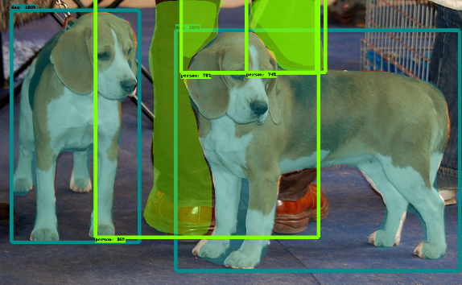

---
    Acquis d'apprentissages visés :
    - Savoir initialiser un espace de travail pour la détection d'objets utilisant l'_API TOD_
    - Savoir installer l'_API TOD_ et les composants requis

    Type d'activité : 🛠️ [setup]
    Durée prévue    : 45 minutes
---

## Prérequis

* BAC+2 et +
* Savoir utiliser les commandes de bases Linux pour utiliser et modifier l'arborescence des fichiers.
* Bonne compréhension de Python et des tableaux multi-dimensionnels de numpy (`ndarray`).
* Première expérience des réseaux de neurones (denses et convolutionnels) souhaitable.

## Plan de l'activité 

L'installation de l'API proposée comporte 6 étapes :
1. Créer et initialiser ton espace de travail
2. Cloner le dépôt `tensorflow/models`
3. Installer les outils `protobuf`
4. Installer l'_API COCO_
5. Installer le package `object_detection` 
6. Tester l'installation de l'API TOD

Dans toute la suite le _prompt_ du terminal sera noté `(tf2) user@host $` : le préfixe `(tf2)` est là pour bien rappeler que le travail d'installation de l'_API TOD_ se fait dans l'__Environnement Virtuel Python tf2__ que tu auras créé au préalable (cf les Prérequis).


### 1. Créer et initialiser ton espace de travail

La première étape consiste à créer le répertoire de travail `tod_tf2`, qui sera le  __dossier racine du projet__ dans lequel seront créés tous les fichiers, et à te positionner dans ce répertoire :
```bash
(tf2) user@host $ cd <quelque_part>   # choisis le répertoire où créer `tod_tf2`, par exemple "cd ~/catkins_ws"
(tf2) user@host $ mkdir tod_tf2
(tf2) user@host $ cd tod_tf2/
```
📥 Ensuite, tu clones le dépôt github `cjlux/tod_tf2_tools.git` et tu copies les fichiers `*.py` et `*.ipynb` du dossier `tod_tf2_tools` dans le dossier `tod_tf2` : 
```bash
# From tod_tf2/
(tf2) user@host $ git clone https://github.com/cjlux/tod_tf2_tools.git
(tf2) user@host $ cp tod_tf2_tools/*.py .
(tf2) user@host $ cp tod_tf2_tools/*.ipynb .
```

### 2. Cloner le dépôt `tensorflow/models`

📥 Dans le dossier de travail `tod_tf2` clone le dépôt github `tensorflow/models` (~ 576 Mio) :
```bash
# From tod_tf2/
(tf2) user@host $ git clone https://github.com/tensorflow/models.git
...some stuff...
```

Tu obtiens un dossier `models`. <br>
L’API TOD est dans le dossier `models/research/object_detection`, commme le montre la commande `tree` :
```bash	
(tf2) user@host $ tree -d -L 2 .
.
├── models
│   ├── community
│   ├── official
│   ├── orbit
│   └── research
└── tod_tf2_tools
```	

📥 Complète ton installation avec quelques paquets Python utiles pour le travail avec l'API TOD :

```bash
(tf2) user@host $ conda install cython contextlib2 pillow lxml
(tf2) user@host $ pip install labelimg rospkg
```
Mets à jour la variable d’environnement `PYTHONPATH` en ajoutant à la fin du fichier `~/.bashrc` les deux lignes :
```bash
export TOD_ROOT="<chemin absolu du dossier tod_tf2>"
export PYTHONPATH=$TOD_ROOT/models:$TOD_ROOT/models/research:$PYTHONPATH
```
remplace `"<chemin absolu du dossier tod_tf2>"` par le chemin absolu du dossier `tod_tf2` 
sur ta machine (en général c'est : `/home/<logname>/catkin_ws/todtf2`).

* Lance un nouveau terminal pour activer le nouvel environnement shell : tout ce qui suit sera fait dans ce nouveau terminal.

* ⚠️ n'oublie pas d'activer l'EVP `tf2` dans ce nouveau terminal :
```bash
user@host $ conda activate tf2
(tf2) user@host $
 ```

### 3. Installer les outils `protobuf`

L’API native TOD utilise des fichiers `*.proto` pour la configuration des modèles et le stockage des paramètres d’entraînement. 
Ces fichiers doivent être traduits en fichiers `*.py` afin que l’API Python puisse fonctionner correctement : 

* Installe d'abord le paquet debian `protobuf-compile` qui donne accès à la commande `protoc` :
```bash
(tf2) user@host $ sudo apt install protobuf-compiler
```
* Tu peux ensuite te positionner dans le dossier `tod_tf2/models/research` et taper :
```bash
# From tod_tf2/models/research/
(tf2) user@host $ protoc object_detection/protos/*.proto  --python_out=.
```
Cette commande travaille de façon muette.

### 4. Installer l'API COCO

COCO est une banque de données destinée à alimenter les algorithmes de détection d’objets, de segmentation… <br>
Voir [cocodataset.org](https://cocodataset.org) pour les tutoriels, publications… 

📥 Pour installer l’API Python de COCO, clone le site `cocoapi.git` (~ 15 Mo) dans le dossier `/tmp`, tape la commande `make` dans le dossier `cocoapi/PythonAPI`, puis recopie le dossier `pycococtools` dans ton dossier `.../models/research/` :
```bash
(tf2) user@host $ cd /tmp
(tf2) user@host $ git clone  https://github.com/cocodataset/cocoapi.git
(tf2) user@host $ cd cocoapi/PythonAPI/
(tf2) user@host $ make
(tf2) user@host $ cp -r pycocotools/ <chemin absolu du dossier tod_tf2>/models/research/
```
remplace `"<chemin absolu du dossier tod_tf2>"` par le chemin absolu du dossier `tod_tf2` sur ta machine (par exemple `~/catkins_ws/tod_tf2`).

### 5. Installer le package `object_detection` 

Pour finir l'installation, place-toi dans le dossier  `models/research/` et tape les commandes :
```bash
# From tod_tf2/models/research/
(tf2) user@host $ cp object_detection/packages/tf2/setup.py .
(tf2) user@host $ python setup.py build
(tf2) user@host $ pip install .
```

### 6. Tester l'installation de l'API TOD

Pour tester ton installation de l’API TOD, place-toi dans le dossier `models/research/` et tape la commande :
```bash	
# From within tod_tf2/models/research/
(tf2) user@host $ python object_detection/builders/model_builder_tf2_test.py
```
Le programme déroule toute une série de tests et doit se terminer par un OK sans faire apparaître d'erreur :

	...
	[       OK ] ModelBuilderTF2Test.test_invalid_second_stage_batch_size
    [ RUN      ] ModelBuilderTF2Test.test_session
    [  SKIPPED ] ModelBuilderTF2Test.test_session
    [ RUN      ] ModelBuilderTF2Test.test_unknown_faster_rcnn_feature_extractor
    INFO:tensorflow:time(__main__.ModelBuilderTF2Test.test_unknown_faster_rcnn_feature_extractor): 0.0s
    I1026 22:28:48.083127 140638063505792 test_util.py:2188] time(__main__.ModelBuilderTF2Test.test_unknown_faster_rcnn_feature_extractor): 0.0s
    [       OK ] ModelBuilderTF2Test.test_unknown_faster_rcnn_feature_extractor
    [ RUN      ] ModelBuilderTF2Test.test_unknown_meta_architecture
    INFO:tensorflow:time(__main__.ModelBuilderTF2Test.test_unknown_meta_architecture): 0.0s
    I1026 22:28:48.083944 140638063505792 test_util.py:2188] time(__main__.ModelBuilderTF2Test.test_unknown_meta_architecture): 0.0s
    [       OK ] ModelBuilderTF2Test.test_unknown_meta_architecture
    [ RUN      ] ModelBuilderTF2Test.test_unknown_ssd_feature_extractor
    INFO:tensorflow:time(__main__.ModelBuilderTF2Test.test_unknown_ssd_feature_extractor): 0.0s
    I1026 22:28:48.085861 140638063505792 test_util.py:2188] time(__main__.ModelBuilderTF2Test.test_unknown_ssd_feature_extractor): 0.0s
    [       OK ] ModelBuilderTF2Test.test_unknown_ssd_feature_extractor
    ----------------------------------------------------------------------
    Ran 24 tests in 58.669s

    OK (skipped=1)

L'abscence de message d'erreur valide l'installation de l'_API TOD_ sur ta machine.

## Compléments...

Pour finir, tu peux vérifier l’installation en utilisant le notebook IPython `object_detection_tutorial.ipynb` présent dans le dossier `tod_tf2`.<br>
(note : c'est une copie du notebook `tod_tf2/models/research/object_detection/colab_tutorials/object_detection_tutorial.ipynb` dans laquelle on a enlevé les cellules d'installation de l'API_TOD et quelques autres cellules qui peuvent générer des erreurs...).

* ⚠️ Avant d'exécuter les cellules du notebook, il faut corriger une erreur dans le fichier `.../tod_tf2/models/research/object_detection/utils/ops.py`, ligne 850 :
remplace `tf.uint8` par `tf.uint8.as_numpy_dtype`

* Dans le dossier `tod_tf2` lance la commande `jupyter notebook` et charge le notebook `object_detection_tutorial.ipynb`.
* Exécute les cellules une à une, tu ne dois pas avoir d’erreur :

	* La partie "__Detection__" (dure de quelques secondes à plusieurs minutes suivant ton CPU) utilise le réseau pré-entraîné `ssd_mobilenet_v1_coco_2017_11_17` pour détecter des objets dans deux images de test :<br>


	* La partie "__Instance Segmentation__" est plus gourmande en ressources (jusqu'à 8 Go de RAM) et peut durer plusieurs dizaines de minutes sur un CPU ; elle utilise le réseau pré-entraîné `mask_rcnn_inception_resnet_v2_atrous_coco_2018_01_28` pour détecter les objets et leurs masques :<br>
(_ne lance pas cette cellule si ta machine n'a pas au moins 8 Go de RAM et un CPU puissant_) :<br>



